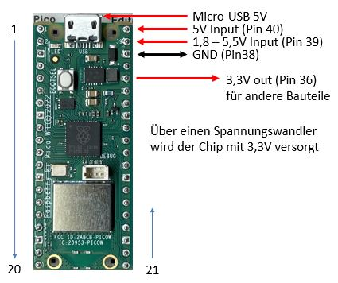
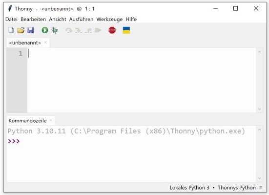
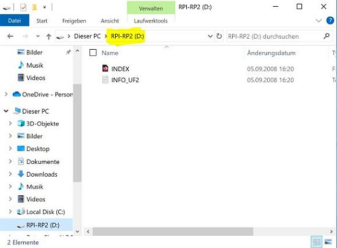
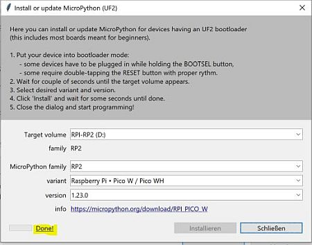
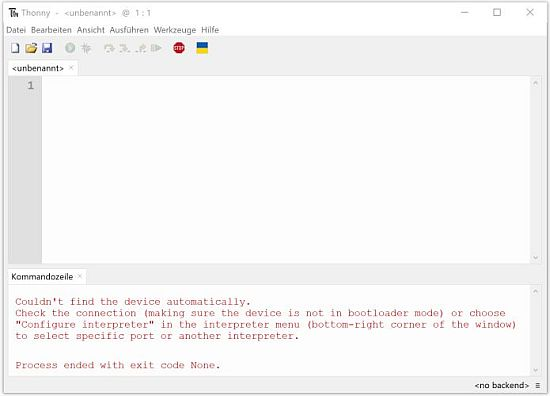
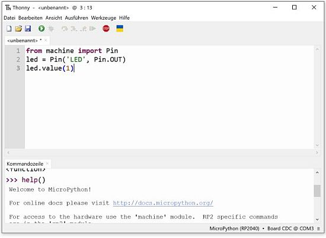

# 2.2 Inbetriebnahme Pi Pico W (ältere Version)

Unser Elektronik Set besteht aus mehreren Komponenten. Wir beginnen aber ganz einfach nur mit dem Microcontrollerboard, unserem Raspberry Pi Pico W bzw. dem Raspberry Pi Pico WH.

## Die Basis: Raspberry Pi Pico W
Der Raspberry Pi Pico (= Pi Pico) ist ein kostengünstiges aber vielseitiges Microcontrollerboard mit dem Microcontroller RP2040, der sich ideal für Einsteigerprojekte eignet. Der Pi Pico ermöglicht einen schnellen Einstieg in die Welt der Medienelektronik und kann zur Steuerung von Sensoren, Displays und anderen Komponenten genutzt werden. Die Programmierung erfolgt in Python, genauer gesagt in MicroPython, einer abgespeckten Version von Python.

Die Dokumentation des Pi Pico [findet sich hier](https://www.raspberrypi.com/documentation/microcontrollers/pico-series.html#pico-1-family) 

??? info "Nerd-Wissen Microcontroller RP2040"
    Hier der Link zum [Microcontroller RP2040](https://www.raspberrypi.com/documentation/microcontrollers/rp2040.html)   

Es gibt den Pi Pico in verschiedenen Ausführungen. 

* Es gibt den **Raspberry Pi Pico**  
Ohne WLAN und ohne Bluetooth. Er ist zwar günstiger, aber ohne WLAN ist man schon sehr eingeschränkt.
* Es gibt den **Raspberry Pi Pico W** 
Mit WLAN und mit Bluetooth. Dieser ist in der folgenden Abbildung zu sehen.
* Es gibt den **Raspberry Pi Pico WH** 
Das Board hat noch *Header* installiert, z.B. in den drei Löchern oberhalb des WLAN-Chips.

Unser Board hat insgesamt 40 "Pins". Einige Pins dienen zur Spannungsversorgung, aber die meisten Pins sind programmierbar, sogenannte GPIO-Pins. GPIO steht für "General Purpose Input/Output". Es sind vielseitig einsetzbare Pins, die sowohl als Eingänge als auch als Ausgänge konfiguriert werden können, um verschiedene elektronische Komponenten zu steuern oder Daten von Sensoren zu lesen.

Für die erste Anwendung brauchen wir noch nicht mehr über das Board zu wissen, denn wir wollen zunächst die interne LED zum Blinken bringen.

Bei der eingebauten LED müssen wir uns erstmal um nichts weiter kümmern. Sie ist richtig angeschlossen und hat einen passenden Vorwiderstand.

## Erstinstallation

Das Ziel dieses Abschnitts ist es, dass wir die Thonny Programmierumgebung installiert haben, den Pi Pico mit dem Computer verbunden haben und die interne LED anschalten. Wir brauchen dazu einen Computer/Laptop mit Microsoft Windows, MacOS oder Linux für die Programmierumgebung ["Thonny IDE"](https://thonny.org/).

Unser Computer mit dem USB-Anschluss und der Programmierumgebung "Thonny IDE" ermöglicht es uns, dass wir Programme schreiben können und diese anschließend auf den Pi Pico laden können. Und dann anschließend können wir dem Pi Pico (ebenfalls über Thonny auf unserem Computer) mitteilen das Programm auszuführen.

??? info "Nerd-Wissen Schnellerer Einstieg"
    Wem es hier zu langsam geht, der kann folgendes Video nutzen: [https://www.youtube.com/watch?v=_ouzuI_ZPLs](https://www.youtube.com/watch?v=_ouzuI_ZPLs)

    Sie können dann auch in das Thonny-Terminalfelster *help()* eingeben und sich anschauen, welche Umgebung installiert ist. 

    Unter [https://docs.micropython.org/en/latest/](https://docs.micropython.org/en/latest/) finden Sie alles zu MicoPthon.

Wer bei der Installation unsicher ist, sollte die Installation im ersten Praktikumstermin vornehmen. 

1. Das Microcontrollerboard wird auf das Experimentierboard (engl. Breadboard) gesteckt, und USB-Leitung wird schon an den Computer aber noch nicht an den Pi Pico angeschlossen). 

      

2. Thonny herunterladen [https://thonny.org/](https://thonny.org/), installieren und starten.

    

    Nach dem Start sollte es so aussehen.

      

3. Button BOOTSEL gedrückt halten und Microcontoller mittels USB mit dem Computer verbinden. ***Geduld haben***, es kann 1-2 Minuten dauern und solange BOOTSEL gedrückt halten. 

    

    Wenn es erfolgreich war, dann erscheint ein neues "Laufwerk", wie abgebildet.

      

4. Nun in Thonny unter **Werkzeuge -> Optionen** im Tab **Interpreter** den Interpreter aus der Liste auswählen **MicroPython (RP2040)**.

    

      

5. Wenn dies erreicht ist, gibt es unten rechts einen Link "MicroPython installieren oder aktualisieren", den wir anklicken. Dann öffnet sich ein neues Fenster und wir müssen das "Target volume" entsprechend dem Laufwerk einstellen. Danach bei "variant" den Eintrag **Raspberry Pi Pico W / Pico WH** auswählen.

    

    

    Nun auf installieren drücken und warten, bis die Installation abgeschlossen ist. Sobald "done" unten links erscheint, können wir das Fenster schließen. 

      

6. Jetzt sehen wir ein leeres Thonny-Fenster und müssen Thonny neu starten.

      

7. Nach dem Neustart den COM-Port angeben, sofern dieser nicht automatisch gefunden wurde.

    Der Raspberry Pi Pico kommuniziert über einen sogenannten COM-Port mit dem Computer. Oder anders gesagt, der Computer stellt einen COM-Port für den Pi Pico zur Verfügung. Bei mir ist es an einem Computer COM 3 und an einem anderen Laptop COM 6, bei Ihnen kann es ein anderer COM-Port sein.

    **ROTE SCHRIFT in der Kommandozeile**: In meinem Fall wurde der COM-Port nicht automatisch gefunden und es erscheint eine rote Schrift in dem unteren Teil von Thonny. 

    

    Dann muss man in Thonny unter **Werkzeuge -> Optionen** im Tab **Interpreter** den Port auswählen und das Fenster mit "ok" verlassen.

      

    **So sollte es am Ende aussehen! Ansonsten ist etwas schiefgelaufen.**

    

## Das erste Script schreiben und ausführen

Schreiben Sie von Hand diese Zeilen in die Thonny Programmierumgebung und drücken Sie anschließend im Menü den grünen Pfeil, der das Progamm auf den Pi Pico lädt und ausführt.

!!! note "led.value(1) - led.value(0)"
    Wenn in einem Script steht, dass ein Ausgang auf "1" (siehe led.value(1) im Script) geändert wird, dann bedeutet dies, dass an dem zugehörigen Pin die Spannung von 0 Volt auf 3,3 Volt geändert wird.

*Jetzt sollte die LED leuchten und es ist ein wichtiger Schritt geschafft!*

*Herzlichen Glückwunsch! Sie sind nun "betriebsbereit".*