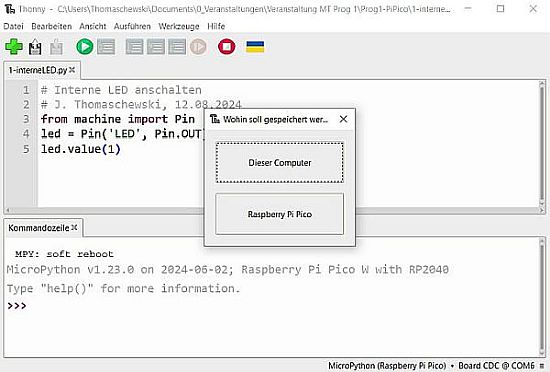

# 2.2 Thonny

Hier Infos zu den Basisfunktionalitäten der Thonny-Oberfläche

!!! note "Basis-Wissen Verbindungsinfo"
    In der Thonny-Oberfläche ist unten rechts eine Info-Zeile. Diese Zeil ist sehr wichtig und enthält die Info welches Python wo ausgeführt wird. 

    Wenn offensichtlich keine Verbindung zum Pi Pico besteht, dann den roten "Stop"-Button in der Menü-Leiste klicken, damit die Verbingung erneut probiert wird. 

## Das erste Script abspeichern

Wir werden nun viele kleine Scripte erstellen und es gibt immer zwei Arten die Scripte abzuspeichern: auf dem Computer/Laptop oder auf dem Pi Pico. 

Wenn man ein Script auf dem Pi Pico unter dem Namen main.py speichert, dann wird es ausgeführt, sobald der Pi Pico mit Strom versorgt wird. Wenn man dem Script einen anderen Namen gibt, dann wird es abgespeichert, aber nicht direkt ausgeführt.

!!! note "Basis-Wissen Script speichern"
    Sie können also den Pi Pico Zuhause programmieren und die Scripte darauf speichern und dann in der Hochschule die Programmierung daran forstsetzen.

Geben Sie den Scripten eindeutige, aussagekräftige Namen. Das erste Script möchte ich nun bei mir im Verzeichnis **Prog1-PiPico** unter dem Namen **1-interneLED.py** auf dem Laptop speichern. Bei Datei -> Speichern unter erscheint ein Fenster mit der Auswahl "Dieser Computer" und "Raspberry Pi Pico".

Aber bevor wir das Script speichern, fehlt noch etwas sehr wichtiges: Kommentarheader im Script.
Kommentarheader sind absolut wichtig und Abgaben ohne Kommenatarheader werden nicht anerkannt!

!!! note "Regeln"
    - Speichern Sie kein Script ohne einen Kommentarheader mit den minimalen Daten 
        - "Was macht das Script", 
        - "Wer hat es erstellt" und 
        - "Von wann ist das letzte Update".
    - Verwenden Sie stehts aussagekräftige Namen für die Dateien.

