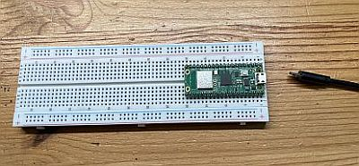
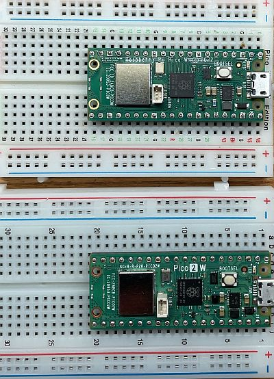

# 2 Inbetriebnahme und Basisinfos

## Gliederung

[2.1 Inbetriebnahme Pi Pico 2](2.1Inbetriebnahme-pico2.md) 
[2.2 Inbetriebnahme Pi Pico ](2.2Inbetriebnahme.md) 
[2.3 Thonny](2.3Thonny.md) 
[2.4 ChatGPT und andere KI](2.4ChatGPTUndAndereKI.md) 

## Was Sie hier erwartet

Nach dem Durcharbeiten dieses Kapitels haben Sie den Raspberry Pi Pico erfolgreich angeschlossen, kennen die sehr einfache Entwicklungsumgebung "Thonny" und sind in der Lage eigene Programme (Scripte) zu erstellen. Und Sie kennen "den guten Umgang mit ChatGPT".

## Das Material für dieses Script

Um mit diesem Script zu arbeiten benötigen Sie:

- Raspberry Pi Pico W bzw. die neuere Version Pi Pico 2 W (das "W" steht dabei für WLAN + Bluetooth)
- Experimentierboard (engl. Breadboard) mit zugehörigen Steckleitungen
- USB-Leitung vom Pi Pico zum Computer

    

- 2 Widerstände (220 Ohm)
- 2 LEDs (rot, grün)
- 2 Taster
- Drehschalter (Rotary Encoder KY-040) 
- OLED Display SSD 1306
- Lichtsensor BH 1750
- Temperatursensor Sensor BMP 280

Den Umgang mit dem Material lernen wir nun auf den folgenden Seiten Schritt-für-Schritt kennen. 

## Haben Sie den Pi Pico W oder die neuere Version Pi Pico 2 W?

Welchen der beiden Pi Picos haben Sie? Wie wir an der Abbildung sehen können, sind beide Varianten sehr ähnlich und man erkennt den Unterschied nur am Aufdruck.

Oben: Original Pi Pico W 
Unten: neuer Pi Pico 2 W

??? info "Nerd-Wissen Pi Pico WH"
    Genau genommen handelt es sich bei den beiden Pi Picos um die Version "WH". Das "W" steht dabei für WLAN + Bluetooth und das "H" für "Header", also eine zusätzliche Anschlussbuchse und die "Beinchen" sind alle schon angelötet. 

!!! warning "Unterschiedliche Installation!"
    **Je nach Variante "Pi Pico W" oder "Pi Pico 2 W" ist die Installation etwas unterschiedlich! Bitte aufpassen!** 
    
    **Auf der nächsten Seite geht es weiter mit der Installation zum "Pi Pico 2 W" und danach folgt die Seite für die Installation beim "Pi Pico W".**

