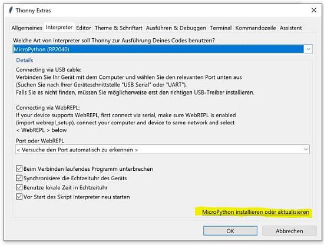
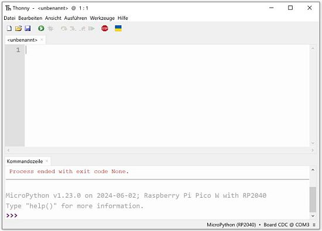

# 2 Inbetriebnahme und Basisinfos

Unser Elektronik Set besteht aus mehreren Komponenten. Wir beginnen aber ganz einfach nur mit dem Microcontrollerboard, unserem Raspberry Pi Pico W.

## Die Basis: Raspberry Pi Pico W
Der Raspberry Pi Pico (= Pi Pico) ist ein kostengünstiges aber vielseitiges Microcontrollerboard mit dem Microcontroller RP2040, der sich ideal für Einsteigerprojekte eignet. Der Pi Pico ermöglicht einen schnellen Einstieg in die Welt der Medienelektronik und kann zur Steuerung von Sensoren, Displays und anderen Komponenten genutzt werden. Die Programmierung erfolgt in Python, genauer gesagt in MicroPython, einer abgespeckten Version von Python.

Die Dokumentation des Pi Pico [findet sich hier](https://www.raspberrypi.com/documentation/microcontrollers/raspberry-pi-pico.html) 

??? info "Nerd-Wissen Microcontroller RP2040"
    Hier der Link zum [Microcontroller RP2040](https://www.raspberrypi.com/documentation/microcontrollers/rp2040.html)   

Es gibt den Pi Pico in verschiedenen Ausführungen. Wir nutzen die Ausführung Raspberry Pi Pico W, bei der das "W" für WiFi (also WLAN) steht. Aber der Chip verfügt auch über Bluetooth.


Unser Board hat insgesamt 40 "Pins". Einige Pins dienen zur Spannungsversorgung, aber die meisten Pins sind programmierbar, sogenannte GPIO-Pins. GPIO steht für "General Purpose Input/Output". Es sind vielseitig einsetzbare Pins, die sowohl als Eingänge als auch als Ausgänge konfiguriert werden können, um verschiedene elektronische Komponenten zu steuern oder Daten von Sensoren zu lesen.


Für die erste Anwendung brauchen wir noch nicht mehr über das Board zu wissen, denn wir wollen zunächst die interne LED zum Blinken bringen.

Bei der eingebauten LED müssen wir uns erstmal um nicht weiter kümmern. Sie ist richtig angeschlossen und hat einen passenden Vorwiderstand.

## Erstinstallation

Das Ziel diese Abschnitts ist es, dass wir die Thonny Programmierumgebung installiert haben, den Pi Pico mit dem Computer verbunden haben und die interne LED an schalten. Wir brauchen dazu einen Computer/Laptop mit Microsoft Windows, MacOS oder Linux für die Programmierumgebung ["Thonny IDE"](https://thonny.org/).

??? info "Nerd-Wissen Schnellerer Einstieg"
    Wem es hier zu langsam geht, der kann folgendes Video nutzen: [https://www.youtube.com/watch?v=_ouzuI_ZPLs](https://www.youtube.com/watch?v=_ouzuI_ZPLs)

    Sie können dann auch in das Thonny-Terminalfelster *help()* eingeben und sich anschauen, welche Umgebung installiert ist. 

    Unter [https://docs.micropython.org/en/latest/](https://docs.micropython.org/en/latest/) finden Sie alles zu MicoPthon.

Wer bei der Installation unsicher ist, sollte die Installation im ersten Praktikumstermin vornehmen. 

1. Das Microcontrollerboard wird auf das Experimentierboard (engl. Breadboard) gesteckt und USB-Leitung wird schon an den Computer aber noch nicht an den Pi Pico angeschlossen). 

    <br><br>


2. Thonny herunterladen [https://thonny.org/](https://thonny.org/), installieren und starten.

    

    Nach dem Start sollte es so aussehen.

    <br><br>


3. Button BOOTSEL gedrückt halten und Micocontoller mittels USB mit dem Computer verbinden. ***Geduld haben***, es kann 1-2 Minuten dauern und solange BOOTSEL gedrückt halten. 

    

    Wenn es erfolgreich war, dann erscheint ein neues "Laufwerk", wie abgebildet.

    <br><br>


4. Nun in Thonny unter **Werkzeuge -> Optionen** im Tab **Interpreter** den Interpreter aus der Liste auswählen **MicroPython (RP2040)**.

    

    <br><br>


5. Wenn dies erreicht ist, gibt es unten rechts einen Link "MicroPython installieren oder aktualisieren", den wir anklicken. Dann öffnet sich ein neues Fenster und wir müssen das "Target volume" entsprechend dem Laufwerk einstellen. Danach bei "variant" den Eintrag **Raspberry Pi Pico W / Pico WH** auswählen.

    

    

    Nun auf installieren drücken und warten, bis die Installation abgeschlossen ist. Sobald "done" unten links erscheint, können das Fenster schließen. 

    <br><br>


6. Jetzt sehen wir ein leeres Thonny-Fenster. und müssen Thonny neu starten.

    <br><br>


7. Nach den Neustart den COM-Port angeben, sofern dieser nicht automatisch gefunden wurde.

    Der Raspberry Pi Pico kommuniziert über einen sogenannten COM-Port mit dem Computer. Oder anders gesagt, der Computer stellt einen COM-Port für den Pi Pico zur Verfügung. Bei mir ist es an einem Computer COM 3 und an einem anderen Laptop COM 6, bei Ihnen kann es ein anderer COM-Port sein.

    **ROTE SCHRIFT in der Kommandozeile**: In meinem Fall wurde der COM-Port nicht automatisch gefunden und es erscheint eine rote Schrift in dem unteren Teil von Thonny. 

    

    Dann muss man in Thonny unter **Werkzeuge -> Optionen** im Tab **Interpreter** den Port auswählen und das Fenster mit "ok" verlassen.

    <br><br>

    **So sollte es am Ende aussehen! (Ansonsten ist etwas schief gelaufen).**

    

## Das erste Script schreiben und ausführen

Schreiben Sie von Hand diese Zeilen in die Thonny Programmierumgebung und drücken Sie anschließend im Menü den grünen Pfeil, der das Progamm auf den Pi Pico läd und ausführt.


Jetzt sollte die LED leuchten und es ist ein wichtiger Schritt geschafft!


## Infos zur Thonny-Oberfläche

Hier Infos zu den Basisfunktionalitäten der Thonny-Oberfläche


!!! note "Basis-Wissen Verbindungsinfo"
    In der Thonny-Oberfläche ist unten rechts eine Info-Zeile. Diese Zeil ist sehr wichtig und enthält die Info welches Python wo ausgeführt wird. 

    Wenn offensichtlich keine Verbindung zum Pi Pico besteht, dann den roten "Stop"-Button in der Menü-Leiste klicken, damit die Verbingung erneut probiert wird. 


## Das erste Script abspeichern

Wir werden nun viele kleine Scripte erstellen und es gibt immer zwei Arten die Scripte abzuspeichern: auf dem Computer/Laptop oder auf dem Pi Pico. 

Wenn man ein Script auf dem Pi Pico unter dem Namen main.py speichert, dann wird es ausgeführt, sobald der Pi Pico mit Strom versorgt wird. Wenn man dem Script einen anderen Namen gibt, dann wird es abgespeichert, aber nicht direkt ausgeführt.

!!! note "Basis-Wissen Script speichern"
    Sie können also den Pi Pico Zuhause programmieren und die Scripte darauf speichern und dann in der Hochschule die Programmierung daran forstsetzen.

Geben Sie den Scripten eindeutige, aussagekräftige Namen. Das erste Script möchte ich nun bei mir im Verzeichnis **Prog1-PiPico** unter dem Namen **1-interneLED.py** auf dem Laptop speichern. Bei Datei -> Speichern unter erscheint ein Fenster mit der Auswahl "Dieser Computer" und "Raspberry Pi Pico".

Aber bevor wir das Script speichern, fehlt noch etwas sehr wichtiges: Kommentarheader im Script.
Kommentarheader sind absolut wichtig und Abgaben ohne Kommenatarheader werden nicht anerkannt!


!!! note "Regeln"
    - Speichern Sie kein Script ohne einen Kommentarheader mit den minimalen Daten 
        - "Was macht das Script", 
        - "Wer hat es erstellt" und 
        - "Von wann ist das letzte Update".
    - Verwenden Sie stehts aussagekräftige Namen für die Dateien.


## Interne LED blinken lassen - gute und schlechte Programmierung

Wie einfach es ist, schlechten Sourcecode zu schreiben, möchte ich an diesem kleinen Beispiel zeigen. Anschließend soll KI (genauer gesagt ChatGPT) genutzt werden, denn die gute Nutzung ist sehr vorteilhaft, während eine schlechte Nutzung in Sackgassen führt; und am Ende muss man von vorne neu von Hand anfangen. 

!!! note "Hinweis: Einrückungen"
    In Python sind Einrückungen total wichtig, da das Programm daran erkennt, was Teil einer Schleife, Anweisung oder Funktion ist. In Thonny verwenden wir die Tab-Taste für eine Einrückung.  

Wir wollen die interene LED nun blinken lassen. 

Hier der erste schlechte Script, der zwar funktioniert, aber nicht erweiterbar ist. 
Genutzt wird eine Endlosschleife (while), die den eingerückten Codeblock immer wieder erneut ausführt.

```python linenums="1"
# Interne LED blinken lassen - schlecht 1
# J. Thomaschewski, 12.08.2024
from machine import Pin
from time import sleep
led = Pin('LED', Pin.OUT)
while True:
    led.on()
    sleep(0.5)
    led.off()
    sleep(0.5)
```

Nun das zweite schlechte Script, der ebenso funktioniert, aber ebenfalls nicht erweiterbar ist. Statt `led.on()` und `led.off()` verwenden wir die Funktionalität `led.toggle()`.

```python linenums="1"
# Interne LED blinken lassen - schlecht 2
# J. Thomaschewski, 12.08.2024
from machine import Pin
from time import sleep
led = Pin('LED', Pin.OUT)
while True:
    led.toggle()
    sleep(2)
```

Schlecht deshalb, da wir eine while-Schleife nutzen, die endlos läuft und wir das Programm somit nicht erweitern können. Die gute Lösung enthält eine Definition einer Funktion, die über einen Timer gesteuert wird. Hier soll uns der Sourcecode noch nicht interessieren, sondern nur die Tatsache, dass es gute und schlechte Ansätze in der Programmierung gibt (und dass ChatGPT oftmals zu den schlechten Versionen greift).

```python linenums="1"
# Interne LED blinken lassen - gut
# J. Thomaschewski, 12.08.2024
from machine import Pin, Timer
led = Pin('LED', Pin.OUT)

def blink(timer):
    led.toggle()

Timer().init(freq=5, callback=blink)
```

## Nutzung von KI am Beispiel von ChatGPT

Ich gebe eine deutliche Empfehlung für die Nutzung von Künstlicher Intelligenz (KI). 

Zunächst verweise ich auf die Regeln der Hochschule zur Nutzung der KI, die in einem Positionspapier zusammengefasst sind und derzeit [hier zu finden ist](https://www.hs-emden-leer.de/hochschule/organisation/einrichtungen/campusdidaktik/ki-in-der-hochschullehre)

### ChatGPT programmieren lassen

Hier schauen wir uns ChatGPT-Ergebnisse an. 

**Fragestellung an ChatGPT 4o am 12.08.2024**

```text
Erstelle mir ein MicroPython-Script für die Nutzung durch den Raspberry Pi Pico. Die interne LED soll blinken.
```

**Antwort** 

```python linenums="1"
from machine import Pin
import time

# Die interne LED des Raspberry Pi Pico ist an Pin 25 angeschlossen
led = Pin(25, Pin.OUT)

while True:
    led.value(1)  # LED einschalten
    time.sleep(0.5)  # 500 Millisekunden warten
    led.value(0)  # LED ausschalten
    time.sleep(0.5)  # 500 Millisekunden warten
```

***WICHTIG: Die Antwort von ChatGPT ist zwingend um einen Kommentarheader zu ergänzen und lautet dann für die Nuntzung durch uns z.B. wie folgt***
```python linenums="1" hl_lines="1-3"
# Interne LED blinken lassen - gut
# Script erstellt von ChatGPT 4o
# J. Thomaschewski, 12.08.2024
from machine import Pin
import time

# Die interne LED des Raspberry Pi Pico ist an Pin 25 angeschlossen
led = Pin(25, Pin.OUT)

while True:
    led.value(1)  # LED einschalten
    time.sleep(0.5)  # 500 Millisekunden warten
    led.value(0)  # LED ausschalten
    time.sleep(0.5)  # 500 Millisekunden warten
```

Es gibt die drei Varianten

1. Sourcecode erstellt von ChatGPT 4o<br>
    Dies ist zu nutzen, wenn ChatGPT den Hauptteil erstellt hat und nur minimale Änderungen stattgefunden haben.

2. Sourcecode mit Hilfe von ChatGPT 4o<br>
    Hier muss der Sourcecode und die Struktur einen erheblichen Eigenanteil aufweisen. Ansonsten ist die Variante A. zu wählen.

3. XYZ wurde von ChatGPT 4o erstellt<br>
    Wenn ein eindeutiger Teil von ChatGPT erstellt wurde, dann würde ich dies immer genau benennen. 

Die Verwendung von KI-Tools ist in dieser Versanstaltung ausdrücklich erlaubt, sofern eine Kennzeichnung vorhanden ist.

!!! note "Hinweis: Probleme mit ChatGPT"
    Das Problem ist nicht bei CharGPT oftmals nicht der schlechte Sourcecode, sondern die mangelnde Erweiterbarkeit. Man fängt mit einem kleinen Stückchen Sourcecode an und lässt es sich erstellen. dann kommen die nächsten und nächsten Wünsche und irgendwann bekommt es CharGPT nicht mehr hin. Aber man selbst bekommt es dann auch nicht mehr hin und muss von Hand von vorne anfangen. 

    Lassen Sie sich also immer nur ein Stückchen helfen!

### ChatGPT kommentieren lassen

Eine sehr gute Verwendung ist die Verwendung von ChatGPT als "Kommentator".

**Fragestellung an ChatGPT 4o am 12.08.2024**

```text
Hinweis: Ich studiere im 1. Semester und habe keine Ahnung von Programmierung.
Kommentiere mir das Script (MicroPython für Raspberry Pi Pico) so ausführlich, sodass ich es gut verstehe.

from machine import Pin
from time import sleep
led = Pin('LED', Pin.OUT)
while True:
    led.toggle()
    sleep(2)
```

**Antwort**
```python linenums="1"
# Importieren der notwendigen Module
from machine import Pin  # Das Modul 'machine' enthält Klassen zur Steuerung der Hardware des Raspberry Pi Pico. Hier wird speziell die Klasse 'Pin' importiert.

from time import sleep   # Das Modul 'time' enthält Funktionen zur Zeitsteuerung. Hier wird speziell die Funktion 'sleep' importiert.

# Initialisieren der LED
led = Pin('LED', Pin.OUT)  # Ein Pin-Objekt namens 'led' wird erstellt. Der Parameter 'LED' steht für den integrierten LED-Pin des Raspberry Pi Pico. 'Pin.OUT' bedeutet, dass dieser Pin als Ausgang konfiguriert wird.

# Endlosschleife
while True:  # Dies ist eine Endlosschleife, die ununterbrochen läuft.
    led.toggle()  # Die Methode 'toggle()' wechselt den Zustand der LED. Wenn sie an ist, wird sie ausgeschaltet und umgekehrt.
    sleep(2)      # Die Funktion 'sleep(2)' pausiert das Programm für 2 Sekunden, bevor die Schleife erneut durchlaufen wird.
```

## Zusammenfassung

- Sie haben die Erstinstallation vorgenommen und die interne LED anschalten können. Damit sind Sie einsatzbereit für die kommenden Aufgaben.
- Sie können Scripte in Thonny schreiben und abspeichern, sowohl auf einem lokalen Computer als auch auf dem Pi Pico Board.
- Sie wissen, dass Sie bei mir unbedingt einen Kommentarheader verwenden müssen.
- Sie wissen, wie Sie ChatGPT oder andere KI-Tools nutzen können und dass die Nutzung zwingend im Programmheader angegeben werden muss.