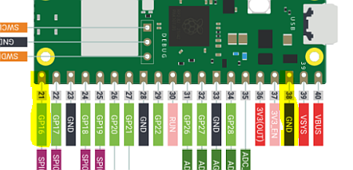

# 3.1 LEDs blinken

Die interne LED haben wir schon blinken lassen, aber nun wollen wir mit externen LEDs beginnen.

## Die Hardware- und Elektronikgrundlagen

Wir benötigen immer das Microcontrollerboard Raspberry Pi Pico W auf dem Breadboard und die USB-Anschlussleitung sowie Jumper-Leitungen, die man für die Verkabelung auf dem Breadboard benötigt.

Wir benötigen für diese drei Anwendungen ferner:

- 2 Widerstände (220 Ohm)

- LEDs (rot, grün)


!!! note "Basis-Wissen LED"
    Eine LED (Light Emitting Diode; dt.: Leuchtdiode) ist ein Halbleiterbauelement, das Licht erzeugt, wenn elektrischer Strom in Durchlassrichtung fließt. Somit ist beim Anschluss auf die Polarität zu achten. 
    
    Die Polarität erkennt man daran, dass die längere Anschlussleitung (Anode) an Plus und die kürzere (Kathode) an Minus angeschlossen wird.
    ***(Einfach zu merken: Plus hat einen Strich mehr als Minus und ist somit länger.)*** Wenn die Anschlüsse gekürzt wurden, dann geht es wie folgt: Die Kathode wird oft durch eine abgeflachte Seite am Gehäuse markiert. Und wenn man von der Seite in die LED reinschaut, dann ist Minus innen an den dickeren Bereich (der Reflektor) anzuschließen.

    Typische Betriebsspannungen für LEDs liegen zwischen 2 und 3 Volt, abhängig von der Farbe. Somit kann eine LED nicht direkt an eine 3,3 V oder 5 V-Spannung angeschlossen werden, sondern es muss ein Widerstand in Reihe geschaltet werden.

!!! note "Basis-Wissen Widerstand"
    Ein Widerstand wird oft als sogenannter Vorwiderstand eingesetzt und dient dann dazu, die Spannung an einem elektrischen Bauteil zu verringern. In unserer Schaltung benötigen wir den Widerstand vor der LED.

    Der Formelbuchstabe für einen Widerstand ist R (=resistor) und der Wert wird in Ohm (Ω) angegeben. Wir benötigen hier 220 Ω Widerstände. Um den richtigen Widerstand zu finden, muss man die [Farbkodierung für 220 Ω](https://codingworld.io/starterkit22-widerstandsguide/) kennen, die sich noch leicht unterscheidet, je nachdem ob 4 oder 5 Ringe (oder 6 Ringe) aufgedruckt sind. 

## Die Anwendungen

Wir starten mit drei Anwendungen. Zunächst lassen wir eine rote LED blinken. Dann lassen wir eine rote und eine grüne LED unabhängig voneinander blinken und drittens sollen eine rote und eine grüne LED abwechselnd blinken.

### Eine rote LED blinken lassen

  

- Pin 38 an Masse (engl. Ground = GND)

- Pin 21 (= GPIO 16) an den Widerstand

- Widerstand an Plus der LED

- Minus der LED an Masse

Wir haben mit `led = Pin('LED', Pin.OUT)` die interne LED aktiviert. Die einzige Änderung ist nun, dass wir `led = Pin(16, Pin.OUT)` schreiben und das GPIO 16 auf dem physikalischen Pin 21 liegt. 

!!! warning "Pin ungleich Pin"
    Dies ist eine wichtige Warnung zum "Pin-Problem"! 

    - Wenn ich schreibe **Pin 38 an Masse (engl. Ground = GND)**, dann ist damit der physikalische Pin auf "grünen" Pi Pico Board gemeint!
    - Ebenso, wenn ich schreibe **Pin 21 (= GPIO 16) an den Widerstand**. Aber mit der Bezeichnung GPIO 16 habe ich schon die Zahl 16 angegeben, die dann im Script als *"Pin"* verwendet wird. 

    Dies müssen alle verstanden haben, BEVOR Sie die erste Schaltung in Betrieb nehmen. Ansonsten gerne nochmal nachfragen.

!!! warning "Das richtige "Plus 3,3 V verwenden"
    Noch eine Warnung, ohne die Ihr Board leicht zerstört werden könnte!

    Wenn wir 3,3 Volt auf dem Breadboard benötigen, dann nehmen wir nur und ausschließlich den Pin 36 mit der Bezeichnung "3V3(Out)".

Hier das Script. Bitte mit Copy&Paste in Thonny einfügen und nach Änderungen auch den Kommentarheader ändern.

```python linenums="1"
# Externe LED blinken lassen
# J. Thomaschewski, 12.08.2024
from machine import Pin, Timer

# GPIO 16 ist auf Pin 21
led = Pin(16, Pin.OUT) 

def blink(timer):
    led.toggle()

Timer().init(freq=5, callback=blink)
```

### Eine rote und eine grüne LED blinken lassen

Wir erweitern das Script so, dass nun zwei LEDs blinken sollen. Dafür nutzen wir zusätzlich GPIO 15 an Pin 20. Der Pi Pico hat insgesamt 26 GPIOs und theoretisch könnte man somit 26 LEDs unabhängig voneinander blinken lassen. In der Praxis muss man beachten, welchen Strom das Pi Pico Board maximal verkraften kann.

 

```python linenums="1"
# Externe LED blinken lassen
# J. Thomaschewski, 12.08.2024
from machine import Pin, Timer

# GPIO 16 ist auf Pin 21 (LED rot)
# GPIO 15 ist auf Pin 20 (LED grün)
ledRed   = Pin(16, Pin.OUT)
ledGreen = Pin(15, Pin.OUT)

def blinkRed(timer):
    ledRed.toggle()
    
def blinkGreen(timer):
    ledGreen.toggle()   


Timer().init(freq=5, callback=blinkRed)
Timer().init(freq=2, callback=blinkGreen)
```

### Eine rote und eine grüne LED abwechselnd lassen

Der Aufbau bleibt gleich und wir ändern lediglich das Script, sodass die rote und die grüne LED nun abwechselnd blinken.

```python linenums="1"
# Externe LED blinken lassen
# J. Thomaschewski, 12.08.2024
from machine import Pin, Timer

# GPIO 16 ist auf Pin 21 (LED rot)
# GPIO 15 ist auf Pin 20 (LED grün)
ledRed   = Pin(16, Pin.OUT)
ledGreen = Pin(15, Pin.OUT)

def blink(timer):
    ledRed.toggle()
    ledGreen.value(not ledRed.value())    
      
Timer().init(freq=2, callback=blink)
```


## Python

Nun wollen wir Python verstehen. Wir beginnen mit einem sehr einfachen Script aus dem Programm bei der die interne LED angeschaltet wurde. Sie können die Zeilen in Thonny einfügen und laufen lassen. Die "restliche Schaltung" kann so bleiben und wird nicht genutzt.

```python linenums="1"
# Bibliotheken laden
from machine import Pin

# Initialisierung der Onboard-LED
led = Pin('LED', Pin.OUT)

# LED einschalten
led.on()
```


!!! question "Script verstehen"
    Was ist im Script fest vorgegeben und was kann man *ändern wie man möchte*?

    ??? example "Lösungen"
        Für die gewünschte Funktionalität ist bis auf led alles vorgegeben. led ist ein frei gewählter Variablenname und kann beliebig umbenannt werden. Aber achten Sie auf einen sinnvollen Namen und machen Sie es nicht wie in diesem Beispiel :smile:.
            
        ```python linenums="1"
        # Bibliotheken laden
        from machine import Pin

        # Initialisierung der Onboard-LED
        hans = Pin('LED', Pin.OUT)

        # LED einschalten
        hans.on()
        ```


Folgende Fragen wollen wir nun beantworten:

1. Welche erste Syntax können wir erkennen?
2. Woher weiß man, wie die Klasse "Pin" verwendet werden kann?
3. Was kann alles in einer Variable gespeichert werden?
4. Welche Regeln gibt es für die Benennung von Variablen?

#### 1. Erste Syntax

| Syntax                                | Erklärung                         |
|---------------------------------------|-----------------------------------|
| `#`                                   | Kommentar                         |
| `from bibliothek import Klasse`       | Eine `Klasse` wird genutzt        |
| `led = Pin('LED', Pin.OUT)`           | `Variablenname = Wert`            |


#### 2. Die Klasse "Pin"

Unter [https://docs.micropython.org/](https://docs.micropython.org/) sind alle Bibliotheken und die darin enthaltenen Klassen dokumentiert. Was wir suchen, ist unter [https://docs.micropython.org/en/latest/library/machine.Pin.html#machine.Pin](https://docs.micropython.org/en/latest/library/machine.Pin.html#machine.Pin) zu finden.

Wir können die Dokumentation jetzt noch nicht verstehen und konzentrieren uns auf die für uns derzeit notwendigen Teile.

| Syntax                    | Erklärung                                                                 |
|---------------------------|--------------------------------------------------------------------------|
| `Pin.OUT`                 | Pin wird als Ausgabe festgelegt. Beispielsweise, weil eine LED daran angeschlossen ist. |
| `Pin.IN`                  | Pin wird als Eingabe festgelegt. Beispielsweise, weil ein Helligkeitssensor daran angeschlossen ist. |
| `.on()`, `.high()`, `.value(1)` | Schaltet den Ausgang auf 3,3 V, also *an*                                             |
| `.off()`, `.low()`, `.value(0)` | Schaltet den Ausgang auf 0 V, also *aus*                                              |


!!! info "Nerd-Wissen Signal statt Pin"
    In unserem Beispiel einer einfachen LED wird "Signal" statt "Pin" empfohlen. Bei den einfachen Aufgaben ist es mir an dieser Stelle aber egal. Siehe [https://docs.micropython.org/en/latest/library/machine.Signal.html](https://docs.micropython.org/en/latest/library/machine.Signal.html).

#### 3. Was kann alles in einer Variable gespeichert werden?

| Typ        | Beschreibung                                  | Beispiel                          |
|------------|-----------------------------------------------|-----------------------------------|
| Integer    | Ganze Zahlen, z.B. `42`                       | `breite = 42`                     |
| Float      | Gleitkommazahlen, z.B. `3.14`                 | `temperatur = 3.14`               |
| String     | Text, z.B. `"Hallo Welt"`                     | `begruessung = "Hallo Welt"`      |
| Boolean    | Wahrheitswerte, z.B. `True` oder `False`      | `istAktiv = True`                 |
| List       | Listen von Werten, z.B. `[1, 2, 3]`           | `zahlen = [1, 2, 3]`              |
| Dictionary | Schlüssel-Wert-Paare, z.B. `{"key": "value"}` | `person = {"name": "Alice"}`      |
| Tuple      | Unveränderliche Listen, z.B. `(1, 2, 3)`      | `koordinaten = (1, 2, 3)`         |
| Set        | Mengen von eindeutigen Werten, z.B. `{1, 2, 3}` | `einzigartigeZahlen = {1, 2, 3}` |
| Object     | Instanzen von Klassen oder andere Objekte     | `led = Pin()`                     |


#### 4. Regeln für die Benennung von Variablen

Bei der Benennung von Variablen in Python sollten bestimmte Regeln und Konventionen beachtet werden, um den Code lesbar, verständlich und fehlerfrei zu halten:

1. **Buchstaben, Ziffern und Unterstriche**: Variablennamen dürfen nur Buchstaben (a-z, A-Z), Ziffern (0-9) und Unterstriche (_) enthalten. Allerdings darf ein Variablenname nicht mit einer Ziffer beginnen. Beispiele: `breite`, `tiefe1`.

2. **Keine reservierten Schlüsselwörter**: Vermeiden Sie die Verwendung von Python-Schlüsselwörtern (z.B. `if`, `else`, `while`), da diese spezielle Bedeutungen haben und zu Syntaxfehlern führen können. Eine Liste der reservierten Schlüsselwörter finden Sie in der [Python-Dokumentation](https://docs.python.org/3/reference/lexical_analysis.html#keywords).

3. **Keine deutschen Umlaute und Leerzeichen**: Verwenden Sie keine deutschen Umlaute (ä, ö, ü) oder Leerzeichen in Variablennamen, da diese zu Kompatibilitätsproblemen führen können. Stattdessen sollten Sie ae, oe, ue verwenden. Beispiel: `maxHoehe` statt `maxHöhe`.

4. **Aussagekräftige Namen**: Wählen Sie Namen, die den Inhalt oder Zweck der Variablen beschreiben. Dies erleichtert das Verständnis des Codes. Beispiel: Verwenden Sie `temperatur` statt `temp`.

5. **Kleinschreibung**: Gemäß der PEP 8-Richtlinie sollten Variablennamen in Python normalerweise in Kleinbuchstaben mit Unterstrichen geschrieben werden, z.B. `max_temperatur`. Da jedoch in vielen Programmiersprachen die CamelCase-Schreibweise bevorzugt wird, wollen wir auch in diesem Kurs CamelCase verwenden. Beispiel: `maxTemperatur` statt `max_temperatur`.

6. **Konstanten**: Für Konstanten, die sich während der Programmausführung nicht ändern sollen, verwenden Sie Großbuchstaben. Beispiel: `PI = 3.14159`.

7. **Vermeiden Sie einbuchstabige Namen**: Außer in Schleifenindizes (z.B. `i`, `j`) sollten einbuchstabige Variablennamen vermieden werden, da sie den Code weniger verständlich machen.

Durch die Einhaltung dieser Regeln wird Ihr Code konsistenter und leichter lesbar, was insbesondere bei der Zusammenarbeit in Teams und der Fehlersuche von großem Vorteil ist.
