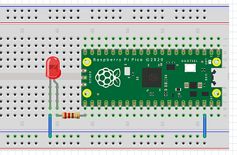

# 3.2 LEDs dimmen

Bisher waren die LEDs an oder aus. Nun wollen wir LEDs dimmen und dazu benötigen wir einen Trick, denn die Pins können nur "an"/"aus". 

## Die Hardware- und Elektronikgrundlagen

Wir benötigen für unsere nächsten Anwendungen:

- Widerstand (220 Ohm)

- LED (rot)

- Drehschalter (Rotary Encoder KY-040) 

Die Pins kennen nur die Zustände "an"/"aus", aber es gibt des Trick der **Pulsweitenmodulation (PWM)**. Hierbei wird der Pin schnell mit einer hohen Frequenz "an"/"aus"-geschaltet.

Der Duty Cycle (Einschaltdauer) ist der Prozentsatz der Zeit, in der das Signal in einem Zyklus "ein" ist.

   - Ein 100% Duty Cycle (Einschaltdauer) bedeutet, dass das Signal die ganze Zeit "ein" ist (volle Leistung).

   - Ein 0% Duty Cycle (Einschaltdauer) bedeutet, dass das Signal die ganze Zeit "aus" ist (keine Leistung).

   - Ein 80% Duty Cycle (Einschaltdauer) bedeutet, dass das Signal 80% der Zeit "ein" und 20% der Zeit "aus" ist.

Die Einschaltdauer bezieht sich also auf den prozentualen Anteil der Zeit, in der der Strom eingeschaltet ist, im Vergleich zur Gesamtzeit des
Zeit des "an"/"aus"-Zyklus. Im folgenden Diagramm ist ein 80% Duty Cycle dargestellt, der die LED somit auch nur mit 80% der Leistung versorgt.
 


## Die Anwendungen

Wir haben hier drei Anwendungen: zuerst lassen wir die rote LED blinken, aber dabei nicht ausgehen, sondern reduzieren die Helligkeit. Danach soll die rote LED langsam heller werden. Anschließend verwenden wir den Drehschalter, um die Helligkeit der LED einzustellen.

### Eine rote LED blinken lassen (100% - 20%)

Wir verwenden folgendes Setup (wie zuvor)

  

- Pin 38 an Masse

- Pin 21 (= GPIO 16) an den Widerstand

- Widerstand an Plus der LED

- Minus der LED an Masse


```python linenums="1"
# Externe LED blinken lassen 100% zu 20%
# J. Thomaschewski, 12.08.2024

from machine import Pin, PWM, Timer

# GPIO 16 auf Pin 21 ist nun ein PWM-Ausgang mit 1000 Hz
led = PWM(Pin(16))
led.freq(1000)  

# Variablen zur Steuerung der Einschaltdauer (Duty Cycle)
dutyCycleHigh = 65535  # 100% Leistung
dutyCycleLow  = 13107  # 20% Leistung (65535 * 0.2)
state = False            # Startzustand der LED "aus"

def blink(timer):
    global state         # globale Variable wird übernommen
    if state:
        led.duty_u16(dutyCycleLow)  # Setze den Duty Cycle auf 20%
    else:
        led.duty_u16(dutyCycleHigh)  # Setze den Duty Cycle auf 100%
    state = not state     # Wechsel des Zustands False <-> True

Timer().init(freq=2, callback=blink)
```


**Zeile 11:** Der Wert 65535 wird verwendet, weil er die maximale Auflösung für den Duty Cycle in der PWM-Implementierung auf dem Raspberry Pi Pico ist. Die Methode duty_u16() erwartet Werte im Bereich von 0 bis 65535, was einer 16-Bit-Auflösung entspricht.

!!! note "Hinweis: Die Zahl 65535"
    Bei `led.duty_u16` sagt die 16 aus, dass es sich um 16 Bit, also 2 hoch 16 Abstufungen (im Binärsystem) handelt. 2 hoch 16 = 65536. Da wir bei "0" beginnen, ist die größtmögliche Zahl die 65535.

!!! question "Script verstehen"
    Was ist im Script fest vorgegeben und was kann man *ändern wie man möchte*?


### Eine rote LED wird langsam heller

Der Aufbau bleibt gleich und wir ändern lediglich das Script

```python linenums="1"
# LED wird langsam heller
# J. Thomaschewski, 13.08.2024

from machine import Pin, PWM
from time import sleep_ms

# GPIO 16 auf Pin 21 ist nun ein PWM-Ausgang mit 1000 Hz
led = PWM(Pin(16))
led.freq(1000)

# Starte mit einem Duty Cycle von 0
duty = 0

# Erhöhe die Helligkeit der LED schrittweise über 3 Sekunden
while duty <= 65535:
    led.duty_u16(duty)  # Setze den Duty Cycle direkt auf den aktuellen Wert
    duty += 65   # Erhöhe den Duty Cycle in angepassten Schritten
    sleep_ms(3)  # Wartezeit von 3 Millisekunden (3 Sekunden / ca. 1000 Schritte)

# LED bleibt auf maximaler Helligkeit
```

!!! question "Sourcecode verstehen"
    Schreiben Sie den Sourcecode so um, dass die LED zuerst 100% hell ist und dann in ca. 3 Sekunden dunkel wird.

### Drehschalter als Input

Bisher haben wir die GPIO-Pins als Output-Pins für LEDs verwendet. Aber nun wollen wir Daten einlesen. Im konkreten Fall wollen wir Eingabewerte des Drehschalters (Bezeichnung KY-040) einlesen.

 

Das hier gezeigte Script basiert auf dem Sourcecode von [Elektronik Kompendium](https://www.elektronik-kompendium.de/sites/raspberry-pi/2703141.htm) und wurde nur leicht abgeändert.


Pinbelegung für Raspberry Pi Pico und KY-040

| Raspberry Pi Pico   | KY-040 |
|---------------------|--------|
| Verbindung zu Masse | GND    |
| Pin 36              | +      |
| Pin 22 - GPIO 17    | SW     |
| Pin 24 - GPIO 18    | DT     |
| Pin 25 - GPIO 19    | CLK    |

Zunächst es muss die [Bibliothek "rotary" von Elektronik Kompendium](https://www.elektronik-kompendium.de/sites/raspberry-pi/code/rotary.py) heruntergeladen und unter dem Namen **rotary.py** auf dem Pi Pico gespeichert werden. 

```python linenums="1"
# LED wird mit Drehschalter geändert
# Original von Elektronik Kompendium 
# https://www.elektronik-kompendium.de/sites/raspberry-pi/2703141.htm
# angepasst von J. Thomaschewski, 13.08.2024

from machine import Pin, PWM
from rotary import Rotary

# GPIOs festlegen (LED auf GPIO 16)
sw  = 17
dt  = 18
clk = 19

# Einstellungen
steps   = 10        # in 10 Schritten änderbar
stepMax = 60000     # 60000 weil nah am Maximum 65535
step    = int(stepMax / steps)

# Initialiserung Drehschalter
rotary  = Rotary(dt, clk, sw)
value   = int(stepMax / 6)

# Initialisierung PWM und LED
led = PWM(Pin(16))
led.freq(1000)
led.duty_u16(value)

# Funktion
def rotary_changed(change):
    global value
    global step
    global stepMax
    if change == Rotary.ROT_CW:
        value = value + step
        print('Rechts (', value, ')')
    elif change == Rotary.ROT_CCW:
        value = value - step
        print('Links (', value, ')')

    # Korrektur, wenn Wert außerhalb des Bereichs
    if value < 0:
        value = 0
    elif value > stepMax:
        value = 65535

    led.duty_u16(value)  # Helligkeit der LED einstellen

# Wenn der Encoder bedient wird
rotary.add_handler(rotary_changed)
```

!!! question "Script verstehen"
    Was ist im Script fest vorgegeben und was kann man *ändern wie man möchte*?

## Python

Folgende Fragen wollen wir nun beantworten:

1. Welche Python Befehle sind in den bisherigen Scripten vorhanden?
2. Welche Operatoren gibt es in Python?
3. Welches sind Aufrufe aus Teilen der Bibliothek?


### 1. Welche Python-Befehle sind in den bisherigen Skripten vorhanden?

| Befehl                   | Erklärung                                                   |
|--------------------------|-------------------------------------------------------------|
| [`from *bibliothek* import *Klasse*`](https://docs.python.org/3/reference/simple_stmts.html#import)  | Importiert die Klasse aus der Bibliothek        |
| [`print(...)`](https://docs.python.org/3/library/functions.html#print)               | Gibt eine Nachricht auf der Konsole aus                     |
| [`def`](https://docs.python.org/3/reference/compound_stmts.html#function-definitions)                      | Definiert eine Funktion                                     |
| [`if`](https://docs.python.org/3/reference/compound_stmts.html#the-if-statement)                       | Bedingte Anweisung                                          |
| [`elif`](https://docs.python.org/3/reference/compound_stmts.html#the-if-statement)                     | Weitere Bedingte Anweisung                                  |
| [`else`](https://docs.python.org/3/reference/compound_stmts.html#the-if-statement)                     | Alternative Bedingte Anweisung                              |
| [`while`](https://docs.python.org/3/reference/compound_stmts.html#the-while-statement)                    | Schleife, die solange eine Bedingung erfüllt ist, wiederholt wird |
| [`global`](https://docs.python.org/3/reference/simple_stmts.html#global)                   | Deklariert eine Variable als global                         |
| [`True`](https://docs.python.org/3/library/constants.html#True), [`False`](https://docs.python.org/3/library/constants.html#False)              | Wahrheitswerte                                              |


### 2. Welche Operatoren gibt es in Python?

A. Rechenoperatoren

| Operator    | Erklärung                                             | Beispiel                |
|-------------|-------------------------------------------------------|-------------------------|
| =           | Zuweisung                                             | a = 5                   |
| +           | Addition                                              | a + b                   |
| -           | Subtraktion                                           | a - b                   |
| *           | Multiplikation                                        | a * b                   |
| **          | Potenzierung                                          | a ** b                  |
| /           | Division                                              | a / b                   |
| %           | Modulus (Restwert einer Division)                     | a % b  (z.B. 10 % 3 ergibt 1) |
| //          | Ganzzahlige Division                                  | a // b (z.B. 10 // 3 ergibt 3)|
| +=          | Addition und Zuweisung                                | a += 3 (z.B. a = 2; a += 3 ergibt 5) |
| -=          | Subtraktion und Zuweisung                             | a -= 2                  |
| *=          | Multiplikation und Zuweisung                          | a *= 2                  |
| **=         | Potenzierung und Zuweisung                            | a **= 2                 |
| /=          | Division und Zuweisung                                | a /= 2                  |
| %=          | Modulus und Zuweisung                                 | a %= 3                  |
| //=         | Ganzzahlige Division und Zuweisung                    | a //= 2                 |

B. Vergleichsoperatoren (die als Ergebnis True / False liefern)

| Operator    | Erklärung                                             | Beispiel                |
|-------------|-------------------------------------------------------|-------------------------|
| ==          | Gleichheit                                            | a == b                  |
| !=          | Ungleichheit                                          | a != b                  |
| <           | Kleiner als                                           | a < b                   |
| >           | Größer als                                            | a > b                   |
| <=          | Kleiner oder gleich                                   | a <= b                  |
| >=          | Größer oder gleich                                    | a >= b                  |
| and         | Logisches UND                                         | a and b                 |
| or          | Logisches ODER                                        | a or b                  |
| not         | Logisches NICHT                                       | not a                   |


Weitere Details zu diesen Operatoren finden Sie in der offiziellen [Python-Dokumentation zu den Operatoren](https://docs.python.org/3/reference/expressions.html#operator-precedence).


### 3. Welches sind Aufrufe aus Teilen der Bibliothek?

| Aufruf                    | Erklärung                                                   |
|---------------------------|-------------------------------------------------------------|
| Pin(...)                  | Initialisiert einen GPIO-Pin                                |
| PWM(...)                  | Initialisiert PWM auf einem GPIO-Pin                        |
| Timer().init(...)         | Initialisiert einen Timer mit einer Frequenz und Callback   |
| sleep_ms(...)             | Pausiert die Ausführung für eine bestimmte Anzahl Millisekunden |
| Rotary(...)               | Initialisiert den Rotary-Encoder                            |
| rotary.add_handler(...)   | Fügt einen Handler für den Rotary-Encoder hinzu             |
| .freq(1000)               | Setzt die Frequenz auf 1000 Hz                               |
| .duty_u16(value)          | Setzt den Duty Cycle auf den angegebenen Wert               |
| .ROT_CW                   | Drehrichtung im Uhrzeigersinn                               |
| .ROT_CCW                  | Drehrichtung gegen den Uhrzeigersinn                        |

