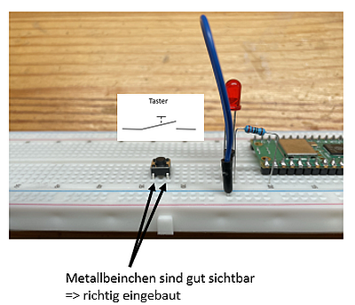
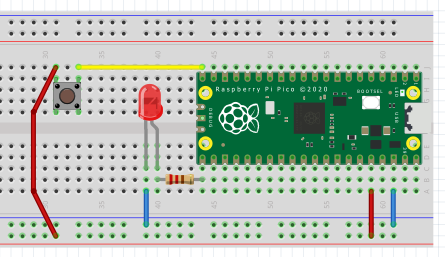

# 3.3 LEDs schalten

Jetzt möchten wir die LED ein- und ausschalten können.

## Die Hardware- und Elektronikgrundlagen

Wir benötigen für unsere nächsten Anwendungen:

- Widerstand (220 Ohm)

- LED (rot)

- Taster 

!!! note "Basis-Wissen Unterschied Taster und Schalter"
    Ein Taster schließt den Stromkreis nur, solange er gedrückt wird, und kehrt nach Loslassen in seine Ausgangsposition zurück, wie bei einer Türklingel oder Tastaturtasten. Ein Schalter hingegen bleibt in der gewählten Position (ein/aus), bis er erneut betätigt wird, und schaltet den Stromkreis dauerhaft ein oder aus, wie bei einem einfachen Lichtschalter.

Die Einbauposition des Tasters ist sehr wichtig. Man muss von vorne auf die beiden Anschlüsse schauen können!




## Die Anwendungen

Wir haben zwei Anwendungen, aber in unterschiedlichen "Qualitätsstufen". Zunächst soll die LED angehen, wenn der Taster gedrückt ist und ausgehen, wenn der Taster nicht mehr gedrückt ist. Anschließend wollen wir den Taster über die Programmierung als Schalter verwenden: einmal drücken = an und erneut drücken = aus.

### Eine rote LED mit einem Taster steuern - 1



- Pin 38 an Masse

- Pin 36 an Plus

- Pin 21 (= GPIO 16) an den Widerstand

- Widerstand an Plus der LED

- Minus der LED an Masse

- Pin 20 (GPIO 15) an den Taster

- Andere Seite des Tasters an Plus

```python linenums="1"
# LED mit Taster - 1
# Datei 3.3a-Taster.py
# J. Thomaschewski, 14.08.2024
from machine import Pin

led    = Pin(16, Pin.OUT)
taster = Pin(15, Pin.IN, Pin.PULL_DOWN)

while True:
    if taster.value() == 1: # Ermittelt automatisch, wenn der Taster gedrückt wird.
        led.on()
    else:
        led.off()
```

Wenn der Taster gedrückt wird, dann bekommt den Wert `taster.value()=1` und in der if-Bedingung steht dann `1=1`, was `True` ist.


!!! question "Script verstehen"
    Bauen Sie das Script so um, dass der Taster die LED aus"tastet".


### Eine rote LED mit einem Taster steuern - 2

Der Aufbau bleibt gleich und wir ändern lediglich das Script. Aber wir wollen uns eine weitere Lösung ansehen, die didaktisch interessant ist. Dazu wiederholen wir noch mal folgendes `led.value(1) = led.high() = led.on()` und `led.value(0) = led.low() = led.off()`. 


```python linenums="1"
# LED mit Taster - 2
# Original Sourcecode von Rui Santos
# https://RandomNerdTutorials.com/raspberry-pi-pico-outputs-inputs-micropython/
# Datei 3.3b-Taster.py
# angepasst von J. Thomaschewski, 14.08.2024

from machine import Pin

led    = Pin(16, Pin.OUT)
taster = Pin(15, Pin.IN, Pin.PULL_DOWN)

while True:
  led.value(taster.value())
```

Hier ist die Logik interessant. Wir haben also wieder eine While-Schleife, die als Endlosschleife funktioniert. 

- taster.value() = 0, wenn nicht gedrückt => Dann steht da: led.value(0), wenn wir den Wert 0 von taster.value() einsetzen!

- taster.value() = 1, wenn gedrückt => Dann steht da: led.value(1), wenn wir den Wert 1 von taster.value() einsetzen!

So wird gerne programmiert und es *"sieht schlimm aus, ist es aber nicht"*.


### Den Taster als Schalter verwenden - Zustand speichern

Der Aufbau bleibt gleich und wir ändern lediglich das Script. Beim einmaligen drücken des Tasters soll die LED angeschaltet werden und beim erneuten Drücken ausgeschaltet werden.

Hier lernen wir zunächst einen **wichtigen "Trick"** der Programmierung kennen!

```python linenums="1"
# Taster mit "Zustand"
# Datei 3.3c-TasterZustand.py
# J. Thomaschewski, 19.10.2024
from machine import Pin

taster = Pin(15, Pin.IN, Pin.PULL_DOWN)
led    = Pin(16, Pin.OUT)

ledStatus = False                   # Hier wird der Antfangszustand festgelegt.

while True:

    if taster.value() == 1:         # Kennen wir schon: wenn der Taster gedrückt wird, dann ist taster.value=1

        ledStatus = not ledStatus   # Hier wird der (Anfangs-)Zustand geändert.
        print(ledStatus)
```

Mit diesem Script können wir also den Status bei jedem Tastendruck ändern. 

Manchmal funktioniert es und manchmal nicht. Das Problem ist der Taster, da die mechanischen Kontakte mehrfach auslösen können. Dies nennt man "prellen". Wir verwenden einen einfachen Workarround, denn das Prellen entsteht beim Tasten in einem Zeitraum von wenigen Millisekunden. Also bauen wir eine kleine zeitliche Verzögerung ein.

### Den Taster als Schalter verwenden - mit Prellschutz 

Der Aufbau bleibt gleich und wir ändern lediglich das Script.

```python linenums="1"
# Taster mit "Zustand"
# Datei 3.3d-TasterZustandPrellschutz.py
# J. Thomaschewski, 19.10.2024
from machine import Pin
from time import sleep

taster = Pin(15, Pin.IN, Pin.PULL_DOWN)
led    = Pin(16, Pin.OUT)

ledStatus = False

while True:
    
    if taster.value() == 1:
        
        ledStatus = not ledStatus
        print(ledStatus)
        sleep(0.2)      # Prellschutz: erst nach 0.2 sec wird die if-Abfrage wiederholt.
```

Der Operator `not` ist für das Wechseln des Status sehr wichtig!

### Den Taster als Schalter verwenden - LEDs schalten 

Das Script für das Ein- und Ausschalten der LED sieht damit wie folgt aus:

```python linenums="1"
# LED mit Taster als Schalter (mit Prellschutz)
# Datei 3.3e-TasterLED.py
# J. Thomaschewski, 19.10.2024
from machine import Pin
from time import sleep

taster = Pin(15, Pin.IN, Pin.PULL_DOWN)
led    = Pin(16, Pin.OUT)

ledStatus = False

while True:
    
    if taster.value() == 1:
        
        ledStatus = not ledStatus
        print(ledStatus)
    
        if ledStatus == True:
            led.on()
        else:
            led.off()
        
        sleep(0.2)      # Prellschutz: erst nach 0.2 sec wird die if-Abfrage wiederholt.
```


Wenn man zu lange drückt, dann fängt die LED an zu blinken. Logisch, oder? 
Soll dies nicht vorkommen, so fügen wir noch eine while-Schleife hinzu, die einfach nur wartet, bis man die Taster losgelassen hat.

```python linenums="1"
# LED mit Taster als Schalter (mit Prellschutz)
# Datei 3.3f-TasterLED-vers2.py
# J. Thomaschewski, 19.10.2024
from machine import Pin
from time import sleep

taster = Pin(15, Pin.IN, Pin.PULL_DOWN)
led    = Pin(16, Pin.OUT)

ledStatus = False

while True:
    
    if taster.value() == 1:
        
        ledStatus = not ledStatus
        print(ledStatus)
    
        if ledStatus == True:
            led.on()
        else:
            led.off()
        
        sleep(0.2)      # Prellschutz: erst nach 0.2 sec wird die if-Abfrage wiederholt.
        while taster.value() == 1:  # Schleife läuft, bis der Taster loegelassen wurde.
            pass
```

!!! warning "Scripte sind didaktische Beispiele!"
    Dieses Script (wie auch alle anderen bisher gezeigten Scripte) eignet sich nicht für den produktiven Einsatz in irgendwelchen kritischen Systemen. Der hier vorgenommene Prellschutz ist *"viel zu einfach gedacht"*, aber didaktisch leicht vermittelbar und eine Lösung für unsere einfachen Anwendungen.


## Python

Wir müssen nachsehen, was `taster = Pin(15, Pin.IN, Pin.PULL_DOWN)` macht. Die Dokumentation gibt es hier: [https://docs.micropython.org/en/latest/](https://docs.micropython.org/en/latest/).


!!! question "Aufgabe"
    Erstellen sie ein Script für eine Fußgängerampel. WICHTIG: vor der Programmierung überlegen sie sich die Logik, die sie programmieren möchten und dann gehen sie in kleinen Schritten vor!