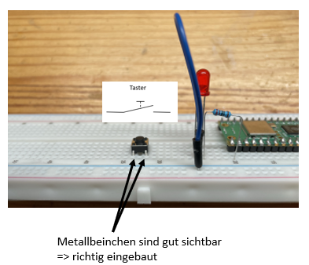
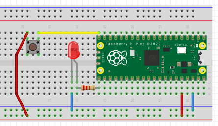

# 3.3 LEDs schalten

Jetzt möchten wir die LED ein- und ausschalten können.

## Die Hardware- und Elektronikgrundlagen

Wir benötigen für unsere nächsten Anwendungen:

- Widerstand (220 Ohm)

- LED (rot)

- Taster 

!!! note "Basis-Wissen Unterschied Taster und Schalter"
    Ein Taster schließt den Stromkreis nur, solange er gedrückt wird, und kehrt nach Loslassen in seine Ausgangsposition zurück, wie bei einer Türklingel oder Tastaturtasten. Ein Schalter hingegen bleibt in der gewählten Position (ein/aus), bis er erneut betätigt wird, und schaltet den Stromkreis dauerhaft ein oder aus, wie bei einem einfachen Lichtschalter.

Die Einbauposition des Tasters ist sehr wichtig. Man muss von vorne auf die beiden Anschlüsse schauen können!




## Die Anwendungen

Wir haben zwei Anwendungen, aber in unterschiedlichen "Qualitätsstufen". Zunächst soll die LED angehen, wenn der Taster gedrückt ist und ausgehen, wenn der Taster nicht mehr gedrückt ist. Anschließend wollen wir den Taster über die Programmierung als Schalter verwenden: einmal drücken = an und erneut drücken = aus.

### Eine rote LED mit einem Taster steuern - 1



- Pin 38 an Minus

- Pin 36 an Plus

- Pin 21 (GPIO 16) an den Widerstand

- Widerstand an Plus der LED

- Minus der LED an Minus

- Pin 20 (GPIO 15) an den Taster

- Andere Seite des Tasters an Plus

```python linenums="1"
# LED mit Taster - 1
# J. Thomaschewski, 14.08.2024
from machine import Pin

taster = Pin(15, Pin.IN, Pin.PULL_DOWN)
led    = Pin(16, Pin.OUT)

while True:
    if taster.value() == 1:
        led.on()
    else:
        led.off()
```

!!! question "Sourcecode verstehen"
    Bauen Sie das Script so um, dass der Taster die LED aus"tastet".


### Eine rote LED mit einem Taster steuern - 2

Der Aufbau bleibt gleich und wir ändern lediglich das Script. Aber wir wollen uns eine weitere Lösung ansehen, die didaktisch interessant ist. 


```python linenums="1"
# LED mit Taster - 2
# Original Sourcecode von Rui Santos
# https://RandomNerdTutorials.com/raspberry-pi-pico-outputs-inputs-micropython/
# angepasst von J. Thomaschewski, 14.08.2024

from machine import Pin

led    = Pin(16, Pin.OUT)
taster = Pin(15, Pin.IN, Pin.PULL_DOWN)

while True:
  led.value(taster.value())
```

Hier ist die Logik interessant. Wir haben also wieder eine While-Schleife, die als Endlosschleife funktioniert. 

- taster.value() = 0, wenn nicht gedrückt => Dann steht da: led.value(0), wenn wir den Wert 0 von taster.value() einsetzen!

- taster.value() = 1, wenn nicht gedrückt => Dann steht da: led.value(1), wenn wir den Wert 1 von taster.value() einsetzen!

So wird gerne programmiert und es *"sieht schlimm aus, ist es aber nicht"*.


### Den Taster als Schalter verwenden

Der Aufbau bleibt gleich und wir ändern lediglich das Script. Beim einmaligen drücken des Tasters soll die LED angeschaltet werden und beim erneuten Drücken ausgeschaltet werden.

```python linenums="1"
# LED mit Taster als Schalter
# J. Thomaschewski, 14.08.2024
from machine import Pin

taster = Pin(15, Pin.IN, Pin.PULL_DOWN)
led    = Pin(16, Pin.OUT)

# Funktion LED schalten
def toggleLed(pin):
    led.toggle()
    
# Taster-Auslösung
taster.irq(trigger=Pin.IRQ_RISING, handler=toggleLed)
```
Manchmal funktioniert es und manchmal nicht. Das Problem ist der Taster, da die mechanischen Kontakte mehrfach auslösen können. Dies nennt man "prellen". Wir verwenden einen einfachen Workarround, denn das Prellen entsteht beim Tasten in einem Zeitraum von wenigen Millisekunden. Also bauen wir eine kleine zeitliche Verzögerung ein.

### Den Taster als Schalter verwenden - mit Prellschutz 

Der Aufbau bleibt gleich und wir ändern lediglich das Script.

```python linenums="1"
# LED mit Taster als Schalter und Verzögerung
# J. Thomaschewski, 14.08.2024
from machine import Pin
from time import sleep

taster = Pin(15, Pin.IN, Pin.PULL_DOWN)
led    = Pin(16, Pin.OUT)

# Funktion LED schalten
def toggleLed(pin):
    led.toggle()
    sleep(0.1)
    
# Taster-Auslösung
taster.irq(trigger=Pin.IRQ_RISING, handler=toggleLed)
```

!!! warning "Scripte sind didaktische Beispiele!"
    Dieses Script (wie auch alle anderen bisher gezeigten Scripte) eignet sich nicht für den produktiven Einsatz in irgendwelchen kritischen Systemen. Der hier vorgenommene Prellschutz ist *"viel zu einfach gedacht"*, aber didaktisch leicht vermittelbar und eine Lösung für unsere einfachen Anwendungen.


## Python

Wir müssen nachsehen, was `taster = Pin(15, Pin.IN, Pin.PULL_DOWN)` und `taster.irq(trigger=Pin.IRQ_RISING, handler=toggleLed)` machen. Die Dokumentation gibt es hier: [https://docs.micropython.org/en/latest/](https://docs.micropython.org/en/latest/).


!!! note "Erklärung der beiden Zeilen duch CharGPT 4o am 14.08.2024"
    ***Prompt***: Erkläre im Detail die beiden Zeilen, insbesondere die Parameter Pin.PULL_DOWN und .irq und IRQ_RISING des microPython Sourcecode für Studierende im 1. Semester in Textform oder in einer Tabelle, jedoch ohne ein Sourcecodebeispiel. `taster = Pin(15, Pin.IN, Pin.PULL_DOWN)` und     `taster.irq(trigger=Pin.IRQ_RISING, handler=toggleLed)`

    ***Antwort (gekürzt)***

    **Pin(15, Pin.IN, Pin.PULL_DOWN)**

    Diese Zeile erstellt ein Pin-Objekt `taster` für Pin Nummer 15 des Microcontrollers. Hier sind die wichtigsten Parameter im Detail:

    | Parameter | Beschreibung |
    |-----------|---------------|
    | 15        | Der Pin auf dem Microcontroller, der verwendet wird. In diesem Fall ist es Pin 15. |
    | Pin.IN    | Stellt den Pin als Eingang ein. Das bedeutet, der Pin liest den Zustand (High oder Low), anstatt einen Zustand zu setzen. |
    | Pin.PULL_DOWN | Aktiviert den internen Pull-Down-Widerstand. Ein Pull-Down-Widerstand sorgt dafür, dass der Pin standardmäßig auf Low (0V) gesetzt ist, wenn kein Signal anliegt. Dies verhindert, dass der Pin „floatet“ und zufällige Werte liest. |

    **taster.irq(trigger=Pin.IRQ_RISING, handler=toggleLed)**
    
    Diese Zeile richtet einen Interrupt für den Pin `taster` ein. Ein Interrupt ist ein Signal, das den normalen Ablauf des Programms unterbricht, um eine spezielle Funktion (den Handler) auszuführen. Die Parameter im Detail:

    | Parameter | Beschreibung |
    |-----------|---------------|
    | trigger=Pin.IRQ_RISING | Der Interrupt wird ausgelöst, wenn die Signalflanke von Low nach High wechselt (ansteigende Flanke). Das bedeutet, der Interrupt wird aktiviert, wenn der Taster gedrückt wird und der Pin von 0V auf 3.3V wechselt. |
    | handler=toggleLed | Dies ist die Funktion, die ausgeführt wird, wenn der Interrupt ausgelöst wird. In diesem Fall würde eine Funktion namens `toggleLed` aufgerufen werden, die typischerweise eine LED umschaltet. |

    Diese Konfiguration ermöglicht es, schnell und effizient auf Änderungen an einem Pin zu reagieren, was besonders nützlich in Anwendungen ist, bei denen eine sofortige Reaktion auf Benutzereingaben oder externe Signale erforderlich ist.


!!! question "Aufgabe"
    Erstellen sie ein Script für eine Fußgängerampel. WICHTIG: vor der Programmierung überlegen sie sich die Logik, die sie programmieren möchten und dann gehen sie in kleinen Schritten vor!