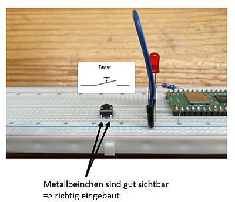
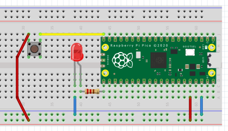
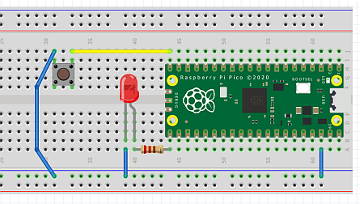

# 3.3 LEDs schalten

Jetzt möchten wir die LED ein- und ausschalten können.

## Die Hardware- und Elektronikgrundlagen

Wir benötigen für unsere nächsten Anwendungen:

- Widerstand (220 Ohm)

- LED (rot)

- Taster 

!!! note "Basis-Wissen Unterschied Taster und Schalter"
    Ein Taster schließt den Stromkreis nur, solange er gedrückt wird, und kehrt nach Loslassen in seine Ausgangsposition zurück, wie bei einer Türklingel oder Tastaturtasten. Ein Schalter hingegen bleibt in der gewählten Position (ein/aus), bis er erneut betätigt wird, und schaltet den Stromkreis dauerhaft ein oder aus, wie bei einem einfachen Lichtschalter.

Die Einbauposition des Tasters ist sehr wichtig. Man muss von vorne auf die beiden Anschlüsse schauen können!




## Die Anwendungen

Wir haben zwei Anwendungen, aber in unterschiedlichen "Qualitätsstufen". Zunächst soll die LED angehen, wenn der Taster gedrückt ist und ausgehen, wenn der Taster nicht mehr gedrückt ist. Anschließend wollen wir den Taster über die Programmierung als Schalter verwenden: einmal Drücken = an und erneut drücken = aus.

### Eine rote LED mit einem Taster steuern - 1a (Pin.PULL_DOWN)

!!! danger "Folgender Sourcecode für Raspberry Pi Pico W, nicht aber für Raspberry Pi 2 Pico W"
    Der folgende Sourcecode funktioniert für den Raspberry Pi Pico W, aber nicht für die Version 2025 des Raspberry Pi 2 Pico W!

    Der Raspberry Pi 2 Pico W aus 2024/2025 hat ein Problem mit **Pin.PULL_DOWN** und muss stattdessen **Pin.PULL_UP** nutzen. Also folgt hier nun eine kleine Erklärung zu den Unterschieden zwischen **Pin.PULL_DOWN** und **Pin.PULL_UP** sowie im Anschluss der Sourcecode für den Raspberry Pi 2 Pico W.

    Wenn ein Pin als Eingang genutzt wird, dann kann man dem Pin intern in einen definierten Zustand versetzen. 
    - Bei Pin.PULL_DOWN wird der entsprechende Eingang auf 0V gesetzt und über den Taster ein Plus-Signal gesendet. Dies ist didaktisch oftmals einfacher zu verstehen und daher "der Standard". Aber bei der Version 2025 des Raspberry Pi 2 Pico W funktioniert dies nicht. 
    - Bei Pin.PULL_UP wird der entsprechende Eingang auf 3,3V gesetzt und über den Taster ein Minus-Signal gesendet, was auch möglich ist (und bei Version 2025 des Raspberry Pi 2 Pico W auch funktioniert.) 



- Pin 38 an Masse

- Pin 36 an Plus

- Pin 21 (= GPIO 16) an den Widerstand

- Widerstand an Plus der LED

- Minus der LED an Masse

- Pin 20 (GPIO 15) an den Taster

- Andere Seite des Tasters an Plus

```python linenums="1"
# LED mit Taster - 1
# Datei 3.3a-Taster.py
# J. Thomaschewski, 14.08.2024
from machine import Pin

led    = Pin(16, Pin.OUT)
taster = Pin(15, Pin.IN, Pin.PULL_DOWN) 

while True:
    if taster.value() == 1: # Ermittelt automatisch, wenn der Taster gedrückt wird.
        led.on()
    else:
        led.off()
```

Wenn der Taster gedrückt wird, dann bekommt er den Wert `taster.value()=1` und in der if-Bedingung steht dann `1=1`, was `True` ist.

### Eine rote LED mit einem Taster steuern - 1b (Pin.PULL_UP)




- Pin 38 an Masse

- Pin 21 (= GPIO 16) an den Widerstand

- Widerstand an Plus der LED

- Minus der LED an Masse

- Pin 20 (GPIO 15) an den Taster

- Andere Seite des **Tasters nun an Masse**

```python linenums="1"
# LED mit Taster - 1
# Datei 3.3a-Taster-PULL_UP.py
# J. Thomaschewski, 03.01.2026
from machine import Pin

led    = Pin(16, Pin.OUT)
taster = Pin(15, Pin.IN, Pin.PULL_UP) 

while True:
    if taster.value() == 0: # Ermittelt automatisch, wenn der Taster gedrückt wird.
        led.on()
    else:
        led.off()
```

Wenn der Taster gedrückt wird, dann bekommt **er nun den Wert `taster.value()=0`** und in der if-Bedingung steht dann `0=0`, was `True` ist.

!!! question "Script verstehen"
    Bauen Sie das Script so um, dass der Taster die LED aus "tastet".

!!! danger "Ab hier selbst von Pin.PULL_DOWN auf Pin.PULL_UP anpassen"
    **Ab hier wissen wir ja nun, wie Pin.PULL_DOWN und Pin.PULL_UP funktionieren. Wenn Sie die Version 2025 des Raspberry Pi 2 Pico W haben, dann müssen Sie dies nun immer selbständig korrigieren.**


### Eine rote LED mit einem Taster steuern - 2

Der Aufbau bleibt gleich und wir ändern lediglich das Script. Aber wir wollen uns eine weitere Lösung ansehen, die didaktisch interessant ist. Dazu wiederholen wir noch mal folgendes `led.value(1) = led.high() = led.on()` und `led.value(0) = led.low() = led.off()`. 


```python linenums="1"
# LED mit Taster - 2
# Original Sourcecode von Rui Santos
# https://RandomNerdTutorials.com/raspberry-pi-pico-outputs-inputs-micropython/
# Datei 3.3b-Taster.py
# angepasst von J. Thomaschewski, 14.08.2024

from machine import Pin

led    = Pin(16, Pin.OUT)
taster = Pin(15, Pin.IN, Pin.PULL_DOWN)

while True:
  led.value(taster.value())
```

Hier ist die Logik interessant. Wir haben also wieder eine While-Schleife, die als Endlosschleife funktioniert. 

- taster.value() = 0, wenn nicht gedrückt => Dann steht da: led.value(0), wenn wir den Wert 0 von taster.value() einsetzen!

- taster.value() = 1, wenn gedrückt => Dann steht da: led.value(1), wenn wir den Wert 1 von taster.value() einsetzen!

So wird gerne programmiert und es *"sieht schlimm aus, ist es aber nicht"*.

??? info "Angepasst für den Pi 2 Pico W aus 2024/2025 mit Pin.PULL_UP"
    Wenn wir nur  Pin.PULL_DOWN durch Pin.PULL_UP erestzen, dann ist die LED die ganze Zeit an und geht bei Druck auf den Taster aus. Wenn wir aber das gegenteilige Verhalten haben möchten, dann müssen wir ein `not taster.value()` verwenden.

    ```python linenums="1"
    # LED mit Taster - 2b Pin-PULL_UP
    # Original Sourcecode von Rui Santos
    # https://RandomNerdTutorials.com/raspberry-pi-pico-outputs-inputs-micropython/
    # Datei 3.3b-Taster-PULL-UP.py
    # angepasst von J. Thomaschewski, 04.01.2026

    from machine import Pin

    led    = Pin(16, Pin.OUT)
    taster = Pin(15, Pin.IN, Pin.PULL_UP)

    while True:
        led.value(not taster.value())
    ```


### Den Taster als Schalter verwenden - Zustand speichern

Der Aufbau bleibt gleich und wir ändern lediglich das Script. Beim einmaligen drücken des Tasters soll die LED angeschaltet werden und beim erneuten Drücken ausgeschaltet werden.

Hier lernen wir zunächst einen **wichtigen "Trick"** der Programmierung kennen!

```python linenums="1"
# Taster mit "Zustand"
# Datei 3.3c-TasterZustand.py
# J. Thomaschewski, 19.10.2024; verbessert 04.01.2026
from machine import Pin
import time

taster = Pin(15, Pin.IN, Pin.PULL_UP)
led    = Pin(16, Pin.OUT)

ledStatus = False

while True:
    if taster.value() == 0:
        ledStatus = not ledStatus
        led.value(ledStatus)
        print(ledStatus)
    time.sleep_ms(50)   
```

- Der Operator `not` (Zeile 14) ist für das Wechseln des Status sehr wichtig!

- Mit diesem Script können wir also den Status bei jedem Tastendruck ändern. 

- Manchmal funktioniert es und manchmal nicht (dies sieht man gut an der True False Ausgabe im Terminalfenster). Das Problem ist der Taster, da die mechanischen Kontakte mehrfach auslösen können. Dies nennt man "prellen". Wir verwenden einen einfachen Workaround, denn das Prellen entsteht beim Tasten in einem Zeitraum von wenigen Millisekunden. Also bauen wir eine kleine zeitliche Verzögerung ein.

!!! inportant "Mechanische Taster liefern **kein sauberes digitales Signal**"
    Beim Drücken und Loslassen prellen die Kontakte für einige Millisekunden, wodurch schnelle Wechsel zwischen `0` und `1` entstehen.

    Da die `while True`-Schleife sehr schnell läuft, kann ein einzelner Tastendruck ohne Entprellung als **mehrere Tastendrücke** erkannt werden.

    Merke: Ein Taster ist Mechanik – deshalb muss die Software das Signal entprellen.


### Den Taster als Schalter verwenden - mit Prellschutz 

Der Aufbau bleibt gleich und wir ändern lediglich das Script.

```python linenums="1"
# Taster mit "Zustand"
# Datei 3.3d-TasterZustandPrellschutz.py
# J. Thomaschewski, 19.10.2024; komplett überarbeitet 04.01.2026
from machine import Pin
import time

taster = Pin(15, Pin.IN, Pin.PULL_UP)
led    = Pin(16, Pin.OUT)

ledStatus = False
led.value(ledStatus)

while True:
    if taster.value() == 0:               # gedrückt
        time.sleep_ms(30)                 # entprellen
        if taster.value() == 0:           # immer noch gedrückt?
            ledStatus = not ledStatus
            led.value(ledStatus)
            print(ledStatus)

            while taster.value() == 0:    # warten bis losgelassen
                time.sleep_ms(10)

            time.sleep_ms(30)             # entprellen beim Loslassen
```


**1. Tastendruck erkennen (Zeile 14)**  
In Zeile 14 wird geprüft, ob der Taster gedrückt ist.  
Bei `Pin.PULL_UP` bedeutet `taster.value() == 0`, dass der Taster geschlossen ist.

**2. Kurze Wartezeit – Entprellen (Zeile 15)**  
In Zeile 15 wird mit `time.sleep_ms(30)` eine kurze Pause eingefügt.  
Diese Wartezeit überbrückt die Prellphase des Tasters.

**3. Bestätigung des Tastendrucks (Zeile 16)**  
In Zeile 16 wird der Taster erneut abgefragt.  
Nur wenn der Taster nach der Wartezeit weiterhin gedrückt ist, gilt der Tastendruck als gültig und der LED-Zustand wird geändert.

**4. Warten bis zum Loslassen (Zeilen 21–22)**  
In den Zeilen 20–21 wartet das Programm, bis der Taster wieder losgelassen wird.  
So wird sichergestellt, dass **pro Tastendruck nur ein Zustandswechsel** erfolgt.

!!! question "Script verstehen"
    Löschen Sie mal die Zeilen 21-22 und drücken Sie den Taster nur **sehr kurz**. Alles funktionert wie gewünscht. Aber sobald Sie auch nur etwas länger drücken "ist es kompisch". Versuchen Sie zu verstehen, woran dies liegt.

---


!!! warning "Diese Scripte sind didaktische Beispiele!"
    Dieses Script (wie auch alle anderen bisher gezeigten Scripte) eignet sich nicht für den produktiven Einsatz in irgendwelchen kritischen Systemen. Der hier vorgenommene Prellschutz ist *"viel zu einfach gedacht"*, aber didaktisch leicht vermittelbar und eine Lösung für unsere einfachen Anwendungen.


## Python

Wir müssen nachsehen, was `taster = Pin(15, Pin.IN, Pin.PULL_DOWN)` macht. Die Dokumentation gibt es hier: [https://docs.micropython.org/en/latest/](https://docs.micropython.org/en/latest/).


!!! question "Aufgabe"
    Erstellen Sie ein Script für eine Fußgängerampel. WICHTIG: vor der Programmierung überlegen Sie sich die Logik, die sie programmieren möchten und dann gehen sie in kleinen Schritten vor!