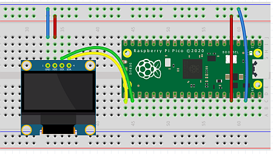

# 3.4 I2C und Display steuern

Wir können mit dem Pi Pico noch so viel mehr steuern. Die LEDs waren ja nur ein einfacher Anfang. Spannend wird auch, dass wir ein Display sehr einfach einbinden können. 


## Die Hardware- und Elektronikgrundlagen

Wir benötigen für unsere nächsten Anwendungen:

- Taster 

- OLED Display SSD 1306

    

!!! note "Basis-Wissen OLED-Display"
    Das OLED Display SSD1306 wird in Elektronikprojekten oft verwendet. Es ist günstig, klein, hat einen hohen Kontrast und einen relativ niedrigen Stromverbrauch, da nur die beleuchteten Pixel Strom verbrauchen. Das Display basiert auf der OLED-Technologie (Organic Light Emitting Diode), bei der jede Pixel einzeln leuchtet.

    - **Auflösung**: 128x64 Pixel, Schwarz-Weiß
    - **Schnittstellen**: I2C oder SPI (wir verwenden die I2C-Version)
    - **Betriebsspannung**: 3,3V oder 5V (wir verwenden die 3,3V-Version)

Die Datenübertragung findet per I2C statt. Für den I2C-Betrieb werden in der Regel vier Pins verwendet:

- **VCC**: Versorgungsspannung (3,3V oder 5V)

- **GND**: Erdung

- **SCL**: I2C Clock (Signal für die Synchronisation der Datenübertragung)

- **SDA**: I2C Data (Signal für die Datenübertragung)

!!! note "Basis-Wissen I2C"
    I2C (Inter-Integrated Circuit) ist eine weit verbreitete serielle Kommunikation in Elektronikprojekten und ermöglicht die Verbindung zwischen einem Mikrocontroller und verschiedenen Peripheriegeräten über nur zwei Datenleitungen, was die Verkabelung vereinfacht.

    I2C verwendet für jeden Gerätetyp eine eindeutige Adresse, um unterschiedliche Geräte an denselben Leitungen anzuschließen und trotzdem zu unterscheiden. 

    
## Die Anwendungen

Zunächst nehmen wir das Display in Betrieb (natürlich mit einem Hello World) und dazu benötigen wir die eindeutige I2C-Adresse des OLED-Displays.  

### I2C-Scanner zur Emittlung der Adresse

Jetzt kann man im Pinout auch erkennen, welche Pins sich für SDA bzw. SCL eignen. Wir nehmen Pin 21 als SDA und Pin 22 als SCL


Der Aufbau sieht wir folgt aus:

 


Somit haben wir folgende Anschlüsse

- Pin 38 an Masse

- Pin 36 an Plus

- Pin 21 (= GPIO 16, gelb) an OLED-Display SDA

- Pin 22 (= GPIO 17, grün) an OLED-Display SCL

- OLED-Display mit Plus und Masse verbinden


```python linenums="1"
# I2C Scanner
# Original Sourcecode von Rui Santos
# https://randomnerdtutorials.com/raspberry-pi-pico-ssd1306-oled-micropython/
# angepasst von J. Thomaschewski, 14.08.2024
from machine import Pin, I2C

i2c = I2C(id=0, scl=Pin(17), sda=Pin(16), freq=10000)

print('I2C SCANNER')
devices = i2c.scan()

if len(devices) == 0:
    print("No i2c device !")

else:
    print('i2c devices found:', len(devices))

    for device in devices:
        print("I2C hexadecimal address: ", hex(device))
```

Die Ausgabe lautet bei unserem OLED-Display:

    I2C SCANNER

    i2c devices found: 1

    I2C hexadecimal address:  0x3c

Damit haben wir die Adresse für das OLED-Display ermittelt: **0x3c**

### OLED-Display "Hello World"

Zunächst benötigen wir die Bibliothek für das OLED-Display. 

**Achtung**: es gibt unterschiedliche Bibliotheken für das SSD1306-OLED-Display, auch wenn diese den identischen Dateinamen *ssd1306.py* verwenden. Hier mal eine Liste nach kurzer Suche gefundenen Bibliotheken.

- **[Adafruit MicroPython SSD1306](https://github.com/adafruit/micropython-adafruit-ssd1306)**: Diese Bibliothek stammt vom Hersteller Adafruit ist eine der Standardbibliotheken für SSD1306-Displays unter MicroPython. Sie wird nicht mehr aktiv weiterentwickelt. Die [Nachfolge-Bibliotheken](https://github.com/adafruit/Adafruit_CircuitPython_SSD1306) von Adafruit eignen sich sehr gut für umfangreiche Projekte, ist aber für die Beispiele hier zu komplex.

    - **[stlehmann/micropython-ssd1306](https://github.com/stlehmann/micropython-ssd1306)**: Diese Bibliothek ist ein Fork der ursprünglichen MicroPython-SSD1306-Treiber und bietet eine Installation über upip, den MicroPython-Paketmanager. Sie hat eine ähnliche API wie die Originalbibliothek von Adafruit.

- **[Rui Santos MicroPython SSD1306](https://raw.githubusercontent.com/RuiSantosdotme/ESP-MicroPython/master/code/Others/OLED/ssd1306.py)**: Diese Bibliothek wurde von Rui Santos als Teil eines [MicroPython-Tutorials](https://randomnerdtutorials.com/raspberry-pi-pico-ssd1306-oled-micropython/) entwickelt. Sie bietet grundlegende Funktionen zur Steuerung von SSD1306-Displays über I2C. Die Bibliothek ist auf Einfachheit ausgelegt, was sie ideal für Anfänger*innen macht.

- **[FelixSchladt/Micropython-SSD1306-GFX](https://github.com/FelixSchladt/Micropython-SSD1306-GFX?tab=readme-ov-file)**: Diese Bibliothek bietet zusätzliche GFX-Funktionen, die es ermöglichen, geometrische Formen wie Kreise, Rechtecke und Linien auf dem Display zu zeichnen. 

- **[TimHanewich/MicroPython-SSD1306](https://github.com/TimHanewich/MicroPython-SSD1306)**: Diese Bibliothek ist darauf ausgelegt, Bitmap-Grafiken auf dem SSD1306-Display anzuzeigen. Sie enthält Funktionen, um Bilder in das entsprechende Bitmuster für die Anzeige auf dem OLED zu konvertieren. Die Beispielseite ist sehr interessant! 

**Merke**: es ist sehr zu empfehlen, bei eigenen Programmierungen zunächst einmal zu recherchieren, welche Bibliotheken es gibt und wie die Bibliothek zum Projekt passt.  

Wir verwenden hier die Bibliothek von **[TimHanewich/MicroPython-SSD1306](https://github.com/TimHanewich/MicroPython-SSD1306)**. Somit ist diese Datei [ssd1306.py](https://github.com/TimHanewich/MicroPython-SSD1306/blob/master/src/ssd1306.py) in Thonny einzufügen und auf dem Pi Pico unter dem Namen ssd1306.py abzuspeichern. 

Anschließend diesen Sourcecode ganz normal in Thonny kopieren.

```python linenums="1"
# OLED-Display (I2C) mit Hello World
# J. Thomaschewski, 16.08.2024

from machine import Pin, SoftI2C
from ssd1306 import SSD1306_I2C  # Import der TimHanewich SSD1306 I2C-Klasse

# Initialisierung der I2C-Pins 
i2c = SoftI2C(scl=Pin(17), sda=Pin(16))

# Initialisierung des OLED-Displays mit expliziter I2C-Adresse
oled = SSD1306_I2C(128, 64, i2c, addr=0x3C)

# In der Klammer: Text, x-Startwert, y-Startwert von oben links
oled.fill(0)  # Bildschirm löschen
oled.text('Hello, World 1!', 0, 0)
oled.text('Hello, World 2!', 0, 10)
oled.text('Hello, World 3!', 0, 20)

oled.show()  # Aktualisiere das Display, um den Text anzuzeigen
```

Ist es nicht wundervoll einfach!?

??? example "Ein schönes, etwas komplexeres OLED-Display Beispiel von Tim Hanewich"
        
    Nun verwenden wir das [hier](https://github.com/TimHanewich/MicroPython-SSD1306/tree/master) angegebene Beispiel. 


    ```python linenums="1"
    # OLED-Display (I2C) Beispiel
    # Basieren auf Sourcecode von Tim Hanewich
    # https://github.com/TimHanewich/MicroPython-SSD1306/tree/master
    # leicht abgeändert von J. Thomaschewski, 16.08.2024

    from machine import Pin, SoftI2C
    from time import sleep
    from ssd1306 import SSD1306_I2C
    import framebuf

    # create I2C interface
    i2c = SoftI2C(scl=Pin(17), sda=Pin(16))
    print(i2c.scan()) # 0x3c is the I2C address of the SSD1306. As an integer, 60.

    oled = SSD1306_I2C(128, 64, i2c, addr=0x3C)

    # fill in a single pixel
    oled.fill(0)
    oled.pixel(0, 0, 1) # turn on pixel at (0, 0) (top left)
    oled.pixel(64, 0, 1) # turn on pixel at (64, 0), middle top
    oled.pixel(127, 63, 1) # turn on pixel at (127, 63) (absolute bottom right on my 128x64 display)
    oled.show() # show the update
    sleep(1)

    # display text
    oled.fill(0)
    oled.text("Hello, world!", 0, 0) # print text "Hello, world!" at position (0, 0) (top left)
    oled.show()
    sleep(1)


    # Load smiley face image and display
    # The below bytearray is a buffer representation of a 32x32 smiley face image. This is explained in this documentation below - continue reading!
    oled.fill(0)
    smiley = bytearray(b'\x00?\xfc\x00\x00\xff\xff\x00\x03\xff\xff\xc0\x07\xe0\x07\xe0\x0f\x80\x01\xf0\x1f\x00\x00\xf8>\x00\x00|<\x00\x00<x\x00\x00\x1epx\x1e\x0e\xf0x\x1e\x0f\xe0x\x1e\x07\xe0x\x1e\x07\xe0\x00\x00\x07\xe0\x00\x00\x07\xe0\x00\x00\x07\xe1\xc0\x03\x87\xe1\xc0\x03\x87\xe1\xc0\x03\x87\xe1\xe0\x07\x87\xe0\xf0\x0f\x07\xf0\xf8\x1f\x0fp\x7f\xfe\x0ex?\xfc\x1e<\x0f\xf0<>\x00\x00|\x1f\x00\x00\xf8\x0f\x80\x01\xf0\x07\xe0\x07\xe0\x03\xff\xff\xc0\x00\xff\xff\x00\x00?\xfc\x00')
    fb = framebuf.FrameBuffer(smiley, 32, 32, framebuf.MONO_HLSB) # load the 32x32 image binary data in to a FrameBuffer
    oled.blit(fb, 0, 0) # project or "copy" the loaded smiley image FrameBuffer into the OLED display at position 0,0 (the top left of the smiley will touch the top left corner of the display)
    oled.show()
    sleep(1)


    # load buffer
    oled.fill(0)
    hello_world_buf = bytearray(b'\x00\x00\x00\x00\x00\x00\x00\x00\x00\x00\x00\x00\x00\x00\x00\x00\x00\x00\x00\x00\x00\x00\x00\x00\x00\x00\x00\x00\x00|\x03\x00\x00\x00\x00\x00\x00\x00\x00\x00\x00\x00\x00\x00\x00\xfe\x0f\x80\x00\x00\x00\x00\x00\x00\x00@\x00\x00\x00\x00\x01\xff?\xc0\x00\x00\x00\x00\x00\x00\x00\xe0\x00\x00\x00\x00\x01\xe7\xff\xc0\x00\x00\x00\x04\x00\x00\x00\xe0\x00\x00\x00\x00\x01\xc7\xf9\xc0\x00\x00\x10\x0e\x00\x00\x00\xe0\x00\x00\x00\x00\x01\xc7\xe1\xc0\x00\x008\x0e\x00\x00\x00\xe1\x00\x00\x00\x00\x01\xc3\xc1\xc0\x00\x008\x0e\x00\x00\x00\xe3\x80\x00\x00\x00\x01\xc0\x01\xc0\x00\x008\x0e\x00\x00\x00\xe3\x80\x00\x00\x00\x01\xc0\x03\xc0\x00\x00x\x0e\x00\x00\x00\xe3\x80\x00\x00\x00\x01\xc0\x03\x80\x00\x00p\x0e\x00\x00\x00\xe3\x80\x00\x00\x00\x01\xc0\x07\x80\x00\x00p\x0e\x01\xfc\x00\xe3\x80\x00\x00\x00\x01\xe0\x0f\x80\x00\x00p\x0f\xc3\xfe\x00\xe3\x80\x00\x00\x00\x00\xf0?\x00\x00\x00\xf7\xff\xe7\xfe\x00\xe3\x80\x07\x00\x00\x00\x7f\xfe\x00\x00\x00\xef\xff\xef\x8e\x00\xe3\x80\x0f\x80\x00\x00?\xfc\x00\x00\x00\xe7\xfe\x0f\x0e\x00\xe3\x80\x1f\x80\x00\x00\x1f\xf0\x00\x00\x00\xe0\x1c\x1e\x1e\x00\xe3\x80?\x80\x00\x00\x0f\x00\x00\x00\x00\xe0\x1c\x1f\xfe\x00\xe3\x80\x7f\x80\x00\x00\x00\x00\x00\x00\x00\xe0<\x1f\xfc\x00\xe3\x80\xf3\x80\x00\x00\x00\x00\x00\x00\x01\xe08\x1f\xf8\x00\xe3\x81\xe3\x80\x00\x00\x00\x00\x00\x00\x01\xc08\x0f\x00\x00\xe3\x81\xe3\x80\x00\x00\x00\x00\x00\x00\x01\xc08\x07\xe0\x00\xe3\x81\xc3\x80\x00\x00\x00\x00\x00\x00\x01\xc08\x03\xfc@\xe3\x81\xc3\x80\x00\x00\x00\x00\x00\x00\x01\xc08\x01\xff\xe0c\x81\xc7\x80\x00 \x00\x00\x00\x00\x01\xc0x\x00?\xe0\x01\x81\xcf\x00\x00p\x00\x00\x00\x00\x01\xc0x\x00\x07\xe0\x00\x01\xff\x00\x00p\x00\x00\x00\x00\x00\xc00\x00\x00\x00\x00\x01\xff\x00\x00\xf0\x00\x00\x00\x00\x00\x00\x00\x00\x00\x00\x00\x00\xf8\x00\x00\xf0\x01\x00\x00\x00\x00\x00\x00\x00\x00\x00\x00\x00\x00\x00\x00\xf0\x03\x80\x00\x00\x00\x00\x00\x00\x00\x00\x00\x00\x00\x00\x00\xf0\x03\x80\x00\x00\x00\x00\x00\x00\x00\x00\x00\x00\x00@\x00\xf0\x03\x80\x00\x00\x00\x00\x00\x00\x00\x00\x00\x00\x00\xe0\x01\xf0\x03\x80\x00\x00\x00\x00\x00\x00\x00\x00\x00\x00\x00\xe0\x01\xf0\x03\x80\x00\x00\x00\x00\x00\x00\x00\x00\x00\x00\x00\xe0\x01\xf0\x03\x80\x00\x00\x00\x00\x00\x00\x00\x00\x00\x00\x01\xe0\x01\xf0\x03\x80\x00\x00\x00\x00\x00\x00\x00\x00\x00\x00\x01\xc0\x01\xf0\x03\x80\x00\x00\x00\x00\x00\x00\x00\x00\x00\x04\x01\xc0\x01\xf0\x03\x80\x00\x00\x00\x00\x00\x04\x00\x00\x00\x0e\x01\xc0\x01\xf0\x03\x80\x00\x00\x00\x00\x00\x0e\x00\x00\x00\x1e\x01\xc0\x01\xf0\x03\x80\x00\x00\x00\x00\x0c\x0e\x00\x0c\x00\x1e\x01\xc0\x03\xf0\x03\x80\x00\x00\x18\x00\x1e\x1e\x00\x1f\x00\xfc\x01\xc0\x03\xf0\x03\x80\x00\x00<\x00>\x1c\x00\x7f\x81\xf8\x01\xc0\x03\xf0\x03\x80\x00\x00\x1c\x00~<\x00\xff\x83\xf8\x01\xc0\x03\xf0\x03\x80\x00\x00\x1e\x00~8\x01\xfb\x83\xe0\x01\xc0\x07\xe0\x03\x80\x00\x00\x0e\x00~8\x03\xe3\x83\xc0\x01\xc0\x1f\xe0\x03\x80\x00\x00\x0f\x00\xfex\x07\xc3\x83\xc0\x01\xc0?\xe0\x03\x80\x00\x00\x07\x00\xefp\x0f\x03\x83\x80\x01\xc0\x7f\xe0\x03\x80\x00\x00\x07\x81\xe7\xf0\x0f\x03\x87\x80\x01\xc0\xff\xe0\x03\x80\x00\x00\x03\x83\xc7\xe0\x0e\x07\x87\x00\x01\xc1\xef\xe0\x03\x80\x00\x00\x03\xc3\xc7\xe0\x1e\x07\x07\x00\x01\xc3\xee\xe0\x01\x80\x00\x00\x01\xe7\x87\xc0\x1c\x0f\x07\x00\x01\xc3\xce\xe0\x00\x00\x00\x00\x01\xef\x87\xc0\x1c\x0f\x07\x00\x01\xc3\x8e\xe0\x00\x00\x00\x00\x00\xfe\x07\xc0\x1c\x1e\x07\x00\x01\xc7\x8e\xe0\x00\x00\x00\x00\x00~\x03\x80\x1e>\x07\x00\x01\xc7\x1e\xe0\x00\x00\x00\x00\x00>\x00\x00\x0f\xfc\x07\x00\x01\xc7<\xe0\x00\x00\x00\x00\x00\x1c\x00\x00\x0f\xf8\x03\x00\x01\xc7|`\x01\x00\x00\x00\x00\x00\x00\x00\x07\xf0\x00\x00\x01\xc7\xf8\x00\x00\x00\x00\x00\x00\x00\x00\x00\x00\x00\x00\x00\x00\xc7\xf0\x00\x00\x00\x00\x00\x00\x00\x00\x00\x00\x00\x00\x00\x00\x03\xc0\x00\x00\x00\x00\x00\x00\x00\x00\x00\x00\x00\x00\x00\x00\x00\x00\x00\x00\x00\x00\x00\x00\x00\x00\x00\x00\x00\x00\x00\x00\x00\x00\x00\x00\x00\x00\x00\x00\x00\x00\x00\x00\x00\x00\x00\x00\x00\x00\x00\x00\x00\x00\x00\x00\x00\x00\x00\x00\x00\x00\x00\x00\x00\x00\x00\x00\x00\x00')

    import framebuf
    hello_world_img = framebuf.FrameBuffer(hello_world_buf, 128, 64, framebuf.MONO_HLSB) # load as an image 128 pixels wide, 64 pixels high
    oled.blit(hello_world_img, 0, 0) # write the 128x64 image to the SSD-1306 display, positioned in the top left corner
    oled.show() # show on the display
    ```

### OLED-Display Taster zählen

Wir erweitern das Script. Es soll gezählt werden, wie oft der Taster gedrückt wurde. 

Wir brauchen also zusätzlich 

- Pin 20 (GPIO 15) an den Taster

- Andere Seite des Tasters an Plus


```python linenums="1"
# OLED-Display (I2C) mit Hello World
# J. Thomaschewski, 16.08.2024

from machine import Pin, SoftI2C
from time import sleep
from ssd1306 import SSD1306_I2C  # Import der TimHanewich SSD1306 I2C-Klasse

# Initialisierung der I2C-Pins 
i2c = SoftI2C(scl=Pin(17), sda=Pin(16))

# Initialisierung des OLED-Displays mit expliziter I2C-Adresse
oled = SSD1306_I2C(128, 64, i2c, addr=0x3C)

# Taster initialisieren (GPIO 15)
taster = Pin(15, Pin.IN, Pin.PULL_DOWN)

# Zähler für die Anzahl der Tasterdrücke
counter = 0

# Funktion zum Aktualisieren des Displays
def updateDisplay():
    oled.fill(0)  # Bildschirm löschen
    oled.text('Anzahl ermitteln', 0, 0)
    oled.text('Counter: {}'.format(counter), 20, 30)
    oled.show()

# Funktion, die beim Tasterdruck aufgerufen wird
def countButtonPress(pin):       
    global counter
    sleep(0.1)  # Entprellung des Tasters durch kurze Verzögerung
    if pin.value() == 1:  # Überprüfen, ob der Taster nach der Verzögerung noch gedrückt ist
        counter += 1
        updateDisplay()
        print('Taster gedrückt! Zähler: {}'.format(counter))

# Interrupt-Handler für den Taster einrichten
taster.irq(trigger=Pin.IRQ_RISING, handler=countButtonPress)

# Initiale Anzeige
updateDisplay()
```

## Python

Wir wollen jetzt das Script  analysieren. Zunächst wurden die bisherigen Kommentarzeilen gelöscht und Zeilen zu Blöcken anders zusammengefasst. Ein Sourcecode ist immer ähnlich aufgebaut.

```python linenums="1"
# Zuerst werden alle Bibliotheken geladen
from machine import Pin, SoftI2C
from time import sleep
from ssd1306 import SSD1306_I2C

# Jetzt wird alles initialisiert und Variablen gesetzt
i2c = SoftI2C(scl=Pin(17), sda=Pin(16))
oled = SSD1306_I2C(128, 64, i2c, addr=0x3C)
taster = Pin(15, Pin.IN, Pin.PULL_DOWN)
counter = 0

# Nun werden die Funktionen definiert
def updateDisplay():
    oled.fill(0)  
    oled.text('Anzahl ermitteln', 0, 0)
    oled.text('Counter: {}'.format(counter), 20, 30)
    oled.show()

def countButtonPress(pin):       
    global counter
    sleep(0.1)  
    if pin.value() == 1:  
        counter += 1
        updateDisplay()
        print('Taster gedrückt! Zähler: {}'.format(counter))

##### Hier beginnt das eigentliche Hauptprogramm #####
taster.irq(trigger=Pin.IRQ_RISING, handler=countButtonPress)
updateDisplay() # Initiale Anzeige
```

**Diese oben dargestellte Reihenfolge findet sich in jeder guten Programmierung.**


??? info "Nerd-Wissen Mit ChatGPT die ssd1306-Bibliothek erweitern"
   
       Mit Hilfe von ChatGPT habe ich die Bibliothek ***ssd1306.py*** in der Klasse um folgende Methoden ergänzt, damit auch große Schrift dargestellt werden kann. Damit die ursprüngliche Bibliothek erhalten bleibt, wird die neue Bibliothek unter ***ssd1306big.py*** auf dem Pi Pico abgespeichert.

    ```python linenums="1"
    # Diese Klasse suchen
    class SSD1306_I2C(SSD1306):
    def __init__(self, width, height, i2c, addr=0x3C, external_vcc=False):
        self.i2c = i2c
        self.addr = addr
        self.temp = bytearray(2)
        self.write_list = [b"\x40", None]  # Co=0, D/C#=1
        super().__init__(width, height, external_vcc)

    def write_cmd(self, cmd):
        self.temp[0] = 0x80  # Co=1, D/C#=0
        self.temp[1] = cmd
        self.i2c.writeto(self.addr, self.temp)

    def write_data(self, buf):
        self.write_list[1] = buf
        self.i2c.writevto(self.addr, self.write_list)

    # Hier kommen die neuen Methoden hinzu
    def big_text(self, string, x, y, col=1):
        for i, char in enumerate(string):
            self.draw_big_char(char, x + i*16, y, col)
        
    def draw_big_char(self, char, x, y, col=1):
        char_buf = bytearray(8)
        fb = framebuf.FrameBuffer(char_buf, 8, 8, framebuf.MONO_VLSB)
        fb.text(char, 0, 0, col)
        for j in range(8):
            for i in range(8):
                pixel = fb.pixel(i, j)
                if pixel:
                    self.pixel(x + i*2, y + j*2, col)
                    self.pixel(x + i*2 + 1, y + j*2, col)
                    self.pixel(x + i*2, y + j*2 + 1, col)
                    self.pixel(x + i*2 + 1, y + j*2 + 1, col)

    # Alle anderen Zeilen bleiben unverändert.
    ```

    Mit folgendem Script kann man es dann ausprobieren
    ```python linenums="1"
    # OLED-Display (I2C) Taster zählen mit großem Text
    # J. Thomaschewski, 16.08.2024

    from machine import Pin, SoftI2C
    from time import sleep
    from ssd1306big import SSD1306_I2C  # Import der TimHanewich SSD1306 I2C-Klasse

    # Initialisierung des I2C-Busses für das OLED-Display
    i2c = SoftI2C(scl=Pin(17), sda=Pin(16))

    # Initialisierung des OLED-Displays mit expliziter I2C-Adresse
    oled = SSD1306_I2C(128, 64, i2c, addr=0x3C)

    # Taster initialisieren (GPIO 15)
    taster = Pin(15, Pin.IN, Pin.PULL_DOWN)

    # Zähler für die Anzahl der Tasterdrücke
    counter = 0

    # Funktion zum Aktualisieren des Displays
    def updateDisplay():
        oled.fill(0)  # Bildschirm löschen
        oled.big_text('Count:', 10, 0)
        oled.big_text(str(counter), 50, 40)
        oled.show()

    # Funktion, die beim Tasterdruck aufgerufen wird
    def countButtonPress(pin):       
        global counter
        sleep(0.2)  # Entprellung des Tasters durch kurze Verzögerung
        if pin.value() == 1:  # Überprüfen, ob der Taster nach der Verzögerung noch gedrückt ist
            counter += 1
            updateDisplay()
            print('Taster gedrückt! Zähler: {}'.format(counter))

    # Interrupt-Handler für den Taster einrichten
    taster.irq(trigger=Pin.IRQ_RISING, handler=countButtonPress)

    # Initiale Anzeige
    updateDisplay()
    ```

    

    Insgesamt habe ich dafür weniger als 20 Minuten benötigt, musste aber ChatGPT mehrere Fehlerhinweise geben, da die Displaydarstellung zunächst gedreht war. Man muss also schon wissen, wo die Fehler liegen (zumindest bei ChatGPT 4o, August 2024).

    Ohne ChatGPT wäre ich nicht auf die Idee gekommen, die Bibliothek zu ändern, da diese "kleine" Änderung auch für mich sehr viele Stunden Arbeit bedeutet hätte. 

    **ChatGPT ist in der Programmierung ein sehr mächtiges Werkzeug und es besteht die Gefahr umfangreichen Sourcecode zu erzeugen, den man nicht mehr im Griff hat (der irgendwo fehlerhaft ist oder sich nicht mehr erweitern lässt).**

    


