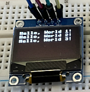

# 3.5 Licht Sensor BH 1750

Jetzt wollen wir die Helligkeit mit dem Lichtsensor BH 1750 messen.

## Die Hardware- und Elektronikgrundlagen

Wir benötigen für unsere nächsten Anwendungen:

- OLED Display SSD 1306

    

- Lichtsensor BH 1750

    


!!! note "Basis-Wissen Lichtsensor BH1750"
    Der Lichtsensor BH1750 ist guter und kostengünstiger Lichtsensor mit einer direkten Ausgabe der Lichtintensität in Lux, ohne dass eine zusätzliche Kalibrierung erforderlich ist.

    - **Messbereich**: 1 - 65535 Lux
    - **Schnittstelle**: I2C 
    - **Betriebsspannung**: 3,3V oder 5V (wir verwenden die 3,3V-Version)

Die Datenübertragung findet per I2C statt. Für den I2C-Betrieb werden in der Regel vier Pins verwendet:

- **VCC**: Versorgungsspannung (3,3V oder 5V)

- **GND**: Erdung

- **SCL**: I2C Clock (Signal für die Synchronisation der Datenübertragung)

- **SDA**: I2C Data (Signal für die Datenübertragung)

## Die Anwendungen

Zunächst nehmen wir nur den Lichtsensor in Betrieb und dann erweitern wir das Script, sodass die Ausgabe nicht im Thonny-Kommandofenster erfolgt, sondern auf dem Display.

### Inbetriebnahme des Lichtsensors

Der Aufbau sieht wir folgt aus:

 


Somit haben wir die bisherigen OLED-Anschlüsse, ergänzgt um den Lichtsensor.

- Pin 38 an Masse

- Pin 36 an Plus

- Pin 21 (= GPIO 16, gelb) an OLED-Display SDA

- Pin 22 (= GPIO 17, grün) an OLED-Display SCL

- OLED-Display mit Plus und Masse verbinden

- Lichtsensor BH 1750 mit Plus und Masse verbinden

- Lichtsensor SDA an an OLED-Display SDA (gelb)

- Lichtsensor SCL an an OLED-Display SCL (grün)

Wir haben wieder die Schritte

 1. Adresse ermitteln mit dem I2C-Scanner. Ergebnis: 0x23

 2. Bibliothek installieren. Auch hier gibt es verschiedene Bibliotheken und es ist nicht leicht eine gute Bibliothek zu finden (siehe z.B. diese Suchergebnisse: https://github.com/search?q=Micropython+bh1750&type=repositories&p=1) 
 
    Wir verwenden das Beispiel von Rui Santos [https://randomnerdtutorials.com/raspberry-pi-pico-bh1750-micropython/](https://randomnerdtutorials.com/raspberry-pi-pico-bh1750-micropython/)

    [Link zur Bibliothek von Tim Pelling](https://github.com/RuiSantosdotme/Random-Nerd-Tutorials/blob/master/Projects/Raspberry-Pi-Pico/MicroPython/bh1750.py), die aber auf der Originalseite nicht mehr vorhanden ist und daher von Rui Santos heruntergeladen wird. **Abspeichern auf dem Pi Pico unter bh1750.py**.


```python linenums="1"
# Anzeige der Helligkeit (Sensor BH1750) im Terminal
# BH1750-Basis von Rui Santos & Sara Santos - Random Nerd Tutorials
# Complete project details at https://RandomNerdTutorials.com/raspberry-pi-pico-bh1750-micropython/
# i2c-Zeile angepasst von J. Thomaschewski, 16.08.2024

from machine import Pin, SoftI2C
from bh1750 import BH1750
import time

# Initialize I2C communication (GPIO angepasst)
i2c = SoftI2C(scl=Pin(17), sda=Pin(16), freq=400000)

# Create BH1750 object
lightSensor = BH1750(bus=i2c, addr=0x23)

try:
    # Read lux every 2 seconds
    while True:
        lux = lightSensor.luminance(BH1750.CONT_HIRES_1)
        print("Luminance: {:.2f} lux".format(lux))
        time.sleep(2)

except Exception as e:
    # Handle any exceptions during sensor reading
    print("An error occurred:", e)
```
Die Ergebnisse werden in der Thonny-Kommandozeile angezeigt.

### Ausgabe des Lichtsensors auf dem OLED-Display

Nun wollen wir die Helligkeit auf dem OLED-Display anzeigen.

```python linenums="1"
# Anzeige der Helligkeit (Sensor BH1750) auf OLED-Display
# BH1750-Basis von Rui Santos & Sara Santos - Random Nerd Tutorials
# Complete project details at https://RandomNerdTutorials.com/raspberry-pi-pico-bh1750-micropython/
# Erweitert um Display-Anzeige J. Thomaschewski, 16.08.2024

from machine import Pin, SoftI2C
from bh1750 import BH1750
from ssd1306 import SSD1306_I2C  # Import der OLED-Bibliothek
from time import sleep

# Initialisierung der I2C-Pins für den BH1750 und das OLED-Display
i2c = SoftI2C(scl=Pin(17), sda=Pin(16), freq=400000)

# Initialisierung des BH1750-Sensors
lightSensor = BH1750(bus=i2c, addr=0x23)

# Initialisierung des OLED-Displays (128x64 Pixel)
oled = SSD1306_I2C(128, 64, i2c)

try:
    # Lux-Wert alle 2 Sekunden auslesen und auf dem OLED-Display anzeigen
    while True:
        lux = lightSensor.luminance(BH1750.CONT_HIRES_1)
        print("Luminance: {:.2f} lux".format(lux))

        # OLED-Display löschen
        oled.fill(0)
        oled.text("Helligkeit", 15, 24)
        oled.text("{:.2f} lux".format(lux), 15, 40)
        oled.show()

        sleep(2)

except Exception as e:
    # Fehlerbehandlung
    print("An error occurred:", e)
```

## Python

Zunächst eine Kleinigkeit. 

| Import                  | Erklärung                      |Aufruf               |
|-------------------------|--------------------------------|---------------------|
| import time             | Importiert *time* komplett     | time.sleep(2)       |            
| from time import sleep  | Importiert nur *sleep*         | sleep(2)            | 


### Fehlerbehandlung in Python: try - except

In Python wird eine Fehlerbehandlung mit den Schlüsselwörtern `try` und `except` durchgeführt. Damit können wir auf Fehler in einem Programm  reagieren, anstatt dass das Programm bei einem Fehler einfach abstürzt.

#### Funktionsweise

- **try**: Der Code, der in den `try`-Block geschrieben wird, ist der Teil des Programms, der möglicherweise einen Fehler verursachen könnte. Python versucht, diesen Code auszuführen. 

    In diesem Block wird der Hauptteil des Codes ausgeführt, der den Lux-Wert vom Lichtsensor liest und ihn auf dem OLED-Display anzeigt. Dieser Code wird in einer Schleife ausgeführt, um kontinuierlich den Helligkeitswert zu aktualisieren.

- **except**: Falls im `try`-Block ein Fehler auftritt, wird der `except`-Block ausgeführt. Hier kann definiert werden, was im Fehlerfall passieren soll, z.B. eine Fehlermeldung ausgeben oder das Programm in einen sicheren Zustand versetzen.

    Falls während der Ausführung des Codes im try-Block ein Fehler auftritt (z.B. ein Problem mit der Verbindung zum Sensor oder Display), wird der except-Block aktiviert. Das Programm beendet sich damit kontrolliert. In diesem Fall wird nur eine einfache Nachricht ausgegeben, damit das Programm an dieser Stelle nicht zu lang wird. Anstelle einer einfachen Ausgabe könnte auch ein Eintrag in eine Log-Datei geschrieben werden und eine E-Mail (oder eine sonstige Warnung) verschickt werden.

#### Beispiel im Kontext

In dem Script wird `try - except` folgendermaßen verwendet:

```python linenums="1"
try:
    # Lux-Wert alle 2 Sekunden auslesen und auf dem OLED-Display anzeigen
    while True:
        lux = lightSensor.luminance(BH1750.CONT_HIRES_1)
        print("Luminance: {:.2f} lux".format(lux))

        # OLED-Display löschen
        oled.fill(0)
        oled.text("Helligkeit", 15, 24)
        oled.text("{:.2f} lux".format(lux), 15, 40)
        oled.show()

        sleep(2)

except Exception as e:
    # Fehlerbehandlung
    print("An error occurred:", e)
```

