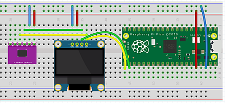

# 3.6 Temperatur und Luftdrucksensor BMP 280

Jetzt wollen wir die Temperatur und den Luftdruck mit dem Sensor BMP 280 messen. Und wir haben *"das gleiche Spiel wie zuvor"*.

## Die Hardware- und Elektronikgrundlagen

Wir benötigen für unsere nächsten Anwendungen:

- OLED Display SSD 1306

    

- Sensor BMP 280

    

!!! note "Basis-Wissen Temperatursensor BMP280"
    Der BMP280 ist ein Sensor zur Messung von Temperatur und Luftdruck. Er ist kompakt, präzise und eignet sich gut für Wetterstationen und Höhenmessungen. Es gibt noch einen ähnlichen Sensor BME280, der Temperatur, Luftfeuchtigkeit und Luftdruck mist.

    - **Messbereich**:
        - **Temperatur**: -40°C bis +85°C (±1.0°C)
        - **Luftdruck**: 300 hPa bis 1100 hPa (±1 hPa, entspricht etwa ±8.4 Meter in der Höhe)
    - **Schnittstelle**: I2C oder SPI (wir verwenden die I2C-Version)
    - **Betriebsspannung**: 1,8V bis 3,6V (wir verwenden die 3,3V-Version)

    Die Datenübertragung findet per I2C statt. Für den I2C-Betrieb werden in der Regel vier Pins verwendet:

- **VCC**: Versorgungsspannung (3,3V oder 5V)

- **GND**: Erdung

- **SCL**: I2C Clock (Signal für die Synchronisation der Datenübertragung)

- **SDA**: I2C Data (Signal für die Datenübertragung)

## Die Anwendungen

Zunächst nehmen wir nur den Temperatur- und Luftdrucksensor in Betrieb und dann erweitern wir das Script, sodass die Ausgabe nicht im Thonny-Kommandofenster erfolgt, sondern auf dem Display.

!!! note "Sensoren und Display"
    Es gibt sehr viele [I2C-Sensoren und Displays aller Art](https://www.sparkfun.com/categories/tags/i2c?sort_by=date_asc&filter_price_floor=&filter_price_ceil=). 

??? info "Nerd-Wissen I2C"
    Eine sehr gute Info zum I2C findet sich bei [Wikipedia](https://de.wikipedia.org/wiki/I%C2%B2C).

### Inbetriebnahme des Lichtsensors

Der Aufbau sieht wir folgt aus:

 


Somit haben wir die bisherigen OLED-Anschlüsse, ergänzgt um den Lichtsensor.

- Pin 38 an Minus

- Pin 36 an Plus

- Pin 21 (GPIO 16, gelb) an OLED-Display SDA

- Pin 22 (GPIO 17, grün) an OLED-Display SCL

- OLED-Display mit Plus und Minus verbinden

- Temperatursensor BMP 280 mit Plus und Minus verbinden

- BMP 280 SDA an an OLED-Display SDA (gelb)

- BMP 280 SCL an an OLED-Display SCL (grün)

Wir haben wieder die Schritte

 1. Adresse ermitteln mit dem I2C-Scanner. Ergebnis: 0x76

 2. Bibliothek installieren. Wir verwenden die Bibliothek und das Beispiel von [David Stellvan](https://github.com/dafvid/micropython-bmp280). 

    [Link zur Bibliothek von David Stellvan](https://github.com/dafvid/micropython-bmp280/blob/master/bmp280.py). **Abspeichern auf dem Pi Pico unter bmp280.py**.

```python linenums="1"
# Anzeige von Temperatur und Luftdruck (Sensor BMP 280) im Terminal
# BMP280-Basis der Bibliothek von David Stellvan
# https://github.com/dafvid/micropython-bmp280
# Angepasst von J. Thomaschewski, 16.08.2024

from machine import Pin, SoftI2C
from bmp280 import *

# Initialize I2C communication (GPIO angepasst)
i2c = SoftI2C(scl=Pin(17), sda=Pin(16), freq=400000)
bmp = BMP280(i2c)

print(bmp.temperature)
print(bmp.pressure)
```
Die Ergebnisse werden in der Thonny-Kommandozeile angezeigt.

!!! question "Übung"
    In dem Beispiel werden die Daten nur einmal angezeigt. Bauen Sie eine einfache Schleife (gerne ohne try-execpt) wie im Beispiel zum Lichtsensor, damit die Werte alle 2 Sekunden ausgegeben werden.

### Ausgabe des Lichtsensors auf dem OLED-Display

Nun wollen wir die Helligkeit auf dem OLED-Display anzeigen.

```python linenums="1"
# Anzeige von Temperatur und Luftdruck (Sensor BMP 280) im Terminal und auf OLED-Display
# BMP280-Basis von David Stellvan
# https://github.com/dafvid/micropython-bmp280
# Angepasst von J. Thomaschewski, 16.08.2024

from machine import Pin, SoftI2C
from bmp280 import *
from ssd1306 import SSD1306_I2C  # Import der OLED-Bibliothek
from time import sleep

# Initialize I2C communication (GPIO angepasst)
i2c = SoftI2C(scl=Pin(17), sda=Pin(16), freq=400000)
bmp = BMP280(i2c)

# Initialisierung des OLED-Displays (128x64 Pixel)
oled = SSD1306_I2C(128, 64, i2c)

while True:
    # Messwerte erfassen
    temperature = bmp.temperature
    pressure = bmp.pressure / 100  # hPa

    # Ausgabe im Terminal
    print("Temperatur: {:.2f}°C".format(temperature))
    print("Luftdruck:  {:.2f} hPa".format(pressure))

    # Anzeige auf dem OLED-Display
    oled.fill(0)  # Bildschirm löschen
    oled.text("Temperatur", 0, 8)
    oled.text("{:.2f} C".format(temperature), 0, 20)
    oled.text("Luftdruck", 0, 40)
    oled.text("{:.2f} hPa".format(pressure), 0, 52)
    oled.show()  # Display aktualisieren

    sleep(2)
```

Damit verlassen wir das Thema der Sensoren und gehen zu einem weiteren spannenden Thema: Eine WLAN-Verbindung zum Pi Pico herstellen.