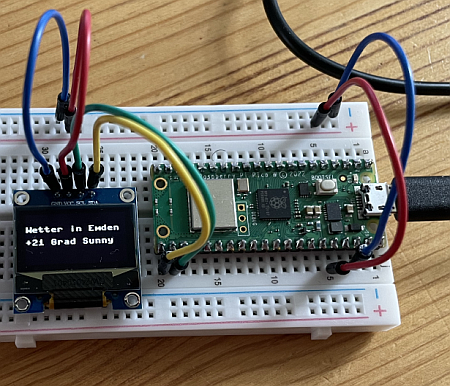

# 3.6 WLAN

Der Raspberry Pi Pico W hat ein WLAN (WIFI) und Bluetooth-Chip auf der Platine. Und dieses WLAN wollen wir nun nutzen.

## Die Hardware- und Elektronikgrundlagen

Wir verwenden den Raspberry Pi Pico W (Version 1). Er hat den WLAN Chip von Infineon CYW43439 verbaut und nutzt somit den WLAN-Standard IEEE 802.11b/g/n (von 2009) auf 2,4 GHz. Der alte WLAN-Standard hat den Vorteil, auch älteren WLAN-Routern problemlos zu funktionieren.

Wir benötigen für unsere nächsten Anwendungen  den Pi Pico auf dem Breadboard und das OLED Display SSD 1306, angeschlossen wie zuvor.

## Die Anwendungen

Zunächst wollen wir nur die WLAN-Verbindung herstellen, bevor wir dann im nächsten Schritt einige Anwendungen realisieren, die  Internetdienste verwenden.

### Inbetriebnahme der WLAN-Verbindung

Hier nun ein einfaches Script zu WLAN-Verbindung. Dieses Script wollen wir in Zukunft nutzen und um entsprechende Dienste erweitern.

**In Zeile 9 muss die SSID und das PASSWORD durch die aktuellen Zugangsdaten ersetzt werden!**

```python linenums="1"
# WLAN-Verbindung herstellen
# J. Thomaschewski, 17.08.2024

import network

# WLAN aktivieren und verbinden. SSID und PASSWORD ersetzen
wlan = network.WLAN(network.STA_IF)
wlan.active(True)
wlan.connect("SSID", "PASSWORD") # SSID und PASSWORD ersetzen

# Warten, bis die Verbindung hergestellt ist
while not wlan.isconnected():
    pass

# Verbindung erfolgreich
print("WLAN verbunden, IP-Adresse:", wlan.ifconfig()[0])
```

### Wenn die WLAN-Verbindung nicht funktioniert...
Meistens liegt es daran, dass die SSID oder das PASSWORD falsch geschrieben wurden. Wenn man aber gaaaanz sicher ist, dass das Problem woanders liegt, dann kommen hier drei Scripte als Abhilfe.


??? example "1. WLAN Netzwerke anzeigen"
    Es kann ja sein, dass das gewünschte Netzwerk beim Pi Pico nicht ankommt.

    ```python linenums="1"
    # Vorhandene WLAN-Netzwerke ermitteln
    # J. Thomaschewski, 16.08.2024

    import network

    wlan = network.WLAN(network.STA_IF)
    wlan.active(True)

    networks = wlan.scan()

    print("Vorhandene WLAN-Netzwerke:")
    for network_info in networks:
        print(network_info)
    ```
    Das gewünschte Netzwerk muss aufgeführt sein, damit man sich damit verbinden kann. Wenn das Netzwerk nicht aufgeführt ist, dann ist es entweder zu weit entfernt sein (Funkwellen kommen nicht an) oder ausgeschaltet oder es hat einen anderen Namen.

??? example "2. MAC Adresse des eigene Pi Pico anzeigen"
    Jeder Funkchip hat eine eindeutige MAC-Adresse. Und viele WLAN-Router zeigen in ihrer Weboberfläche an, wenn ein Gerät versucht hat sich erfolglos anzumelden.

    ```python linenums="1"
    # Eigene MAC-Adresse ermitteln
    # J. Thomaschewski, 17.08.2024

    import network

    wlan = network.WLAN(network.STA_IF)
    wlan.active(True)

    mac = wlan.config('mac')

    mac_address = ':'.join(['{:02x}'.format(b) for b in mac])
    print("WiFi MAC-Adresse:", mac_address)
    ```

??? example "3. Ausführliches Script zur WLAN-Verbindung" 
    Hier kommt ein ausführliches Script zur Herstellung einer WLAN-Verbindung mit Ausgabe der aktuellen Statusinformationen. Dieses Script ist mit Hilfe von ChatGPT entstanden, da meine Verbindungen stehts mit meinem einfachen Script funktioniert haben.

    ```python linenums="1"
    # WLAN-Verbindung herstellen
    # Erstellt von ChatGPT
    # J. Thomaschewski, 17.08.2024

    import network
    import time

    # WLAN-Verbindungsdaten
    SSID = "XXXXXXXXXXX"      # Ersetze durch deinen WLAN-Namen (SSID)
    PASSWORD = "XXXXXXXXXXXX"  # Ersetze durch dein WLAN-Passwort

    def connect_to_wifi(ssid, password):
        # WLAN-Station-Interface initialisieren
        wlan = network.WLAN(network.STA_IF)
        wlan.active(True)
        
        # WLAN-Verbindung herstellen
        if not wlan.isconnected():
            print("Versuche, eine Verbindung zu WLAN herzustellen...")
            wlan.connect(ssid, password)
            
            # Warte, bis die Verbindung hergestellt ist
            for attempt in range(20):  # 20 Versuche, jeweils 0,5 Sekunden
                if wlan.isconnected():
                    print("WLAN verbunden!")
                    print("IP-Adresse:", wlan.ifconfig()[0])
                    return wlan
                else:
                    print("Verbindung wird aufgebaut, Versuch", attempt + 1)
                    time.sleep(0.5)
            
            # Wenn die Verbindung nicht hergestellt wurde
            if not wlan.isconnected():
                print("Fehler: Verbindung zu WLAN konnte nicht hergestellt werden.")
                print("Überprüfe SSID und Passwort.")
                return None
        else:
            print("Bereits mit WLAN verbunden.")
            print("IP-Adresse:", wlan.ifconfig()[0])
            return wlan

    # Verbindung zu WLAN herstellen
    wlan = connect_to_wifi(SSID, PASSWORD)

    # Überprüfen, ob die Verbindung erfolgreich war
    if wlan is None:
        print("WLAN-Verbindung konnte nicht hergestellt werden.")
    else:
        print("WLAN-Verbindung erfolgreich.")

    # Skriptende
    print("Skript beendet.")
    ```

### WLAN-Verbindung trennen

Da der Pi Pico die ganze Zeit mit dem WLAN verbunden bleibt, brauchen wir für unsere weiteren "Experimente" auch ein Script, um die Verbindung zu trennen.

```python linenums="1"
# WLAN-Verbindung trennen
# J. Thomaschewski, 17.08.2024

import network

wlan = network.WLAN(network.STA_IF)

# Überprüfen, ob eine Verbindung besteht
if wlan.isconnected():
    # WLAN-Verbindung trennen
    wlan.disconnect()
    print("WLAN-Verbindung getrennt.")
else:
    print("Keine aktive WLAN-Verbindung.")
```

Wenn wir jetzt die Verbindung getrennt haben, können wir das nächste Script ausprobieren.

### WLAN-Verbindung auf dem Display anzeigen lassen

Hier eine einfache Kombination aus der WLAN-Verbindung und unserem früheren OLED-Display-Script. 

```python linenums="1"
# WLAN-Verbindung herstellen und IP-Adresse auf dem OLED-Display anzeigen
# J. Thomaschewski, 17.08.2024

import network
from machine import Pin, SoftI2C
from ssd1306 import SSD1306_I2C  

# Initialisierung I2C-Pins und OLED-Display
i2c = SoftI2C(scl=Pin(17), sda=Pin(16))
oled = SSD1306_I2C(128, 64, i2c, addr=0x3C)

# WLAN-Station-Interface initialisieren und aktivieren
wlan = network.WLAN(network.STA_IF)
wlan.active(True)

# Verbindung herstellen und warten, bis die Verbindung erfolgreich ist
oled.fill(0)
oled.text("Verbinde WLAN", 0, 0)
oled.show()

wlan.connect("SSID", "PASSWORD")

# Warten, bis die Verbindung hergestellt ist
while not wlan.isconnected():
    pass

# Verbindung erfolgreich
ip_address = wlan.ifconfig()[0]
print("WLAN verbunden, IP-Adresse:", ip_address)

# IP-Adresse auf dem OLED-Display anzeigen
oled.fill(0)  # Bildschirm löschen
oled.text("WLAN verbunden!", 0, 16)
oled.text("IP:", 0, 32)
oled.text(ip_address, 0, 48)
oled.show()  # Display aktualisieren
```

Wie man leicht erkennt, ist das Script weder sehr komplex noch sehr einfallsreich. Ich habe einfach beide Scripte "WLAN-Verbindung" und "OLED-Display" recht trivial miteinander verbunden.  


### Wetterdienst nutzen

Mit unserer WLAN-Verbindung und dem Display ergeben sich nun unendliche Möglichkeiten. 

Ich habe das letzte Script in ChatGPT4o hochgeladen und gebeten einen Wetterdienst ohne API zu finden und das Script anzupassen. Natürlich waren auch diesmal weitere Interaktionen mit ChatGPT notwendig, aber am Ende kam dieser übersichtliche Sourcecode heraus.

```python linenums="1"
# WLAN-Verbindung zum Wetterdienst
# Basis von J. Thomaschewski, erweitert mittels ChatGPT 4o
# J. Thomaschewski, 17.08.2024

import network
import urequests as requests
from machine import Pin, SoftI2C
from ssd1306 import SSD1306_I2C  

# Initialisierung I2C-Pins und OLED-Display
i2c = SoftI2C(scl=Pin(17), sda=Pin(16))
oled = SSD1306_I2C(128, 64, i2c, addr=0x3C)

# WLAN-Verbindungsdaten
SSID     = "SSID"     # Ersetze durch WLAN-Namen (SSID)
PASSWORD = "PASSWORD" # Ersetze durch WLAN-Passwort

# Standortdaten
CITY = "Emden"

# WLAN-Verbindung herstellen
wlan = network.WLAN(network.STA_IF)
wlan.active(True)
wlan.connect(SSID, PASSWORD)
while not wlan.isconnected():
    pass


# Wetterdaten von wttr.in abrufen
def get_weather(city):
    url = "http://wttr.in/{}?format=%t+%C".format(city)  # %t für Temperatur, %C für Bedingungen
    response = requests.get(url)
    data = response.text.strip()
    
    # Ersetzen des °-Zeichens durch " Grad"
    data = data.replace("°C", " Grad")
    return data

# Abrufen und Anzeigen der Wetterdaten auf dem OLED-Display
try:
    weather_data = get_weather(CITY)
    
    oled.fill(0)  # Bildschirm löschen
    oled.text("Wetter in {}".format(CITY), 0, 16)
    oled.text(weather_data, 0, 32)
    oled.show()  # Display aktualisieren

except Exception as e:
    oled.fill(0)  # Bildschirm löschen
    oled.text("Fehler beim", 0, 16)
    oled.text("Abrufen der", 0, 32)
    oled.text("Daten", 0, 48)
    oled.show()  # Display aktualisieren
    print("Fehler beim Abrufen der Wetterdaten:", e)

# WLAN-Verbindung trennen (optional)
wlan.disconnect()
```

 


??? info "Nerd-Wissen Pi Pico als Webserver"
    Man kann den Pi Pico nicht nur als Web-Client, sondern auch als Webserver betreiben. Darauf werden wir aber im Rahmen des Moduls nicht eingehen.


## Python

In den Scripten auf dieser Seite gibt es einige neue Python-Themen, von denen hier `wlan.ifconfig()[0]` als Syntax erklärt werden soll.

### Umgang mit wlan.ifconfig()

Der Befehl `wlan.ifconfig()` liefert ein Array (auch bekannt als Tupel in Python), das aus vier Elementen besteht. Diese Elemente enthalten wichtige Netzwerkinformationen, wie die IP-Adresse und die Subnetzmaske, die das Gerät im Netzwerk verwendet. 

Ein Array ist eine geordnete Sammlung von Werten, auf die man über ihren Index (ihre Position in der Liste) zugreifen kann.

Die Zählung der Indizes beginnt bei 0, was bedeutet, dass das erste Element des Arrays den Index 0 hat, das zweite den Index 1 und so weiter. Um auf einen spezifischen Wert aus dem Array, das von `wlan.ifconfig()` zurückgegeben wird, zuzugreifen, verwendet man die eckigen Klammern `[]` und den entsprechenden Index. 

Zum Beispiel:
- `wlan.ifconfig()[0]` liefert die IP-Adresse.
- `wlan.ifconfig()[1]` liefert die Subnetzmaske.


| Parameter               | Erklärung                                               |
|--------------------------|---------------------------------------------------------|
| IP-Adresse               | Die aktuelle IP-Adresse des Geräts im Netzwerk          |
| Subnetzmaske             | Die Subnetzmaske, die definiert, welcher Teil der IP-Adresse das Netzwerk repräsentiert |
| Gateway-Adresse          | Die IP-Adresse des Routers oder Gateways, das den Zugang zu anderen Netzwerken ermöglicht (z.B. dem Internet) |
| DNS-Server-Adresse       | Die IP-Adresse des DNS-Servers, der zur Namensauflösung verwendet wird (Übersetzung von Domainnamen in IP-Adressen) |

#### Wie es weitergeht...
Sie haben hier nun einen Einstieg in den Raspberry Pi Pico bekommen und nun konzentrieren wir uns im nächten Kapitel auf die Python-Syntax, damit sie diesen Einstieg alleine ausbauen können.