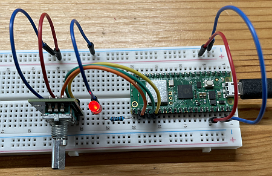
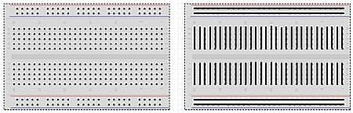

# 3 Raspberry Pi Pico W Anwendungen

## Gliederung

[3.1 LED blinken](3.1LEDBlinken.md) 
[3.2 LED dimmen](3.2LEDDimmen.md) 
[3.3 LED schalten](3.3LEDSchalten.md) 
[3.4 I2C Display](3.4I2C-Display.md) 
[3.5 Licht Sensor BH 1750](3.5LichtSensorBH1750.md) 
[3.6 Temperatursensor BMP 280](3.6TemperatursensorBMP280.md) 
[3.7 WLAN](3.7WLAN.md) 
[3.8 Webserver](3.8Webserver.md) 

## Generelles Vorgehen

Hier stellen wir die Pi Pico-Anwendungen vor, die wir realisieren wollen. Bei den Anwendungen müssen wir nicht mehr zwischen "Pi Pico W" und Pi Pico 2 W" unterscheiden und sprechen daher immer vom Pi Pico (und meinen damit beide Varianten, also den Pi Pico und den Pi Pico 2), da da beide Boards die gleiche Pinbelegung und identische Programmier-Schnittstellen bieten. Der einzige Unterschied liegt im Chip, der beim Pi Pico 2 mehr Leistung und Speicher bietet.

Jedes Unterkapitel hat folgende Struktur

- **Die Hardware- und Elektronikgrundlagen**: Alle neuen Hardwarekomponenten werden kurz vorgestellt.

- **Die Anwendungen**: Wir zeigen die Anwendungen mit vorgegebenen Beispiel-Scripten.

    Das Vorgehen bei allen Anwendungen ist immer
    
    1. Zuerst die Schaltung aufbauen

    2. Pi Pico per USB mit dem Computer verbinden

    3. Thonny starten und das Script kopieren/erstellen

    4. Programm ausführen

- **Python**: Letztendlich wollen wir die Anwendungen ausprobieren UND die Programmierung verstehen. In diesem Abschnitt wird auf die Python-Programmierung eingegangen. Oftmals wird nicht alles besprochen, sondern es wird mit einfacher Syntax begonnen und wir steigern uns langsam. Am Anfang verstehen wir also noch nicht alle Zeilen im Script, sondern nehmen vieles als gegeben hin.

## Raspberry Pi Pico Pinout

Die Übersicht über die Pinbelegung des Raspberry Pi Pico [hier als PDF](https://datasheets.raspberrypi.com/picow/PicoW-A4-Pinout.pdf) ist wichtig, da wir zwei Arten von Pins unterscheiden: Die Pins des grünen Raspberry Pi Pico Boards (1 - 40), die wir als Anschlüsse für die Bauteile (z.B. eine externe LED) benötigen und die logischen Pins GPIO (abgekürzt GP) des Microcontrollers, die wir bei der Programmierung angeben müssen. 

Schauen wir uns den Pin unten rechts an: Pin 21 entspricht GPIO 16.

!!! note "Raspberry Pi Pico W Pinout"
    Die Grafik sollten Sie (ausgedruckt) immer dabeihaben.

## Breadboard

Der Raspberry Pi Pico wird auf ein sogenanntes Breadboard gesteckt, sodass Sie weitere Bauteile ohne zu löten dazustecken können. Dies kann in der Praxis dann so aussehen:

Hier sehen wir, wie die einzelnen Steckpunkte miteinander verbunden sind. Oben und unten verlaufen jeweils zwei "Leitungen" für Plus und Masse. Im Hauptbereich verlaufen kurze "Leitungen", sodass der Pi Pico eingesteckt werden kann.

