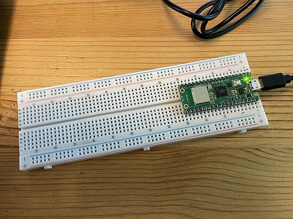

# 4.1  Syntax und Variablen

In diesem Kapitel erlernen Sie die grundlegende Syntax von Python sowie den Umgang mit Variablen und verschiedenen Datentypen.


## Übersicht Allgemeine Syntax

In diesem Abschnitt erhalten Sie einen Überblick über die grundlegenden Syntaxelemente in Python, die die Regeln für das Schreiben und Strukturieren von Code darstellen.


| Syntax                      | Beschreibung                                                   | Beispiel                          |
|-----------------------------|----------------------------------------------------------------|-----------------------------------|
| Kommentar                   | Ein Kommentar im Code, der nicht ausgeführt wird               | `# Dies ist ein Kommentar`        |
| Zuweisung                   | Zuweisung eines Wertes zu einer Variablen                      | `x = 5`                           |
| Ausdruck (Expression)       | Eine Kombination aus Werten, Variablen und Operatoren          | `y = x + 2`                       |
| Funktionsaufruf             | Aufruf einer Funktion mit oder ohne Argumente                  | `print("Hallo Welt")`             |
| Doppelpunkt `:`             | Verwendet nach Schlüsselwörtern wie `if`, `for`, `def`, etc.   | `if x > 0:`                       |
| Einrückung (Indentation)    | Einrücken von Code-Blöcken zur Strukturierung                  | *siehe Beispiel unter der Tabelle* |


Einrückungen in Python sind entscheidend, da sie die Struktur des Codes bestimmen. Jeder Codeblock, der beispielsweise zu einer Bedingung (`if`) oder einer Schleife (z.B. `while` oder `for`) gehört, muss eingerückt sein. Ein typisches Beispiel:

```python
if x > 0:
    print("x ist positiv")
    y = x + 5
```

Auch hatten wir schon die Operatoren, die an dieser Stelle der Vorllständigkeit halber wiederholt werden.

A. Rechenoperatoren

| Operator    | Erklärung                                             | Beispiel                |
|-------------|-------------------------------------------------------|-------------------------|
| =           | Zuweisung                                             | a = 5                   |
| +           | Addition                                              | a + b                   |
| -           | Subtraktion                                           | a - b                   |
| *           | Multiplikation                                        | a * b                   |
| **          | Potenzierung                                          | a ** b                  |
| /           | Division                                              | a / b                   |
| %           | Modulus (Restwert einer Division)                     | a % b  (z.B. 10 % 3 ergibt 1) |
| //          | Ganzzahlige Division                                  | a // b (z.B. 10 // 3 ergibt 3)|
| +=          | Addition und Zuweisung                                | a += 3 (z.B. a = 2; a += 3 ergibt 5) |
| -=          | Subtraktion und Zuweisung                             | a -= 2                  |
| *=          | Multiplikation und Zuweisung                          | a *= 2                  |
| **=         | Potenzierung und Zuweisung                            | a **= 2                 |
| /=          | Division und Zuweisung                                | a /= 2                  |
| %=          | Modulus und Zuweisung                                 | a %= 3                  |
| //=         | Ganzzahlige Division und Zuweisung                    | a //= 2                 |


B. Vergleichsoperatoren (die als Ergebnis True / False liefern)

| Operator    | Erklärung                                             | Beispiel                |
|-------------|-------------------------------------------------------|-------------------------|
| ==          | Gleichheit                                            | a == b                  |
| !=          | Ungleichheit                                          | a != b                  |
| <           | Kleiner als                                           | a < b                   |
| >           | Größer als                                            | a > b                   |
| <=          | Kleiner oder gleich                                   | a <= b                  |
| >=          | Größer oder gleich                                    | a >= b                  |
| and         | Logisches UND                                         | a and b                 |
| or          | Logisches ODER                                        | a or b                  |
| not         | Logisches NICHT                                       | not a                   |


Weitere Details zu diesen Operatoren finden Sie in der offiziellen [Python-Dokumentation zu den Operatoren](https://docs.python.org/3/reference/expressions.html#operator-precedence).

## Übersicht Variablentypen

Hier kommt nochmals die Tabelle mit den verschiedenen Variablentypen, die in Python zur Speicherung und Verarbeitung von Daten verwendet werden können.


#### Was kann alles in einer Variable gespeichert werden?

| Typ        | Beschreibung                                  | Beispiel                          |
|------------|-----------------------------------------------|-----------------------------------|
| [`Integer`](https://docs.python.org/3/library/functions.html#int)    | Ganze Zahlen, z.B. `42`                       | `breite = 42`                     |
| [`Float`](https://docs.python.org/3/library/functions.html#float)      | Gleitkommazahlen, z.B. `3.14`                 | `temperatur = 3.14`               |
| [`String`](https://docs.python.org/3/library/stdtypes.html#str)     | Text, z.B. `"Hallo Welt"`                     | `begruessung = "Hallo Welt"`      |
| [`Boolean`](https://docs.python.org/3/library/functions.html#bool)    | Wahrheitswerte, z.B. `True` oder `False`      | `istAktiv = True`                 |
| [`List`](https://docs.python.org/3/library/stdtypes.html#list)       | Listen von Werten, z.B. `[1, 2, 3]`           | `zahlen = [1, 2, 3]`              |
| [`Dictionary`](https://docs.python.org/3/library/stdtypes.html#dict) | Schlüssel-Wert-Paare, z.B. `{"key": "value"}` | `person = {"name": "Alice"}`      |
| [`Tuple`](https://docs.python.org/3/library/stdtypes.html#tuple)      | Unveränderliche Listen, z.B. `(1, 2, 3)`      | `koordinaten = (1, 2, 3)`         |
| [`Set`](https://docs.python.org/3/library/stdtypes.html#set)        | Mengen von eindeutigen Werten, z.B. `{1, 2, 3}` | `einzigartigeZahlen = {1, 2, 3}` |
| [`Object`](https://docs.python.org/3/reference/datamodel.html#objects-values-and-types)     | Instanzen von Klassen oder andere Objekte     | `led = Pin()`                     |


#### Regeln für die Benennung von Variablen

Und hier kommen die Reglen zur Benennung von Variablen:

1. **Buchstaben, Ziffern und Unterstriche**: Variablennamen dürfen nur Buchstaben (a-z, A-Z), Ziffern (0-9) und Unterstriche (_) enthalten. Allerdings darf ein Variablenname nicht mit einer Ziffer beginnen. Beispiele: `breite`, `tiefe1`.

2. **Keine reservierten Schlüsselwörter**: Vermeiden Sie die Verwendung von Python-Schlüsselwörtern (z.B. `if`, `else`, `while`), da diese spezielle Bedeutungen haben und zu Syntaxfehlern führen können. Eine Liste der reservierten Schlüsselwörter finden Sie in der [Python-Dokumentation](https://docs.python.org/3/reference/lexical_analysis.html#keywords).

3. **Keine deutschen Umlaute und Leerzeichen**: Verwenden Sie keine deutschen Umlaute (ä, ö, ü) oder Leerzeichen in Variablennamen, da diese zu Kompatibilitätsproblemen führen können. Stattdessen sollten Sie ae, oe, ue verwenden. Beispiel: `maxHoehe` statt `maxHöhe`.

4. **Aussagekräftige Namen**: Wählen Sie Namen, die den Inhalt oder Zweck der Variablen beschreiben. Dies erleichtert das Verständnis des Codes. Beispiel: Verwenden Sie `temperatur` statt `temp`.

5. **Kleinschreibung**: Gemäß der PEP 8-Richtlinie sollten Variablennamen in Python normalerweise in Kleinbuchstaben mit Unterstrichen geschrieben werden, z.B. `max_temperatur`. Da jedoch in vielen Programmiersprachen die CamelCase-Schreibweise bevorzugt wird, wollen wir auch in diesem Kurs CamelCase verwenden. Beispiel: `maxTemperatur` statt `max_temperatur`.

6. **Konstanten**: Für Konstanten, die sich während der Programmausführung nicht ändern sollen, verwenden Sie Großbuchstaben. Beispiel: `PI = 3.14159`.

7. **Vermeiden Sie einbuchstabige Namen**: Außer in Schleifenindizes (z.B. `i`, `j`) sollten einbuchstabige Variablennamen vermieden werden, da sie den Code weniger verständlich machen.


## Beispiele für die Variablentypen

**Integer** (Ganze Zahlen, `breite = 42`), **Float**  (Gleitkommazahlen,  `temperatur = 3.14`), und **String**  (Text, `begruessung = "Hallo Welt"`)  wird als unkompliziert angesehen und hier nicht weiter betrachtet. Auf **Boolean** (Wahrheitswerte, z.B. `True` oder `False`) wird im Abschnitt "Bedingte Anweisungen" eingegangen. Und auf **Object** gehen wir auch später erst ein.

Hier schauen wir uns die folgenden Variablentypen an:

| Typ        | Beschreibung                                  | Beispiel                          |
|------------|-----------------------------------------------|-----------------------------------|
| [`List`](https://docs.python.org/3/library/stdtypes.html#list)       | Listen von Werten, z.B. `[1, 2, 3]`           | `zahlen = [1, 2, 3]`              |
| [`Dictionary`](https://docs.python.org/3/library/stdtypes.html#dict) | Schlüssel-Wert-Paare, z.B. `{"key": "value"}` | `person = {"name": "Alice"}`      |
| [`Tuple`](https://docs.python.org/3/library/stdtypes.html#tuple)      | Unveränderliche Listen, z.B. `(1, 2, 3)`      | `koordinaten = (1, 2, 3)`         |
| [`Set`](https://docs.python.org/3/library/stdtypes.html#set)        | Mengen von eindeutigen Werten, z.B. `{1, 2, 3}` | `einzigartigeZahlen = {1, 2, 3}` |


### Wann verwendet man eine List?

Listen werden verwendet, wenn man eine geordnete Sammlung von änderbaren Elementen benötigen (die sich ändern lassen). Sie eignen sich gut für Sequenzen von ähnlichen Objekten, auf die man in der Reihenfolge ihres Einfügens zugreifen möchten. Listen werden in anderen Programmiersprachen (indizierte) Arrays genannt.

**Beispiele für Listen**

   ```python
   zahlen = [1, 2, 3, 4, 5]
   ```

   ```python
   gemischt = [1, "Hallo", 3.14, True]
   ```

   ```python
   verschachtelt = [1, [2, 3], ["a", "b", "c"]]
   ```

**Wie man eine List füllt und Werte ausliest**

- **Füllen**:
  ```python
  meineListe = [1, 2, 3]
  meineListe.append(4)
  ```
- **Auslesen**:
  ```python
  erstesElement = meineLliste[0]
  ```


### Wann verwendet man ein Dictionary?

Dictionaries sind ideal, wenn Sie eine ungeordnete Sammlung von Schlüssel-Wert-Paaren benötigen. Sie sind besonders nützlich, wenn Sie Daten nach einem eindeutigen Schlüssel suchen oder speichern müssen. Listen werden in anderen Programmiersprachen (assoziative) Arrays genannt.

**Beispiele für Dictionaries**

   ```python
   person = {"name": "Alice", "ort": "Wunderland"}
   ```

   ```python
   gemischt = {"zahl": 42, "text": "Hallo", "istAktiv": True}
   ```

   ```python
   verschachtelt = {"person": {"name": "Bob", "alter": 25}, "adresse": {"stadt": "Berlin", "plz": 10115}}
   ```

**Wie man ein Dictionary füllt und Werte ausliest**

- **Füllen**:
  ```python
  meinDictionary = {"name": "Alice", "alter": 9}
  meinDictionary["ort"] = "Wunderland"
  ```
- **Auslesen**:
  ```python
  name  = Meindictionary["name"]   # damit enthält die Variable name einen String
  alter = Meindictionary["alter"]  # damit enthält die Variable alter einen Integer
  ```


### Wann verwendet man ein Tuple?

Tupel sind ähnlich wie Listen, aber unveränderlich (immutable). Sie werden verwendet, wenn Sie eine geordnete Sammlung von Elementen benötigen, die sich nicht ändern soll, wie z.B. Konfigurationsdaten.

**Beispiele für Tuple**

   ```python
   koordinaten = (10, 20)
   ```

   ```python
   gemischt = (1, "Hallo", 3.14, True)
   ```

   ```python
   verschachtelt = (("a", "b"), (1, 2, 3), (True, False))
   ```

**Wie man ein Tuple füllt und Werte ausliest**

- **Füllen**:
  ```python
  MeinTupel = (1, 2, 3)
  ```
- **Auslesen**:
  ```python
  erstesElement = MeinTupel[0]
  ```


### Wann verwendet man ein Set?

Sets sind ungeordnete Sammlungen von eindeutigen Elementen. Sie sind nützlich, wenn Sie sicherstellen möchten, dass keine doppelten Elemente vorhanden sind, oder wenn Sie mathematische Mengenoperationen (wie Schnittmengen, Vereinigungen) durchführen möchten.

**Beispiele für Sets**

   ```python
   zahlen = {1, 2, 3, 4, 5}
   ```

   ```python
   gemischt = {1, "Hallo", 3.14, True}
   ```

   ```python
   verschachtelt = {1, 2, (3, 4), "a", "b"}
   ```

**Wie man ein Set füllt und Werte ausliest**

- **Füllen**:
  ```python
  meinSet = {1, 2, 3}
  meinSet.add(4)
  ```
- **Auslesen**:
  ```python
  elementExistiert = 2 in meinSet         # Prüft, ob 2 im Set vorhanden ist
  einzelnesElement = next(iter(meinSet))  # Gibt ein beliebiges Element aus dem Set zurück
  ```

!!! note "Klausurrelevant"
    Sie können in der Programmierung alle 4 Varianten List, Dictionary, Tuple und Set verwenden. In der Prüfung müssen Sie mit List und Dictionary "aktiv (Scripte schreiben) und passiv (Strukturen erkennen)" umgehen können.


## Pi Pico Script

Wir nehmen nur das Pi Pico-Board und lassen die interne LED blinken.



**Ursprüngliches Script**

```python linenums="1"
# Interne LED blinken lassen 
# J. Thomaschewski, 12.08.2024
from machine import Pin
from time import sleep
led = Pin('LED', Pin.OUT)
while True:
    led.on()
    sleep(0.5)
    led.off()
    sleep(0.5)
```

**Erweitert mit einer *List***

```python linenums="1"
# Interne LED blinken lassen 
# J. Thomaschewski, 12.08.2024
from machine import Pin
from time import sleep

data = ['LED', 0.5, 1.2]

led = Pin(data[0], Pin.OUT)
while True:
    led.on()
    sleep(data[1])
    led.off()
    sleep(data[2])
```

!!! question "Aufgabe"
    - Welche Vorteile und welche Nachteile hat diese Schreibweise?
    - Nutzen Sie nun ein *Dictionary* statt einer *List*
    - Welche Vorteile und welche Nachteile hat dies dann? Was gefällt ihnen besser?