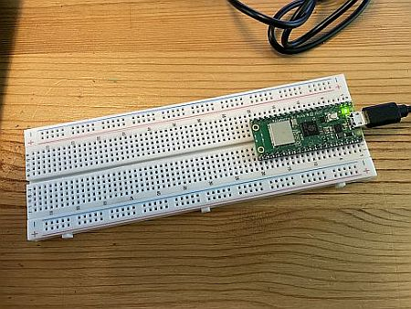

# 4.1  Syntax und Variablen

In diesem Kapitel erlernen Sie die grundlegende Syntax von Python sowie den Umgang mit Variablen und verschiedenen Datentypen.


## 📜 Übersicht Allgemeine Syntax

In diesem Abschnitt erhalten Sie einen Überblick über die grundlegenden Syntaxelemente in Python, die die Regeln für das Schreiben und Strukturieren von Code darstellen.


| Syntax                      | Beschreibung                                                   | Beispiel                          |
|-----------------------------|----------------------------------------------------------------|-----------------------------------|
| Kommentar                   | Ein Kommentar im Code, der nicht ausgeführt wird               | `# Dies ist ein Kommentar`        |
| Zuweisung                   | Zuweisung eines Wertes zu einer Variablen                      | `x = 5`                           |
| Ausdruck (Expression)       | Eine Kombination aus Werten, Variablen und Operatoren          | `y = x + 2` oder `status = not status`  |
| Funktionsaufruf             | Aufruf einer Funktion mit oder ohne Argumente. Es gibt drei Arten von Funktionen:<br>(a) interne Funktionen <br>(b) externe Funktionen<br>(c) eigene Funktionen erstellt mit `def tolleFunktion()`                  | <br>`print("Hallo Welt")` <br>`sleep(2)`<br>` tolleFunktion()`         |
| Doppelpunkt `:`             | Verwendet nach Schlüsselwörtern wie `if`, `for`, `def`, etc.   | `if x > 0:`                       |
| Einrückung (Indentation)    | Einrücken von Code-Blöcken zur Strukturierung                  | *siehe Beispiel unter der Tabelle* |


Einrückungen in Python sind entscheidend, da sie die Struktur des Codes bestimmen. Jeder Codeblock, der beispielsweise zu einer Bedingung (`if`) oder einer Schleife (z.B. `while` oder `for`) gehört, muss eingerückt sein. Ein typisches Beispiel:

```python linenums="1" 
if x > 0:
    print("x ist positiv")
    y = x + 5
```

Auch hatten wir schon die Operatoren, die an dieser Stelle der Vollständigkeit halber wiederholt werden.

## 🧠➕ A. Rechenoperatoren

| Operator    | Erklärung                                             | Beispiel                |
|-------------|-------------------------------------------------------|-------------------------|
| =           | Zuweisung                                             | a = 5                   |
| +           | Addition                                              | a + b                   |
| -           | Subtraktion                                           | a - b                   |
| *           | Multiplikation                                        | a * b                   |
| **          | Potenzierung                                          | a ** b                  |
| /           | Division                                              | a / b                   |
| %           | Modulus (Restwert einer Division)                     | a % b  (z.B. 10 % 3 ergibt 1) |
| //          | Ganzzahlige Division                                  | a // b (z.B. 10 // 3 ergibt 3)|
| +=          | Addition und Zuweisung                                | a += 3 (z.B. a = 2; a += 3 ergibt 5) |
| -=          | Subtraktion und Zuweisung                             | a -= 2                  |
| *=          | Multiplikation und Zuweisung                          | a *= 2                  |
| **=         | Potenzierung und Zuweisung                            | a **= 2                 |
| /=          | Division und Zuweisung                                | a /= 2                  |
| %=          | Modulus und Zuweisung                                 | a %= 3                  |
| //=         | Ganzzahlige Division und Zuweisung                    | a //= 2                 |


Was ist das Ergebnis?
```python linenums="1" 
zahl = 5
zahl += 10
print(zahl)
```

## 🧠⚖️ B. Vergleichsoperatoren (die als Ergebnis True / False liefern)

| Operator    | Erklärung                                             | Beispiel                |
|-------------|-------------------------------------------------------|-------------------------|
| ==          | Gleichheit                                            | a == b                  |
| !=          | Ungleichheit                                          | a != b                  |
| <           | Kleiner als                                           | a < b                   |
| >           | Größer als                                            | a > b                   |
| <=          | Kleiner oder gleich                                   | a <= b                  |
| >=          | Größer oder gleich                                    | a >= b                  |
| and         | Logisches UND                                         | a and b                 |
| or          | Logisches ODER                                        | a or b                  |
| not         | Logisches NICHT                                       | not a                   |

Vergleichsoperatoren sind sehr wichtig, da damit if-Bedingungen und Schleifen (for, while) gesteuert werden.

```python linenums="1"
if a == b:
    print("a un b sind gleich")
```

Die Operatoren `and` und `or` sind sehr wichtig, wenn man mehr als einen Vergleich benötigt.

**Beispiel für die Verwendung von `and` und `or`**

```python linenums="1"
a = 5
b = 10
c = 15

# Verwendung von and: Beide Bedingungen müssen wahr sein
if a < b and b < c:
    print("a ist kleiner als b und b ist kleiner als c")

# Verwendung von or: Mindestens eine Bedingung muss wahr sein
if a > b or b < c:
    print("Mindestens eine der beiden Bedingungen ist wahr")
```

**Logiktabelle für `and`**

| **a**   | **b**   | **a and b** |
|---------|---------|-------------|
| False   | False   | False       |
| False   | True    | False       |
| True    | False   | False       |
| True    | True    | True        |

**Logiktabelle für `or`**

| **a**   | **b**   | **a or b** |
|---------|---------|------------|
| False   | False   | False      |
| False   | True    | True       |
| True    | False   | True       |
| True    | True    | True       |

**Logiktabelle für `not`**

| **a**   | **not a**   | 
|---------|-------------|
| False   | True        | 
| True    | False       | 


Weitere Details zu diesen Operatoren finden Sie in der offiziellen [Python-Dokumentation zu den Operatoren](https://docs.python.org/3/reference/expressions.html#operator-precedence).

!!! important "Vergleich => TRUE/FALSE"
    Immer wenn es einen Vergleich gibt (if-Bedingung, Schleifen) folgt daraus TRUE oder FALSE als Rückgabe. Wer dies einmal verstanden hat, hat schon einen großen Teil der Programmierung geschafft.

## 🧰 Übersicht Variablentypen

Eine typische Variable mit einer Wertzuweisung ist `breite = 42`.

### Regeln für die Benennung von Variablen

1. **Buchstaben, Ziffern und Unterstriche**: Variablennamen dürfen nur Buchstaben (a-z, A-Z), Ziffern (0-9) und Unterstriche (_) enthalten. Allerdings darf ein Variablenname nicht mit einer Ziffer beginnen. Beispiele: `breite`, `tiefe1`.

2. **Keine reservierten Schlüsselwörter**: Vermeiden Sie die Verwendung von Python-Schlüsselwörtern (z.B. `if`, `else`, `while`), da diese spezielle Bedeutungen haben und zu Syntaxfehlern führen können. Eine Liste der reservierten Schlüsselwörter finden Sie in der [Python-Dokumentation](https://docs.python.org/3/reference/lexical_analysis.html#keywords).

3. **Keine deutschen Umlaute und Leerzeichen**: Verwenden Sie keine deutschen Umlaute (ä, ö, ü) oder Leerzeichen in Variablennamen, da diese zu Kompatibilitätsproblemen führen können. Stattdessen sollten Sie ae, oe, ue verwenden. Beispiel: `maxHoehe` statt `maxHöhe`.

4. **Aussagekräftige Namen**: Wählen Sie Namen, die den Inhalt oder Zweck der Variablen beschreiben. Dies erleichtert das Verständnis des Codes. Beispiel: Verwenden Sie `temperatur` statt `temp`.

5. **Kleinschreibung**: Gemäß der PEP 8-Richtlinie sollten Variablennamen in Python normalerweise in Kleinbuchstaben mit Unterstrichen geschrieben werden, z.B. `max_temperatur`. Da jedoch in vielen Programmiersprachen die CamelCase-Schreibweise bevorzugt wird, wollen wir auch in diesem Kurs CamelCase verwenden. Beispiel: `maxTemperatur` statt `max_temperatur`.

6. **Konstanten**: Für Konstanten, die sich während der Programmausführung nicht ändern sollen, verwenden Sie Großbuchstaben. Beispiel: `PI = 3.14159`.

7. **Vermeiden Sie einbuchstabige Namen**: Außer in Schleifenindizes (z.B. `i`, `j`) sollten einbuchstabige Variablennamen vermieden werden, da sie den Code weniger verständlich machen.

Folgende Variablentypen können in Python zur Speicherung und Verarbeitung von Daten verwendet werden.


### Was kann alles in einer Variable gespeichert werden?

| Typ        | Beschreibung                                  | Beispiel                          |
|------------|-----------------------------------------------|-----------------------------------|
| [`Integer`](https://docs.python.org/3/library/functions.html#int)  <br>`int()`  | Ganze Zahlen, z.B. `42` <br>*ist uns schon bekannt*   | `breite = 42`                     |
| [`Float`](https://docs.python.org/3/library/functions.html#float)  <br>`float()`    | Gleitkommazahlen, z.B. `3.14` <br>*ist uns schon bekannt*                 | `temperatur = 3.14`               |
| [`String`](https://docs.python.org/3/library/stdtypes.html#str)  <br>`str()`   | Text, z.B. `"Hallo Welt"` <br>*ist uns schon bekannt*                     | `begruessung = "Hallo Welt"`      |
| [`Boolean`](https://docs.python.org/3/library/functions.html#bool) <br>`bool()`   | Wahrheitswerte, z.B. `True` oder `False` <br>*ist uns schon bekannt*       | `istAktiv = True`                 |
| [`List`](https://docs.python.org/3/library/stdtypes.html#list)   <br>`list()`    | Listen von Werten, z.B. `[1, 2, 3]` <br>*schauen wir uns gleich an*           | `zahlen = [1, 2, 3]`              |
| [`Dictionary`](https://docs.python.org/3/library/stdtypes.html#dict)<br>`dict()` | Schlüssel-Wert-Paare, z.B. `{"key": "value"}` <br>*schauen wir uns gleich an*| `person = {"name": "Alice"}`      |
| [`Tuple`](https://docs.python.org/3/library/stdtypes.html#tuple) <br>`tuple()`     | Unveränderliche Listen, z.B. `(1, 2, 3)` <br>*wird in diesem Semester nicht betrachtet*     | `koordinaten = (1, 2, 3)`         |
| [`Set`](https://docs.python.org/3/library/stdtypes.html#set)   <br>`set()`     | Mengen von eindeutigen Werten, z.B. `{1, 2, 3}` <br>*wird in diesem Semester nicht betrachtet* | `einzigartigeZahlen = {1, 2, 3}` |
| [`Object`](https://docs.python.org/3/reference/datamodel.html#objects-values-and-types) <br>`object()`   | Instanzen von Klassen oder andere Objekte  <br>*wird später erklärt*    | `led = Pin()`                     |

Beispielsweise kann mit `int()` eine Kommazahl in einen Integer umgewandelt werden. Mit diesen angegebenen Funktionen kann also eine Umwandlung stattfinden. Wichtig sind für uns zunächst einmal `int()`, `float()`, `str()` und `bool()`.
```python linenums="1"
# Float-Zahl als Ausgangspunkt
floatZahl = 42.58

# Umwandeln der Float-Zahl in eine Ganzzahl
ganzZahl = int(floatZahl)
print(ganzZahl)
```


### Wir schauen uns nun die Variablentypen `List` und `Dictionary` an

| Typ        | Beschreibung                                  | Beispiel                          |
|------------|-----------------------------------------------|-----------------------------------|
| [`List`](https://docs.python.org/3/library/stdtypes.html#list)       | Listen von Werten, z.B. `[1, 2, 3]`           | `zahlen = [1, 2, 3]`              |
| [`Dictionary`](https://docs.python.org/3/library/stdtypes.html#dict) | Schlüssel-Wert-Paare, z.B. `{"key": "value"}` | `person = {"name": "Alice"}`      |


#### Wann verwendet man List?

Listen werden verwendet, wenn man eine geordnete Sammlung von änderbaren Elementen benötigen (die sich ändern lassen). Sie eignen sich gut für Sequenzen von ähnlichen Objekten, auf die man in der Reihenfolge ihres Einfügens zugreifen möchten. Listen werden in anderen Programmiersprachen (indizierte) Arrays genannt.

**Beispiele für Listen**

   ```python
   zahlen = [1, 2, 3, 4, 5]
   ```

   ```python
   gemischt = [1, "Hallo", 3.14, True]
   ```

   ```python
   verschachtelt = [1, [2, 3], ["a", "b", "c"]]
   ```

**Wie man eine List füllt und Werte ausliest**

- **Füllen**:
  ```python
  meineListe = [1, 2, 3]
  meineListe.append(4)
  ```
- **Auslesen**:
  ```python
  erstesElement = meineListe[0]
  ```


#### Wann verwendet man ein Dictionary?

Dictionaries sind ideal, wenn Sie eine ungeordnete Sammlung von Schlüssel-Wert-Paaren benötigen. Sie sind besonders nützlich, wenn Sie Daten nach einem eindeutigen Schlüssel suchen oder speichern müssen. Dictionaries werden in anderen Programmiersprachen (assoziative) Arrays genannt.

**Beispiele für Dictionaries**

   ```python
   person = {"name": "Alice", "ort": "Wunderland"}
   ```

   ```python
   gemischt = {"zahl": 42, "text": "Hallo", "istAktiv": True}
   ```

   ```python
   verschachtelt = {"person": {"name": "Bob", "alter": 25}, "adresse": {"stadt": "Berlin", "plz": 10115}}
   ```

**Wie man ein Dictionary füllt und Werte ausliest**

- **Füllen**:
  ```python
  meinDictionary = {"name": "Alice", "alter": 9}
  meinDictionary["ort"] = "Wunderland"
  ```
- **Auslesen**:
  ```python
  name  = meinDictionary["name"]   # damit enthält die Variable name einen String
  alter = meinDictionary["alter"]  # damit enthält die Variable alter einen Integer
  ```


## 🔌 Pi Pico Script

Wir nehmen nur das Pi Pico-Board und lassen die interne LED blinken.



**Ursprüngliches Script**

```python linenums="1"
# Interne LED blinken lassen 
# J. Thomaschewski, 12.08.2024
from machine import Pin
from time import sleep
led = Pin('LED', Pin.OUT)
while True:
    led.on()
    sleep(0.5)
    led.off()
    sleep(0.5)
```

**Erweitert mit einer *List***

```python linenums="1"
# Interne LED blinken lassen 
# J. Thomaschewski, 12.08.2024
from machine import Pin
from time import sleep

data = ['LED', 0.5, 1.2]

led = Pin(data[0], Pin.OUT)
while True:
    led.on()
    sleep(data[1])
    led.off()
    sleep(data[2])
```

!!! question "Aufgabe"
    - Welche Vorteile und welche Nachteile hat diese Schreibweise?
    - Nutzen Sie nun ein *Dictionary* statt einer *List*
    - Welche Vorteile und welche Nachteile hat dies dann? Was gefällt ihnen besser?


---


## ✍️ Einfache und doppelte Anführungszeichen

In Python können einfache (`'`) und doppelte (`"`) Anführungszeichen verwendet werden, um Strings zu definieren. Beide Varianten verhalten sich gleich und haben dieselbe Funktionalität. Sie werden oft je nach Bedarf eingesetzt:

- **Einfache Anführungszeichen** werden verwendet, wenn doppelte Anführungszeichen innerhalb der String auftreten, da so das Escapen von Zeichen vermieden werden kann.
- **Doppelte Anführungszeichen** werden oft verwendet, wenn einfache Anführungszeichen im Text enthalten sind.

Beispiel:

```python linenums="1"
text1 = 'Dies ist ein "Zitat" innerhalb eines Strings.'
text2 = "Hier ist ein Beispiel für ein einfaches 'Zitat'."
```

---


## ✍️✍️✍️ Drei Anführungszeichen
Für komplexere Strings, wie etwa mehrzeilige Strings, können **dreifache Anführungszeichen** (`'''` oder `"""`) verwendet werden. Sie sind besonders nützlich, um längere Texte und Dokumentationen (Docstrings) klar zu formatieren.

Python kennt '#' als Zeichen für einzeilige Kommentare. Es gibt aber nichts für mehrzeilige Kommentare (andere Programmiersprachen nutzen dann /* ... */). In Python verwendet man dann mehrzeilige Strings (ohne diese einer Variablen zuzuweisen) als "Quasi-Kommentar".

```python linenums="1"
def addiereZahlen(a, b):
    """
    Addiere zwei Zahlen und gebe das Ergebnis zurück.

    Diese Funktion nimmt zwei numerische Eingaben und gibt ihre Summe zurück.
    Sie eignet sich besonders für einfache Berechnungen und wird oft als Beispiel
    für Docstrings verwendet.

    Parameters:
        a (int, float): Die erste Zahl zum Addieren.
        b (int, float): Die zweite Zahl zum Addieren.

    Returns:
        int, float: Die Summe der beiden Zahlen.

    Hinweis:
        Diese Funktion ist nicht für Strings geeignet und erwartet nur numerische Werte.
    """
    return a + b

    # Interaktive Hilfe
    help(addiereZahlen)
```

Man kann in den Mehrzeilen-String auch Variablen einfügen. Hier zum Beispiel die Variable `state`.

```python linenums="1" hl_lines="2 6"
# (c) Erstellen der HTML-Seite
response = f"""
    <!DOCTYPE html>
    <html>
    <body>
        <h2>Die LED ist: {state}</h2>
        <form action="./lighton">
            <input type="submit" value="Licht an" />
        </form>
        <br>
        <form action="./lightoff">
            <input type="submit" value="Licht aus" />
        </form>
    </body>
    </html>
    """
```

---


## ♻️ Variablenkonvertierung

| Code                    | Printergebnis                    | Beschreibung                                           |
|-------------------------|----------------------------------|--------------------------------------------------------|
| `print(int(5))`         | `5`                              | Integer in Integer umwandeln                           |
| `print(int(8.7))`       | `8`                              | Gleitkommazahl in Integer umwandeln (abschneiden)      |
| `print(float(6))`       | `6.0`                            | Integer in Gleitkommazahl umwandeln                    |
| `print(str(7))`         | `'7'`                            | Integer in String umwandeln                            |
| `print(str(10.5))`      | `'10.5'`                         | Gleitkommazahl in String umwandeln                     |
| `print(int("2"))`       | `2`                              | String, die eine Zahl enthält, in Integer umwandeln    |
| `print(float('4.2'))`   | `4.2`                            | String in Gleitkommazahl umwandeln                     |
| `print(int("2a"))`      | `ValueError: ...`                | Fehlermeldung, da String nicht rein numerisch ist      |
| `print(int("a2"))`      | `ValueError: ...`                | Fehlermeldung, da String nicht rein numerisch ist      |
