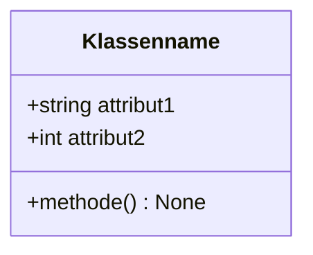
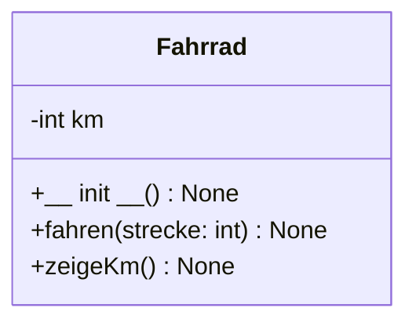
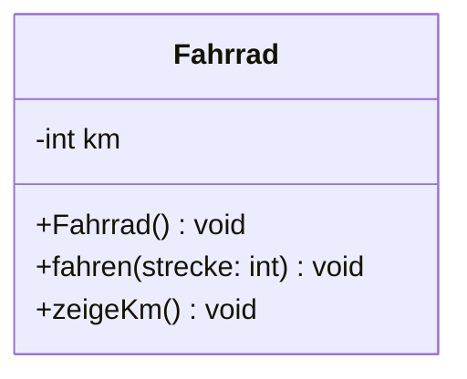
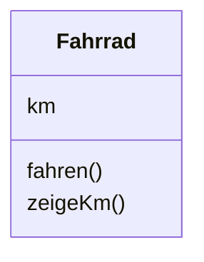
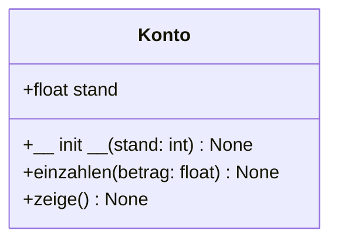
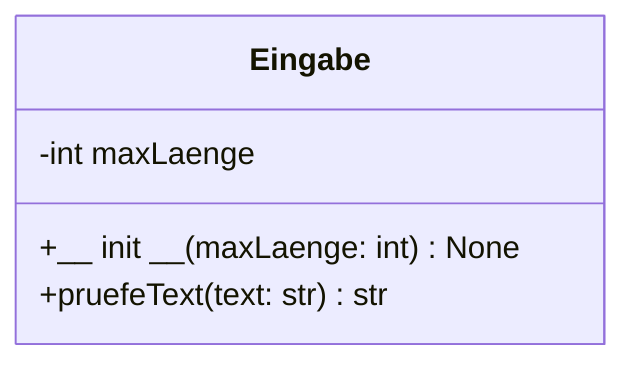
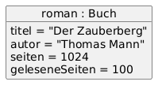

# 4.6.5 Struktur durch klare Methoden und Klassen – Prinzip der Verantwortung

In der objektorientierten Programmierung ist es ein wichtiges Prinzip: **eine Methode – eine Aufgabe**. Das bedeutet: Jede Methode soll genau für das zuständig sein, was ihr Name verspricht – **nicht mehr und nicht weniger**.

Das erhöht die Lesbarkeit, erleichtert spätere Änderungen und fördert **sauberen Code** („Clean Code“). Dieses Prinzip wird auch als **Single Responsibility Principle** bezeichnet.

---

## 🚲 Beispiel: Fahrrad mit klaren Zuständigkeiten

Wir bauen eine Klasse `Fahrrad`, die genau zwei Methoden hat:

- `fahren()` verändert den Zustand (mehr Kilometer)
- `zeigeKm()` zeigt den aktuellen Kilometerstand


```python linenums="1"
# Fahrrad-Klasse mit geschützten Attributen
# J. Thomaschewski, 29.07.2025

class Fahrrad:
    def __init__(self) -> None:
        self.__km: int = 0

    def fahren(self, strecke: int) -> None:
        self.__km += strecke

    def zeigeKm(self) -> None:
        print(f"Gefahrene Kilometer: {self.__km}")


# Hauptprogramm
bike = Fahrrad()
bike.fahren(12)
bike.zeigeKm()
```

Ausgabe:<br>
*Gefahrene Kilometer: 12*

---

## 💡 Guter Stil – Praktisches Beispiel mit Display

In dieser Übung prüfen wir die Textlänge, bevor etwas auf ein OLED-Display ausgegeben wird. Die **Logik** wird dabei sauber von der **Anzeige** getrennt. Auch hier nutzen wir private Attribute im CamelCase-Stil.

```python linenums="1"
# Textlänge prüfen und anzeigen (OLED)
# Praktikumsbeispiel – J. Thomaschewski, 29.07.2025

from machine import Pin, SoftI2C
from ssd1306 import SSD1306_I2C


# OLED initialisieren
i2c = SoftI2C(scl=Pin(17), sda=Pin(16))
oled = SSD1306_I2C(128, 64, i2c, addr=0x3C)


class Eingabe:
    def __init__(self, maxLaenge: int) -> None:
        self.__maxLaenge: int = maxLaenge

    def pruefeText(self, text: str) -> str:
        if len(text) <= self.__maxLaenge:
            return text
        else:
            return "Text ist zu lang!"


# Hauptprogramm
eingabe = Eingabe(16)
text: str = input("Gib deinen Text ein: ")
anzeigeText: str = eingabe.pruefeText(text)

oled.fill(0)
oled.text(anzeigeText, 0, 20)
oled.show()
```

---

!!! quote "Wichtig"
    **🧠 Merksatz: Eine Methode soll eine Aufgabe haben.** Wenn wir beim Erklären einer Methode das Wort „und“ verwenden, ist sie wahrscheinlich zu lang oder falsch aufgeteilt.


!!! question "Aufgabe – Methoden aufteilen"
    Ergänze die Klasse `Fahrrad` um eine Methode `resetKm()`, die den Kilometerstand wieder auf null setzt. Gib den Kilometerstand vor und nach dem Reset aus.

    ??? example "Lösungsvorschlag"
        ```python linenums="1"
        class Fahrrad:
            def __init__(self) -> None:
                self.__km: int = 0

            def fahren(self, strecke: int) -> None:
                self.__km += strecke

            def zeigeKm(self) -> None:
                print(f"Gefahrene Kilometer: {self.__km}")

            def resetKm(self) -> None:
                self.__km = 0


        bike = Fahrrad()
        bike.fahren(25)
        bike.zeigeKm()
        bike.resetKm()
        bike.zeigeKm()
        ```

        Ausgabe:<br>
        *Gefahrene Kilometer: 25*  
        *Gefahrene Kilometer: 0*


---

## 🔍 Strukturierung von Klassen – was eine gute Klasse ausmacht

Nachdem wir uns mit dem Aufbau und der Zuständigkeit einzelner Methoden beschäftigt haben, wollen wir jetzt betrachten, **was eine gut strukturierte Klasse ausmacht**.

Eine Klasse sollte so gestaltet sein, dass sie:

- **eine klar umrissene Aufgabe** erfüllt,
- **alle notwendigen Daten (Attribute)** zur Bearbeitung dieser Aufgabe enthält,
- und **nur Methoden anbietet**, die zum Arbeiten mit genau diesen Daten benötigt werden.

Wir sprechen dabei auch von einer **logischen Kapselung**: Daten und Funktionen, die zusammengehören, sollen auch im Code **zusammenbleiben**.

### Beispiele für gut strukturierte Klassen

| Klasse       | Aufgabe                                      | Sinnvolle Methoden                                 |
|--------------|----------------------------------------------|----------------------------------------------------|
| `Konto`      | Kontostand verwalten                         | `einzahlen()`, `abheben()`, `zeigeStand()`         |
| `Fahrrad`    | Gefahrene Kilometer zählen und zurücksetzen  | `fahren()`, `zeigeKilometer()`, `zuruecksetzen()`  |
| `Ampel`      | Steuerung eines einfachen Ampelablaufs       | `start()`, `wechsleZuRot()`, `wechsleZuGruen()`    |


Wichtig: Eine Klasse sollte **nicht zu viele unterschiedliche Aufgaben** übernehmen. Wenn eine Klasse plötzlich **Benutzereingaben verarbeitet**, **LEDs steuert** und **Daten speichert**, ist sie zu breit aufgestellt. Solche Aufgaben gehören in verschiedene Klassen.

!!! quote "Wichtig"
    **🧠 Merksatz: Eine Klasse sollte eine Aufgabe haben – und nur das tun, was zu dieser Aufgabe gehört.**

Wenn wir nun wissen,  was eine gute Klasse ausmacht, gehen wir auf die nächste Strukturebene und fassen gleichartige Klassen zusammen. 

## ✨ Model - View - Controler (MVC-Konzept)

Das **Model-View-Controller (MVC)**-Konzept ist ein bewährtes Entwurfsmuster in der Softwareentwicklung, das Klassen in drei Gruppen unterteilt:

1. **Model (Modell):** Das Model ist für die Datenhaltung zuständig. Hierin finden sich Klassen zum Speichern und Abrufen der Daten. Da das Model unabhängig von der Verarbeitung der Daten (Controler) und der Ansicht der Daten (View) ist, kann man in einer guten Programmierung die Datenhaltung ändern, ohne dass dies einen Einfluss auf die Datenverarbeitung bzw. die Darstellung der Daten hat.

2. **View (Ansicht):** In den Klassen des Views findet die Darstellung der Anwendung sowie die Interaktionen Darstellung der Benutzerinteraktionen statt.

3. **Controller (Steuerung):** Der Controller fungiert als Vermittler zwischen Model und View. Er verarbeitet Benutzereingaben, aktualisiert das Modell entsprechend und sorgt dafür, dass die Ansicht die aktuellen Daten anzeigt.

Durch diese Trennung der Verantwortlichkeiten fördert das MVC-Muster eine klare Strukturierung des Codes, erleichtert die Wartung und ermöglicht eine parallele Entwicklung der einzelnen Komponenten. In Python wird dieses Muster häufig in Web-Frameworks wie Django verwendet, um eine saubere und skalierbare Anwendungsarchitektur zu gewährleisten. 


## Klassendiagramme 

Bevor wir ein Klassendiagramm betrachten, klären wir kurz, wozu wir es eigentlich brauchen.

### 🧭 Wozu verwenden wir Klassendiagramme?

Klassendiagramme helfen dabei, **Struktur und Aufbau einer Software sichtbar zu machen**, bevor oder während das Programm entsteht. Sie zeigen auf einen Blick:

- **Welche Klassen es gibt**
- **Welche Attribute und Methoden** sie besitzen
- **Wie Klassen miteinander verbunden sind** (Dies wird in Programmieren 2 behandelt 😊)

Damit dienen Klassendiagramme als **Planungs- und Verständniswerkzeug**.  
Studierende, Entwicklerinnen und Entwickler können schneller erkennen,

- wie ein Programm aufgebaut ist,
- wie Objekte zusammenarbeiten,
- und welche Verantwortlichkeiten vorhanden sind.

Kurz gesagt:  
**Ein Klassendiagramm macht sichtbar, was im Sourcecode oft „versteckt“ ist – und erleichtert dadurch Denken, Planen und Kommunizieren.**

---

### Die Syntax der Klassendiagramme

Um Klassendiagramme lesen und erstellen zu können, müssen wir die grundlegende Syntax kennen.  

### 🧩 Grundaufbau einer Klasse

Eine Klasse wird folgendermaßen dargestellt:





```python linenums="1"
class Fahrrad:
    def __init__(self) -> None:
        self.__km: int = 0

    def fahren(self, strecke: int) -> None:
        self.__km += strecke

    def zeigeKm(self) -> None:
        print(f"Gefahrene Kilometer: {self.__km}")
```

Wir sehen sehr deutlich, wie ein Klassendiagramm eine **kurze, grafische Zusammenfassung einer Klasse** liefert:
Klassenname in Fett zuerst, Attribute oben, Methoden darunter, und davor jeweils ein Sichtbarkeits-Symbol (+ oder –).


#### Sichtbarkeit von Attributen und Methoden

Die Symbole geben an, ob und wie von außen auf Attribute und Methoden zugegriffen werden darf:

| Symbol | Bedeutung | Erklärung |
|--------|-----------|-----------|
| `+` | öffentlich (public) | Von überall im Programm zugänglich. Wird genutzt, wenn Daten oder Methoden bewusst nach außen sichtbar sein sollen. |
| `-` | privat (private) | Zugriff nur innerhalb der Klasse. In Python über Konvention abgesichert (Name Mangling). Schützt interne Daten. |
| `#` | geschützt (protected) | Zugriff in der Klasse und ihren Unterklassen. Wird in Python selten verwendet, ist aber in UML Teil der Standardsichtbarkeiten. |

**Damit können wir in Klassendiagrammen sehr schnell erkennen, welche Daten geschützt werden sollen und welche Funktionen öffentlich angeboten werden.**


---


### 📦 Kurzschreibweise vs. ausführliche Schreibweise

Bei Klassendiagrammen unterscheiden wir zwischen einer **Kurzschreibweise** und einer **ausführlichen Schreibweise**.

Die **Kurzschreibweise** zeigt nur die Struktur einer Klasse, also *welche Attribute und Methoden existieren*, aber ohne Details wie Typen, Parameter oder Sichtbarkeit.  
Die **ausführliche Schreibweise** zeigt alle Informationen vollständig an – und wir unterscheiden dabei zwischen:

- einer **allgemeinen, UML-konformen Schreibweise**  
- und einer **programmiersprachenspezifischen Schreibweise** (hier: Python)

---

#### **Ausführliche Schreibweise (UML-konform)**  
Sprachneutral, für Entwurf und Dokumentation geeignet.  
Der Konstruktor trägt den Namen der Klasse und Rückgabetypen sind typisch UML (z. B. `void`, wenn nichts zurückgegeben wird).



---

#### **Ausführliche Schreibweise (Python-orientiert)**  
Näher an der tatsächlichen Implementierung in Python.  
Wir verwenden `__init__()` und den Rückgabetyp `None`.


***Diese Schreibweise wollen wir ab hier nun immer verwenden*** 

---

#### **Kurzschreibweise**  
Ideal, wenn viele Klassen dargestellt werden oder wenn es nur um die grobe Struktur geht.  
Details wie Typen, Parameter und Sichtbarkeiten werden weggelassen.



---

**Zusammenfassung:**  
- Die **Kurzschreibweise** ist kompakt und übersichtlich.  
- Die **ausführliche Schreibweise** zeigt vollständige technische Details.  
- UML-Schreibweise → sprachunabhängig  
- Python-Schreibweise → realitätsnah für unsere Programmierung  

So können wir abhängig von Situation und Zielgruppe entscheiden, welche Darstellung am sinnvollsten ist.


Die Kurzschreibweise eignet sich gut für Einsteiger oder für Diagramme, bei denen die **Beziehungen zwischen Klassen** wichtiger sind als die Details oder wenn sehr viele Klassen dargestellt werden.

---

??? info "Exkurs 🔗 Beziehungen zwischen Klassen (wird in Programmieren 2 vertieft 🤓)"
    Klassendiagramme zeigen nicht nur den Aufbau einzelner Klassen, sondern auch, **wie Klassen miteinander verbunden sind**.  
    Solche Beziehungen werden in der objektorientierten Programmierung sehr wichtig, da komplexe Programme aus vielen zusammenarbeitenden Klassen bestehen.

    Wir betrachten hier die **vier wichtigsten Arten von Beziehungen**.  Die genaue Unterscheidung und praktische Anwendung erfolgt in *Programmieren 2*.

    ---

    #### **1️⃣ Vererbung (Generalisation / Spezialisierung)**  
    Eine Klasse **erbt** Eigenschaften und Methoden einer anderen Klasse.  
    Die darüberliegende Klasse ist die *Basisklasse*, die darunterliegende die *abgeleitete Klasse*.

    ``` mermaid
    classDiagram
        Tier <|-- Hund
    ```

    **Bedeutung:**  
    *Hund* ist ein spezielles *Tier* und übernimmt dessen Attribute und Methoden.  
    Zusätzliche Eigenschaften kann *Hund* selbst definieren.

    ---

    #### **2️⃣ Assoziation (A benutzt B)**  
    Eine Klasse **verwendet** eine andere Klasse, kennt sie also und arbeitet mit ihr zusammen.

    ``` mermaid
    classDiagram
        Auto --> Motor

    ```

    **Bedeutung:**  
    Ein Auto *benutzt* einen Motor, aber **beide können unabhängig existieren**.

    ---

    #### **3️⃣ Aggregation (A besteht teilweise aus B)**  
    Eine „Hat-ein“-Beziehung, aber das enthaltene Objekt kann **auch unabhängig existieren**.

    ``` mermaid
    classDiagram
        class Mannschaft
        class Spieler
        Mannschaft o-- Spieler
    ```

    **Bedeutung:**  
    Eine Mannschaft besteht aus Spielern, aber die Spieler existieren auch ohne die Mannschaft.

    ---

    #### **4️⃣ Komposition (A besteht zwingend aus B)**  
    Eine Klasse besteht aus Bestandteilen, die **ohne das Ganze nicht existieren können**.

    ``` mermaid
    classDiagram
        class Haus
        class Raum
        Haus *-- Raum
    ```

    **Bedeutung:**  
    Ein Raum existiert nicht ohne das Haus.  
    Zerstören wir das Haus, verschwinden die Räume ebenfalls.

    ---

    #### **Warum sind diese Beziehungen wichtig?**

    Beziehungen helfen uns zu verstehen,

    - wie Klassen zusammenarbeiten,
    - welche Klasse welche Verantwortung hat,
    - wie Objekte aufgebaut sind,
    - und wie wir große Projekte strukturiert entwickeln.

    Wir benötigen dieses Verständnis später, um **saubere Softwarearchitektur** zu erstellen, z. B. im MVC-Modell oder bei größeren Projekten.

    ---

    #### **Ausblick auf Programmieren 2**

    In *Programmieren 2* werden wir:

    - Vererbung in Python praktisch umsetzen  
    - Assoziationen programmieren (z. B. ein Auto besitzt einen Motor)  
    - Aggregation und Komposition in realen Beispielen anwenden  
    - Komplexe Klassendiagramme erstellen und interpretieren  

    Dieses Kapitel dient daher als **Grundlagenübersicht**, damit wir ab hier Klassendiagramme besser verstehen und nutzen können.


Damit kennen wir die grundlegende Syntax, um unsere Beispielprogramme in Klassendiagramme zu übersetzen.

---

### 🧪 Beispiel 1: Klasse `Konto` mit öffentlichem Attribut

Als erstes Beispiel betrachten wir eine einfache Klasse `Konto`, bei der das Attribut `stand` **öffentlich** ist.  
So können wir sehr gut sehen, wie sich der Python-Code in ein Klassendiagramm übersetzen lässt – und welche Probleme ein öffentliches Attribut mit sich bringen kann.

##### Klassendiagramm (Python-orientierte Schreibweise)



- `stand` ist **öffentlich** (`+`), somit wird im Python-Code kein doppelter Unterstrich verwendet.  
- Die Methoden `einzahlen(...)` und `zeige()` geben keinen Wert zurück → Rückgabetyp `None`.  
- Das Diagramm zeigt uns damit auf einen Blick:
  - den Zustand des Objekts (`stand`)
  - die öffentlich nutzbaren Funktionen (`einzahlen`, `zeige`)

??? info "Python-Sourcecode zur Klasse `Konto` mit öffentlichem Attribut"
    ``` python linenums="1"
    # Klasse mit öffentlich zugänglichem Attribut (unsicher!)
    # J. Thomaschewski, 29.07.2025
    class Konto:
        def __init__(self):
            self.stand = 100

        def einzahlen(self, betrag):
            if isinstance(betrag, (int, float)) and betrag > 0:
                self.stand += betrag
            else:
                print("Ungültiger Betrag – bitte nur positive Zahlen!")

        def zeige(self):
            print('Kontostand: ', self.stand)


    # Hauptprogramm
    giro = Konto()
    giro.zeige()
    giro.einzahlen(50)
    giro.zeige()

    # Manipulation von außen (kaputt gemacht!)
    giro.stand = "1.000,-- €"  # Funktioniert formal, aber inhaltlich völliger Unsinn
    giro.zeige()               # Gibt sogar ein Ergebnis aus. Der Fehler kommt erst anschließend.
    giro.einzahlen(50)         # Einzahlen geht jetzt nicht mehr. Fehlermeldung erst hier.
    giro.zeige()
    ```

**Was lernen wir an diesem Beispiel?**

- Im **Klassendiagramm** sehen wir nur, dass `stand` öffentlich ist.
- Im **Code** erkennen wir, dass `giro.stand` von außen auf einen unsinnigen Wert gesetzt werden kann.  
- Später – mit **privaten Attributen** und **Kapselung** – werden wir sehen, wie wir diese Gefahr reduzieren können.

---

### 🧪 Beispiel 2: Klasse `Konto` mit **privatem** Attribut

Im zweiten Beispiel nehmen wir exakt die gleiche Klasse wie zuvor, aber diesmal wird das Attribut `stand` **privat** gemacht.  

Damit demonstrieren wir sehr gut, wie sich durch Kapselung (= Verwendung privater Attribute) **Fehler vermeiden** lassen, die im ersten Beispiel noch möglich waren.

##### Klassendiagramm (Python-orientierte Schreibweise)


- `stand` ist jetzt **privat** (`-`), da im Code mit `__stand` gearbeitet wird.  
- Der Zugriff auf das Guthaben erfolgt ausschließlich über die Methoden der Klasse.  
- Dadurch kann keine externe Manipulation mehr auftreten.

??? info "Python-Sourcecode zur Klasse `Konto` mit privatem Attribut"
    ``` python linenums="1"
    # Konto-Klasse mit privatem Attribut (sicherer)
    # J. Thomaschewski, 29.07.2025
    class Konto:
        def __init__(self):
            self.__stand = 100   # privates Attribut durch doppelten Unterstrich

        def einzahlen(self, betrag):
            if isinstance(betrag, (int, float)) and betrag > 0:
                self.__stand += betrag
            else:
                print("Ungültiger Betrag – bitte nur positive Zahlen!")

        def zeige(self):
            print("Kontostand:", self.__stand)


    # Hauptprogramm
    giro = Konto()
    giro.zeige()
    giro.einzahlen(50)
    giro.zeige()

    # Versuch der Manipulation – diesmal ohne Erfolg
    giro.__stand = "1.000,-- €"   # erzeugt ein *neues* Attribut, beeinflusst das echte nicht
    giro.zeige()                  # zeigt weiterhin den echten Stand
    ```

**Was lernen wir an diesem Beispiel?**

- **Private Attribute schützen den internen Zustand** des Objekts.  
- `__stand` kann von außen nicht überschrieben werden.  
- Die Programmlogik bleibt stabil und vorhersehbar.  
- Die Klasse entscheidet selbst, **wie** mit den Daten gearbeitet wird.  

Im Vergleich zum ersten Beispiel sehen wir sehr deutlich, wie wichtig Kapselung in der objektorientierten Programmierung ist.


---

### 🧪 Beispiel 3: Klasse `Eingabe` – Prüfen von Textlängen (Logik + Rückgabewert)

Im dritten Beispiel nutzen wir eine Klasse aus den vorherigen Seiten: **`Eingabe`**.  
Diese Klasse zeigt sehr schön:

- wie **private Attribute** verwendet werden (`__maxLaenge`),  
- wie Methoden **Werte zurückgeben**,  
- und wie Logik von Darstellung getrennt werden kann.

##### Klassendiagramm (Python-orientierte Schreibweise)



**Interpretation:**

- `__maxLaenge` ist **privat** → geschützte Konfiguration der Klasse  
- `pruefeText(...)` gibt einen **String** zurück  
- Die Klasse übernimmt **eine einzige klar definierte Verantwortung**: *Prüfen, ob Text eine maximale Länge überschreitet*

---

??? info "Python-Sourcecode zur Klasse `Eingabe`"
    ``` python linenums="1"
    # Klasse zum Prüfen der Textlänge
    # Praktikumsbeispiel – J. Thomaschewski, 29.07.2025

    class Eingabe:
        def __init__(self, maxLaenge: int) -> None:
            self.__maxLaenge: int = maxLaenge   # privates Attribut

        def pruefeText(self, text: str) -> str:
            if len(text) <= self.__maxLaenge:
                return text
            else:
                return "Text ist zu lang!"


    # Hauptprogramm
    eingabe = Eingabe(16)
    text: str = input("Gib deinen Text ein: ")
    anzeigeText: str = eingabe.pruefeText(text)

    print("Ausgabe:", anzeigeText)
    ```

---

**Was lernen wir an diesem Beispiel?**

- Auch private Attribute können sehr gut in Klassendiagrammen dargestellt werden (`-`).  
- Methoden können **Rückgabewerte** haben – und die erscheinen dann im Klassendiagramm rechts.  
- Die Klasse `Eingabe` hat eine **klare, logisch abgegrenzte Aufgabe**: Texte prüfen.  
- Sie mischt keine Anzeige- oder Eingabefunktionen hinein → **Single Responsibility Principle (SRP)**.

---


## 🧠 Übungen: Klassendiagramme zu Python-Klassen

Im folgenden Abschnitt üben wir, aus zu den Python-Klassen die entsprechenden **Klassendiagramme zu zeichnen**.  
Zu jeder Klasse gibt es:


!!! question "Aufgabe 1 – Klassendiagramm zur Klasse `Baum` (aus dem Skript)"

    Wir betrachten die Klasse `Baum` aus unserem Skript.  
    Erstellen Sie das **Klassendiagramm in ausführlicher Schreibweise (Python-orientiert)**


    ``` python linenums="1"
    # Klasse Baum mit Hauptprogramm - print in Methode
    # J. Thomaschewski, 04.09.2024
    class Baum:
        def __init__(self, art, hoehe):
            self.art   = art
            self.hoehe = hoehe

        def beschreibung(self):
            print(f"Baum: {self.art}, Höhe: {self.hoehe} Meter")


    # Hauptprogramm
    meinBaum = Baum("Eiche", 20)
    meinBaum.beschreibung()
    ```

    ??? example "Lösungsvorschlag"
        ``` mermaid
        classDiagram
            class Baum {
                +str art
                +int hoehe
                +__ init __(art: str, hoehe: int) None
                +beschreibung() None
            }
        ```

---


!!! question "Aufgabe 2 – Klassendiagramm zur Klasse `FahrradComputer` (neues Beispiel)"

    Erstellen Sie das **Klassendiagramm in ausführlicher Schreibweise (Python-orientiert)**


    ``` python linenums="1"
    # Klasse FahrradComputer – berechnet gefahrene Kilometer aus Radumdrehungen
    # Neues Beispiel für Klassendiagramm-Übungen

    class FahrradComputer:
        def __init__(self, radUmfang: float) -> None:
            # Radumfang in Metern
            self.__radUmfang: float = radUmfang
            self.__kmGesamt: float = 0.0

        def addUmdrehungen(self, anzahl: int) -> None:
            # zurückgelegte Strecke in Metern
            strecke_m = anzahl * self.__radUmfang
            # in Kilometer umrechnen
            self.__kmGesamt += strecke_m / 1000

        def getKm(self) -> float:
            return self.__kmGesamt


    # Hauptprogramm
    computer = FahrradComputer(2.1)  # 2,1 m Radumfang
    computer.addUmdrehungen(500)
    print(f"Gefahrene Kilometer: {computer.getKm():.2f}")
    ```

    ??? example "Lösungsvorschlag"
        ``` mermaid
        classDiagram
            class FahrradComputer {
                -float radUmfang
                -float kmGesamt
                +__ init __(radUmfang: float) None
                +addUmdrehungen(anzahl: int) None
                +getKm() float
            }
        ```


---

!!! question "Aufgabe 3 – Klassendiagramm zur Klasse `Buch` (neues Beispiel)"

    Erstellen Sie das **Klassendiagramm in ausführlicher Schreibweise (Python-orientiert)**

    ``` python linenums="1"
    
    # Klasse Buch – verwaltet Buchinformationen und Lesefortschritt
    # Neues, komplexeres Beispiel für Klassendiagramm-Übungen
    # J. Thomaschewski, 27.11.2025

    class Buch:
        def __init__(self, titel: str, autor: str, seiten: int) -> None:
            self.__titel: str = titel
            self.__autor: str = autor
            self.__seiten: int = seiten
            self.__geleseneSeiten: int = 0

        def leseSeiten(self, anzahl: int) -> None:
            if anzahl <= 0:
                print("Bitte eine positive Seitenzahl angeben.")
                return

            self.__geleseneSeiten += anzahl
            if self.__geleseneSeiten > self.__seiten:
                self.__geleseneSeiten = self.__seiten

        def progress(self) -> float:
            if self.__seiten == 0:
                return 0.0
            return self.__geleseneSeiten / self.__seiten * 100

        def istUmfangreich(self) -> bool:
            return self.__seiten > 500

        def getTitel(self) -> str:
            return self.__titel


    # Hauptprogramm
    roman = Buch("Der Zauberberg", "Thomas Mann", 1024)
    roman.leseSeiten(100)
    print(f"Fortschritt: {roman.progress():.1f}%")
    print("Ist umfangreich:", roman.istUmfangreich())
    print("Titel:", roman.getTitel())
    ```

    ??? example "Lösungsvorschlag"
        ``` mermaid
        classDiagram
            class Buch {
                +__ init __(titel: str, autor: str, seiten: int) None
                -str titel
                -str autor
                -int seiten
                -int geleseneSeiten
                +leseSeiten(anzahl: int) None
                +progress() float
                +istUmfangreich() bool
                +getTitel() str
            }
        ```

---

??? info "Exkurs: Objektdiagramm zur Aufgabe 3 – Zustand eines konkreten Buch-Objekts"

    Ein Klassendiagramm zeigt den **Aufbau einer Klasse** (Attribute, Methoden, Sichtbarkeit).  Wie die Klasse verwendet wird, ist dabei nicht erkennbar.
    Ein **Objektdiagramm** dagegen zeigt den **konkreten Zustand eines bestimmten Objekts** zu einem Zeitpunkt während der Programmausführung.

    Hier sehen wir den Zustand des Objekts `roman` der Klasse `Buch`  
    *nachdem 100 Seiten gelesen wurden*:


    {width="20%"}


    **Interpretation**

    - Das Objekt heißt **roman**
    - Die Attribute entsprechen dem aktuellen Zustand im Programm:
        - Titel: *"Der Zauberberg"*
        - Autor: *"Thomas Mann"*
        - Gesamtseiten: *1024*
        - Gelesene Seiten: *100*
    - Ein Objektdiagramm visualisiert also, *wie ein Objekt zu einem bestimmten Zeitpunkt im Speicher aussieht*. Ideal, um Abläufe im Programm verständlich zu machen.
